# E-App – Entwicklung einer webbasierten Anwendung zur selbstdurchgeführten Energieanalyse im Haushalt

> **Dokumententyp:** Inhaltliche Vorlage für die Generierung einer LaTeX-Hausarbeit
> **Quelle:** Vollständige Analyse des Quellcodes im Repository `MaierKilian/E-App`
> **Codestand:** Version 0.5.0, Commit `0b093b8` (Stand: August 2026)
> **Umfang des analysierten Codes:** 185 Quelldateien, ca. 24.000 Zeilen (TypeScript/TSX/CSS) zzgl. Konfiguration, Cloud Function und Übersetzungsdateien

---

## Hinweise für die LaTeX-Generierung

Diese Datei enthält den **vollständigen inhaltlichen Text** der Arbeit in Markdown.
Für die Umsetzung nach LaTeX gelten folgende Konventionen:

| Element im Markdown | Umsetzung in LaTeX |
| --- | --- |
| `# Überschrift` | `\chapter{}` bzw. `\section{}` (je nach gewählter Dokumentklasse) |
| `## / ###` | `\section{}` / `\subsection{}` |
| `> **Abbildung X:** …` | `\begin{figure}` mit `\includegraphics` + `\caption{}` + `\label{fig:…}` |
| ` ```mermaid ` -Blöcke | In TikZ, PlantUML oder als exportierte Grafik umsetzen; Bildunterschrift steht jeweils direkt darunter |
| ` ```typescript ` -Blöcke | `\begin{lstlisting}` bzw. `minted` mit `caption` und `label` |
| Tabellen | `booktabs` (`\toprule`, `\midrule`, `\bottomrule`), bei Bedarf `longtable` |
| `[Q1]`, `[Q2]`, … | Zitat-Schlüssel; siehe Quellenverzeichnis am Ende, dort in `.bib`-Einträge überführen |

**Umfang.** Das Dokument enthält rund 23.800 Wörter, 27 Code-Listings, 39 Tabellen und
26 Abbildungsvorschläge (davon 15 bereits als Mermaid-Diagramme ausgearbeitet, 11 als
Screenshots oder frei zu gestaltende Grafiken beschrieben). Bei üblichem
Satz (11 pt, 1,5-zeilig) ergibt das etwa **60–70 Seiten**. Um sicher bei maximal
60 Seiten zu landen, in dieser Reihenfolge kürzen:

1. **Anhang A** (vollständige Verzeichnisstruktur) auf die Ebene der Feature-Module
   reduzieren – spart ca. 3 Seiten.
2. **Listings 11, 15, 16, 22, 23** in den Anhang verschieben – spart ca. 3 Seiten im
   Hauptteil.
3. **Tabellen 24 und 39** (Formel- und Konstantenübersicht) zu einer einzigen
   Anhangstabelle zusammenführen – spart ca. 2 Seiten.
4. Erst danach inhaltlich kürzen, und zwar in Kapitel 7 bei den Abschnitten
   „Grenzen" der Einzelexperimente, deren Kernaussagen in Abschnitt 7.11 gebündelt
   wiederkehren.

Nicht kürzen sollten die Abschnitte 3.4 (Leitprinzipien), 7.11 (Genauigkeitsgrenzen)
und 15.3 (Grenzen) – sie tragen den wissenschaftlichen Anspruch der Arbeit.

**Gliederung im Überblick**

| Kapitel | Inhalt | geschätzter Umfang |
| --- | --- | --- |
| 1 | Einleitung: Motivation, Ziele, Abgrenzung, Aufbau | 4 S. |
| 2 | Grundlagen und Stand der Technik | 6 S. |
| 3 | Anforderungen und Entwurfsprinzipien | 5 S. |
| 4 | Systemarchitektur | 10 S. |
| 5 | Profilerfassung (Onboarding) | 4 S. |
| 6 | Das Mess-Framework | 6 S. |
| 7 | Die neun Experimente im Detail | 16 S. |
| 8 | Energie-Monitoring | 7 S. |
| 9 | Berichtserzeugung | 4 S. |
| 10 | Wissensbereich | 4 S. |
| 11 | Personalisierte Empfehlungen | 3 S. |
| 12 | Mehrbenutzerbetrieb und Cloud-Synchronisation | 6 S. |
| 13 | Querschnittsthemen | 7 S. |
| 14 | Qualitätssicherung, Build und Auslieferung | 5 S. |
| 15 | Diskussion | 5 S. |
| 16 | Fazit und Ausblick | 4 S. |
| – | Quellenverzeichnis und Anhang | 6 S. |

**Formeln:** Alle mit `$…$` bzw. Blockformeln ausgezeichneten Ausdrücke sollten in
`equation`- oder `align`-Umgebungen gesetzt und durchnummeriert werden, damit im Text
darauf verwiesen werden kann.

**Platzhalter, die vor der Abgabe zu füllen sind:** Titelblattangaben (Verfasser,
Matrikelnummer, Modul, Betreuung, Abgabedatum), sowie alle mit `⟨…⟩` markierten Stellen.

---

## Titelblatt (Angaben)

| Feld | Wert |
| --- | --- |
| Titel | E-App – Entwicklung einer webbasierten Anwendung zur selbstdurchgeführten Energieanalyse im Haushalt |
| Untertitel | Konzeption, Architektur und Implementierung einer React-basierten Progressive Web App mit Firebase-Backend |
| Hochschule | Hochschule für Technik und Wirtschaft Berlin (HTW Berlin) |
| Studiengang | Gebäudeenergie- und Informationstechnik (GEIT) |
| Modul | ⟨Modulbezeichnung⟩ |
| Verfasser | ⟨Name⟩, Matrikelnummer ⟨…⟩ |
| Betreuung | ⟨Prof. …⟩ |
| Abgabedatum | ⟨TT.MM.JJJJ⟩ |

---

## Kurzfassung (Abstract)

Private Haushalte verursachen in Deutschland einen erheblichen Anteil des
Endenergieverbrauchs, verfügen jedoch selten über belastbare Kenntnisse darüber, wo
in ihrem konkreten Zuhause Energie verloren geht. Klassische Energieberatungen sind
kostenintensiv und punktuell; kommerzielle Smart-Home-Lösungen erfordern Investitionen
in Hardware und liefern Rohdaten statt Handlungsempfehlungen. Zwischen beiden Polen
besteht eine Lücke: ein niedrigschwelliges Werkzeug, das Laien befähigt, ihren eigenen
Haushalt systematisch zu untersuchen.

Die vorliegende Arbeit beschreibt Konzeption, Architektur und Implementierung der
**E-App** – einer webbasierten Anwendung, die diese Lücke schließt. Die App erfasst
zunächst über einen zweistufigen Fragebogen ein Gebäude- und Haushaltsprofil. Darauf
aufbauend führt sie den Nutzer durch **neun standardisierte, mit Alltagsgegenständen
durchführbare Messungen** – von der Durchflussmessung am Duschkopf über die Ermittlung
der elektrischen Grundlast am Zähler bis zur Bewertung von Vereisung und
Temperatureinstellung von Kühl- und Gefriergeräten. Jede Messung wird nach einem
einheitlichen Schema (Information → Durchführung → Ergebnis) angeleitet, physikalisch
ausgewertet, vierstufig bewertet und – wo methodisch vertretbar – in ein jährliches
Einsparpotenzial in Euro sowie eine CO₂-Abschätzung überführt. Ergänzend erlaubt ein
Monitoring-Modul die Langzeitverfolgung von Zählerständen für bis zu acht Energieträger,
wobei die Erfassung wahlweise manuell, per On-Device-Texterkennung oder durch ein
serverseitig angebundenes multimodales Sprachmodell erfolgt. Aus Profil und Messergebnissen
werden personalisierte Handlungsempfehlungen abgeleitet und exportierbare PDF-Berichte
erzeugt.

Technisch handelt es sich um eine React-19-Anwendung in TypeScript mit einer
feature-orientierten Modulstruktur (*Feature Slices*), lokaler Zustandsverwaltung über
Zustand-Stores mit `localStorage`-Persistenz und einem optionalen Firebase-Backend für
Authentifizierung, geräteübergreifende Synchronisation und Mehrbenutzerbetrieb. Ein
durchgängiges Entwurfsprinzip ist die **strikte Trennung von Berechnungslogik und
Darstellung**: Sämtliche physikalischen Auswertungen sind als seiteneffektfreie,
isoliert prüfbare Funktionen implementiert.

Die Arbeit dokumentiert die getroffenen Entwurfsentscheidungen, leitet die verwendeten
Rechenmodelle samt Annahmen und Schwellenwerten offen her und diskutiert kritisch die
Genauigkeitsgrenzen eines Ansatzes, der bewusst auf Laienmessungen und Näherungswerte
setzt.

**Schlagworte:** Energieeffizienz, Haushaltsenergie, Progressive Web App, React,
TypeScript, Firebase, Energiemonitoring, Citizen Science, Nutzerzentrierte Gestaltung

---

## Abkürzungsverzeichnis

| Abkürzung | Bedeutung |
| --- | --- |
| API | Application Programming Interface |
| CI/CD | Continuous Integration / Continuous Deployment |
| COP | Coefficient of Performance (Leistungszahl einer Wärmepumpe) |
| CSS | Cascading Style Sheets |
| DSGVO | Datenschutz-Grundverordnung |
| GEIT | Gebäudeenergie- und Informationstechnik (Studiengang der HTW Berlin) |
| HTW | Hochschule für Technik und Wirtschaft Berlin |
| ITP | Intelligent Tracking Prevention (Browser-Schutzmechanismus in Safari) |
| JSON | JavaScript Object Notation |
| kWh | Kilowattstunde |
| LED | Light Emitting Diode |
| NPSH | Net Positive Suction Head |
| OAuth | Offener Standard zur Autorisierung |
| OCR | Optical Character Recognition (optische Zeichenerkennung) |
| PDF | Portable Document Format |
| PV | Photovoltaik |
| PWA | Progressive Web App |
| SPA | Single Page Application |
| SVG | Scalable Vector Graphics |
| UI / UX | User Interface / User Experience |
| WASM | WebAssembly |

---
# 1 Einleitung

## 1.1 Motivation und Problemstellung

Der Endenergieverbrauch privater Haushalte gliedert sich in Deutschland ganz überwiegend
in Raumwärme und Warmwasser; der Stromverbrauch für Beleuchtung, Kommunikation und
Haushaltsgeräte macht einen deutlich kleineren, aber sehr sichtbaren Anteil aus. Für die
einzelne Bewohnerin oder den einzelnen Bewohner bleibt dieser Verbrauch dennoch
weitgehend abstrakt: Er erscheint einmal jährlich als aggregierte Zahl auf einer
Abrechnung, entkoppelt von den täglichen Entscheidungen, die ihn verursacht haben.

Aus dieser Entkopplung ergeben sich drei praktische Probleme:

1. **Fehlende Lokalisierung.** Eine Jahresabrechnung sagt, *wie viel* verbraucht wurde,
   aber nicht, *wo*. Der Haushalt weiß nicht, ob die Kosten aus einer zu kalt
   eingestellten Kühlung, einem vereisten Gefriergerät, einem hohen Duschdurchfluss
   oder aus überheizten Räumen stammen.
2. **Fehlende Priorisierung.** Selbst wenn mehrere Verdachtsmomente bekannt sind, fehlt
   der Maßstab, welche Maßnahme sich zuerst lohnt. Ratgeberlisten im Internet nennen
   Maßnahmen, aber keine auf den konkreten Haushalt bezogene Wirkung.
3. **Hohe Einstiegshürde professioneller Alternativen.** Eine Vor-Ort-Energieberatung
   ist qualitativ hochwertig, aber kostenpflichtig, terminabhängig und punktuell.
   Smart-Home-Messtechnik erfordert Investitionen und liefert wiederum Rohdaten, deren
   Interpretation dem Nutzer überlassen bleibt.

Gleichzeitig ist ein erheblicher Teil der relevanten Größen mit **Alltagsgegenständen
messbar**: Ein Messbecher und eine Stoppuhr genügen für den Volumenstrom eines
Duschkopfes; ein einfaches Thermometer für die Innentemperatur eines Kühlschranks; der
ohnehin vorhandene Stromzähler für die Grundlast eines Haushalts. Die fehlende Brücke
ist nicht die Messtechnik, sondern die **Anleitung, die Auswertung und die Einordnung**.

> **Abbildung 1:** Problemaufriss – Gegenüberstellung von „Jahresabrechnung" (aggregiert,
> retrospektiv, nicht handlungsleitend) und „geführte Einzelmessung" (lokal, sofort,
> handlungsleitend). Empfohlene Darstellung: zweispaltige Gegenüberstellung mit Icons.

## 1.2 Zielsetzung

Ziel der Arbeit ist die Konzeption und Implementierung einer Anwendung, die einen
technisch nicht vorgebildeten Haushalt in die Lage versetzt, seinen eigenen
Energieverbrauch systematisch zu untersuchen und daraus priorisierte Handlungen
abzuleiten. Daraus ergeben sich sechs konkrete Teilziele:

**Z1 – Kontextualisierung.** Die Anwendung erfasst ein Gebäude- und Haushaltsprofil,
damit Messungen und Empfehlungen auf die konkrete Wohnsituation bezogen werden können
(Personenzahl, Wohnfläche, Baujahr, Heizsystem, Räume, Sanierungsstand).

**Z2 – Anleitung.** Für jede Messung existiert eine schrittweise Anleitung, die keine
Fachkenntnisse voraussetzt und benötigte Hilfsmittel explizit benennt.

**Z3 – Auswertung.** Erfasste Rohwerte werden nach nachvollziehbaren, im Code offen
dokumentierten Modellen in Bewertungen und – soweit methodisch vertretbar – in
Jahreskosten bzw. Einsparpotenziale überführt.

**Z4 – Langzeitbeobachtung.** Zählerstände mehrerer Energieträger können über die Zeit
erfasst und als Verbrauchsverlauf, Trend und Jahreshochrechnung dargestellt werden.

**Z5 – Handlungsableitung und Dokumentation.** Aus Profil und Messergebnissen entstehen
personalisierte Empfehlungen sowie exportierbare PDF-Berichte.

**Z6 – Zugänglichkeit und Datenhoheit.** Die Anwendung ist ohne Installation im Browser
nutzbar, funktioniert ohne Benutzerkonto in wesentlichen Teilen und speichert Daten
standardmäßig lokal auf dem Gerät; eine Cloud-Anbindung ist optional.

Ein bewusst nachgeordnetes, aber im Code bereits angelegtes Nebenziel ist die
**Zweitverwendung als Lernwerkzeug**: Ein integrierter Wissensbereich enthält neben
allgemeinem Energiewissen auch Vorbereitungsmaterial zu Laborversuchen des Studiengangs
Gebäudeenergie- und Informationstechnik der HTW Berlin.

## 1.3 Abgrenzung

Die Arbeit grenzt sich in folgenden Punkten ab:

- **Keine messtechnische Zertifizierung.** Die Anwendung erhebt nicht den Anspruch,
  eichrechtlich belastbare Messwerte zu liefern. Alle Auswertungen sind
  Orientierungswerte; dies wird im Produkt an jeder relevanten Stelle ausgewiesen
  (siehe Abschnitt 7.11).
- **Kein Ersatz einer Energieberatung.** Die App ersetzt weder einen Energieausweis
  noch eine normgerechte Heizlastberechnung nach DIN EN 12831 oder eine
  Gebäudebilanzierung nach DIN V 18599.
- **Keine Hardware-Integration.** Eine direkte Anbindung an Smart Meter, Smart Plugs
  oder Gebäudeautomationssysteme ist konzeptionell vorbereitet, aber nicht Bestandteil
  des betrachteten Standes.
- **Kein Abrechnungssystem.** Es findet keine Verrechnung mit realen Versorgerverträgen
  statt; Tarifangaben dienen ausschließlich der Umrechnung von Verbrauch in Kosten.
- **Kein Bezahlmodell im Betrieb.** Ein Berechtigungssystem für spätere Tarifstufen ist
  implementiert, jedoch ohne angeschlossene Abrechnung (siehe Abschnitt 13.7).

## 1.4 Aufbau der Arbeit

Kapitel 2 ordnet die Arbeit fachlich und technisch ein: Es umreißt die energetischen
Grundlagen, sichtet bestehende Lösungsansätze und stellt die eingesetzten Technologien
vor. Kapitel 3 leitet daraus funktionale und nichtfunktionale Anforderungen sowie die
Leitprinzipien des Entwurfs ab.

Kapitel 4 beschreibt die Systemarchitektur – Schichtenmodell, Modulstruktur,
Zustandsverwaltung, Persistenz und Backend. Die Kapitel 5 bis 11 behandeln die
funktionalen Bausteine in der Reihenfolge, in der ein Nutzer ihnen begegnet:
Onboarding (5), das Mess-Framework (6), die neun Experimente im Detail (7), das
Energie-Monitoring (8), die Berichtserzeugung (9), der Wissensbereich (10) und die
Empfehlungen (11).

Kapitel 12 behandelt Mehrbenutzerbetrieb und Cloud-Synchronisation einschließlich der
Sicherheitsregeln. Kapitel 13 fasst Querschnittsthemen zusammen (Design-System,
Internationalisierung, Barrierefreiheit, Datenschutz). Kapitel 14 dokumentiert
Qualitätssicherung, Build und Auslieferung. Kapitel 15 diskutiert Ergebnisse und
Grenzen, Kapitel 16 schließt mit Fazit und Ausblick.

---

# 2 Grundlagen und Stand der Technik

## 2.1 Energetische Grundlagen

Für das Verständnis der in Kapitel 7 hergeleiteten Rechenmodelle genügen wenige
physikalische Zusammenhänge, die hier kompakt zusammengestellt sind.

### 2.1.1 Leistung, Energie und Kosten

Die Leistung $P$ (Einheit Watt) beschreibt die pro Zeit umgesetzte Energie. Über eine
Dauer $t$ ergibt sich die Energie $E = P \cdot t$, üblicherweise in Kilowattstunden
angegeben. Für einen dauerhaft laufenden Verbraucher folgt daraus unmittelbar der
Jahresverbrauch:

$$E_{\text{Jahr}} [\text{kWh}] = \frac{P [\text{W}] \cdot 24 \cdot 365}{1000}$$

Die Energiekosten setzen sich aus einem verbrauchsabhängigen **Arbeitspreis**
(ct/kWh) und einem verbrauchsunabhängigen **Grundpreis** (€/Monat) zusammen. Für die
Bewertung von Einsparungen ist ausschließlich der Arbeitspreis relevant, da der
Grundpreis durch eine Verbrauchsreduktion nicht sinkt – eine Unterscheidung, die in der
Implementierung konsequent durchgehalten wird.

### 2.1.2 Erwärmung von Wasser

Die zur Erwärmung einer Wassermenge erforderliche Energie folgt aus der spezifischen
Wärmekapazität von Wasser ($c \approx 4{,}19\,\text{kJ}/(\text{kg}\cdot\text{K})$).
Umgerechnet auf praxisnahe Einheiten gilt näherungsweise:

$$E [\text{Wh}] = V [\text{L}] \cdot \Delta T [\text{K}] \cdot 1{,}163\,\frac{\text{Wh}}{\text{L}\cdot\text{K}}$$

Dieser Zusammenhang bildet die Grundlage des Duschkopf-Tests (Abschnitt 7.1).

### 2.1.3 Heizenergie und Raumtemperatur

Der Heizwärmebedarf eines Raumes hängt in erster Näherung linear von der Differenz
zwischen Innen- und Außentemperatur ab. Daraus folgt die in der Praxis verbreitete
Faustregel, dass **je Kelvin Absenkung der Raumtemperatur etwa 6 % Heizenergie**
eingespart werden. Messungen der Hochschule Biberach ermittelten real sogar Werte von
7–8 %; die Implementierung rechnet bewusst mit dem konservativeren Wert von 6 %
[Q3].

### 2.1.4 Wirkungsgrade und Energieträger

Nutzbare Wärme entsteht je nach Erzeuger mit unterschiedlichem Aufwand. Für die
Umrechnung eines Trägerpreises in Kosten je nutzbarer Kilowattstunde Wärme gilt
allgemein:

$$c_{\text{Wärme}} \left[\frac{€}{\text{kWh}_{\text{th}}}\right] = \frac{c_{\text{Träger}}}{H \cdot \eta}$$

mit dem Heizwert $H$ des Energieträgers und dem Nutzungsgrad $\eta$. Bei Wärmepumpen
tritt an die Stelle des Nutzungsgrads die Leistungszahl (COP), die Werte deutlich
über 1 annimmt. Die in der App hinterlegten Kennwerte sind in Tabelle 7.2
zusammengestellt.

### 2.1.5 CO₂-Bilanzierung

Für die Umrechnung eingesparter elektrischer Energie in vermiedene Emissionen setzt die
Anwendung einen Emissionsfaktor des deutschen Strommixes von
$0{,}38\,\text{kg CO}_2/\text{kWh}$ an – eine Größenordnung für 2023/24, die sich
jährlich ändert und im Code an genau einer Stelle gepflegt wird.

## 2.2 Bestehende Lösungsansätze

Die vorhandenen Angebote lassen sich in vier Gruppen einteilen; die E-App positioniert
sich in der Lücke zwischen ihnen.

| Ansatz | Stärken | Schwächen im Hinblick auf die Zielsetzung |
| --- | --- | --- |
| **Vor-Ort-Energieberatung** | Fachlich fundiert, gebäudespezifisch, förderfähig | Kostenpflichtig, terminabhängig, einmalig; keine kontinuierliche Begleitung |
| **Online-Energiesparrechner** (Verbraucherzentralen, Versorger) | Kostenlos, niedrigschwellig | Beruhen auf Selbsteinschätzung statt Messung; keine Priorisierung; keine Verlaufsbeobachtung |
| **Smart-Home-/Smart-Meter-Systeme** | Kontinuierliche, präzise Messdaten | Investition in Hardware nötig; liefern Rohdaten statt Empfehlungen; Datenschutzbedenken |
| **Ratgeberliteratur und Checklisten** | Breite Abdeckung, kostenlos | Generisch, nicht auf den Haushalt bezogen, ohne Wirkungsabschätzung |

Die identifizierte Lücke lautet demnach: **geführte Eigenmessung mit sofortiger,
haushaltsbezogener Auswertung und Priorisierung, ohne zusätzliche Hardware und ohne
Kosten.** Genau dieses Feld besetzt die E-App. Methodisch ist der Ansatz der
*Citizen Science* verwandt: Laien erheben nach standardisierter Anleitung Daten, deren
Aussagekraft nicht aus der Präzision der Einzelmessung, sondern aus der Systematik des
Vorgehens entsteht.

## 2.3 Eingesetzte Technologien

Die Technologieauswahl folgt drei Kriterien: (a) Auslieferung ohne Installation,
(b) Betreibbarkeit ohne eigenen Server bei minimalen laufenden Kosten und
(c) Typsicherheit als Ersatz für eine umfangreiche Testsuite in einem
Einzelentwicklerprojekt.

### 2.3.1 Frontend

**React 19** dient als UI-Bibliothek. Die Anwendung nutzt ausschließlich
Funktionskomponenten mit Hooks; Klassenkomponenten kommen nicht vor. React wird im
`StrictMode` betrieben, wodurch Effekte in der Entwicklung doppelt ausgeführt werden –
ein Umstand, der die Implementierung zu idempotenten Initialisierungen zwingt (siehe
etwa die `started`-Wächter in den Synchronisationsmodulen, Abschnitt 12.2).

**TypeScript 6** wird mit strengen Compiler-Optionen eingesetzt: `noUnusedLocals`,
`noUnusedParameters`, `noFallthroughCasesInSwitch`, `verbatimModuleSyntax` und
`erasableSyntaxOnly`. Die Domänentypen sind zentral in `src/types/index.ts` definiert
und bestehen überwiegend aus String-Literal-Vereinigungstypen (z. B. `RoomType`,
`HeatGeneratorType`), wodurch der Compiler bei jeder Erweiterung alle betroffenen
Fallunterscheidungen erzwingt.

**Vite 8** ist Build-Werkzeug und Entwicklungsserver. Eine Besonderheit ist die
Konfiguration zweier Auslieferungspfade (siehe Abschnitt 14.3).

**Tailwind CSS 4** wird über das offizielle Vite-Plugin eingebunden. Statt einer
klassischen Konfigurationsdatei kommt die neue `@theme inline`-Direktive zum Einsatz,
die CSS-Variablen an Tailwind-Utilities bindet – die Grundlage des Theming-Systems
(Abschnitt 13.1).

**Zustand 5** dient der Zustandsverwaltung. Die Bibliothek wurde gegenüber Redux oder
der React Context API bevorzugt, weil sie (a) sehr wenig Zeremonie erfordert, (b) über
`persist` eine eingebaute `localStorage`-Anbindung mitbringt und (c) den Zugriff auf
den Zustand **außerhalb** von React-Komponenten erlaubt (`store.getState()`). Letzteres
ist für das Synchronisationsmodul und für die Berechnungsaufrufe in den Messkomponenten
essenziell.

**React Router 7** realisiert die clientseitige Navigation.

**i18next / react-i18next** mit `i18next-browser-languagedetector` liefern die
Zweisprachigkeit (Deutsch, Englisch).

**lucide-react** stellt das Icon-Set bereit. Icons werden als Komponentenreferenz in
Datenstrukturen mitgeführt (z. B. im Messkatalog), was eine deklarative Zuordnung von
Icon zu Domänenobjekt erlaubt.

**jsPDF** erzeugt die PDF-Berichte vollständig clientseitig – ohne Serverrunde und
damit ohne Datenübertragung.

**tesseract.js** stellt eine WebAssembly-Portierung der Tesseract-OCR-Engine für die
geräteinterne Zählerstandserkennung bereit.

### 2.3.2 Backend

Das Backend besteht ausschließlich aus verwalteten Firebase-Diensten; es gibt keinen
eigenen Anwendungsserver.

| Dienst | Verwendung |
| --- | --- |
| **Firebase Authentication** | E-Mail/Passwort- und Google-Anmeldung |
| **Cloud Firestore** | Dokumentenspeicher für Wohnprofile und Kontodaten |
| **Cloud Functions (2. Generation)** | Eine einzige aufrufbare Funktion `scanMeter` als geschützter Vermittler zur Gemini-API |
| **Firebase Hosting** | Auslieferung der gebauten Anwendung |
| **Firebase Analytics** | Anonyme Nutzungsstatistik (abschaltbar) |
| **Google Gemini API** | Multimodale Zählerstandserkennung aus Fotos |

> **Abbildung 2:** Technologie-Landkarte – Frontend-Bausteine (React, Zustand, Router,
> i18next, Tailwind), lokale Persistenz und die Firebase-Dienste in ihrer jeweiligen
> Rolle. Empfohlene Darstellung: geschichtetes Blockdiagramm.

---

# 3 Anforderungen und Entwurfsprinzipien

## 3.1 Zielgruppen

Aus dem Quellcode lassen sich drei adressierte Nutzergruppen ableiten, die sich in den
Zielabfragen des Onboardings (`UserGoal`) und in der Berechtigungslogik widerspiegeln.

**Der kostenbewusste Haushalt** bildet die Hauptzielgruppe. Er sucht konkrete
Euro-Beträge und schnelle Maßnahmen. Für ihn ist die Priorisierung nach €/Jahr
entscheidend – deshalb ist das aggregierte Einsparpotenzial das prominenteste Element
des Messbereichs.

**Der Mieter versus der Eigentümer** unterscheiden sich in ihrem Handlungsspielraum.
Das Onboarding erfasst diesen Unterschied (`OccupancyStatus`), und die
Empfehlungserzeugung blendet fest installierte Maßnahmen (etwa Dämmung oder
Heizungstausch) für Mieter aus – ein Mechanismus, der im Code als *Persona-Gating*
bezeichnet wird.

**Der Studierende des Studiengangs GEIT** nutzt die Anwendung als Lernwerkzeug. Für ihn
existieren der Wissensbereich mit Laborvorbereitung und Karteikarten sowie das
HTW-Farbschema.

## 3.2 Funktionale Anforderungen

| ID | Anforderung | Umsetzung in Kapitel |
| --- | --- | --- |
| FA-01 | Erfassung eines Gebäude- und Haushaltsprofils in zwei Detailstufen | 5 |
| FA-02 | Nachträgliche, gezielte Bearbeitung einzelner Profilabschnitte | 5.3 |
| FA-03 | Katalog geführter Messungen mit Schwierigkeitsgrad und Zeitaufwand | 6.1 |
| FA-04 | Einheitlicher dreiphasiger Messablauf (Information, Durchführung, Ergebnis) | 6.2 |
| FA-05 | Raumbezogene Messungen mit eigenem Ergebnis je Raum | 6.3 |
| FA-06 | Zwischenspeicherung unvollständiger Messungen über Tage hinweg | 6.5 |
| FA-07 | Vierstufige Bewertung jedes Messergebnisses | 6.4 |
| FA-08 | Aggregation aller Messungen zu Gesamtsparpotenzial und CO₂-Abschätzung | 6.6 |
| FA-09 | Neun konkrete Messverfahren | 7 |
| FA-10 | Erfassung von Zählerständen für bis zu acht Energieträger | 8.1 |
| FA-11 | Verbrauchsberechnung, Trendermittlung und Jahreshochrechnung | 8.3 |
| FA-12 | Zählerstandserfassung per Kamera (OCR und KI-gestützt) | 8.5 |
| FA-13 | Ableseerinnerungen mit wählbarer Frequenz | 8.6 |
| FA-14 | Erzeugung von drei PDF-Berichtstypen in je zwei Ausführlichkeitsstufen | 9 |
| FA-15 | Personalisierte Handlungsempfehlungen mit Erledigt-/Ausblenden-Status | 11 |
| FA-16 | Wissensbereich mit FAQ, Glossar, Laborvorbereitung und Karteikarten | 10 |
| FA-17 | Mehrere Wohnprofile je Konto, umschaltbar | 12.1 |
| FA-18 | Teilen einer Wohnung mit weiteren Personen per Einladungslink | 12.3 |
| FA-19 | Geräteübergreifende Synchronisation | 12.2 |
| FA-20 | Interaktiver Demonstrationsmodus ohne Konto | 13.5 |

## 3.3 Nichtfunktionale Anforderungen

| ID | Anforderung | Umsetzung |
| --- | --- | --- |
| NFA-01 | **Zugänglichkeit ohne Installation** – Betrieb im Browser, mobil-optimiert | Single Page Application, Layout durchgängig „mobile first" |
| NFA-02 | **Funktionsfähigkeit ohne Konto** – Onboarding und Wissensbereich frei zugänglich | `LoginGate` schützt nur Messungen, Monitoring und Berichte |
| NFA-03 | **Datenhoheit** – Nutzdaten verbleiben standardmäßig auf dem Gerät | `localStorage` als primäre Persistenz; Cloud optional |
| NFA-04 | **Ehrlichkeit der Ausgabe** – geschätzte Werte sind als solche gekennzeichnet | Durchgängige `estimated`-Flags in allen Rechenmodellen |
| NFA-05 | **Robustheit gegen Fehleingaben** – keine Abstürze durch NaN, negative oder fehlende Werte | Sämtliche Rechenfunktionen prüfen `Number.isFinite` und begrenzen Wertebereiche |
| NFA-06 | **Erweiterbarkeit** – neue Messungen ohne Änderung des Rahmenwerks | Katalog-/Registry-Muster, siehe 6.1 |
| NFA-07 | **Mehrsprachigkeit** | i18next mit vollständigen Übersetzungen (1.392 Schlüssel je Sprache) |
| NFA-08 | **Barrierefreiheit** | Fokusringe, ARIA-Attribute, Berücksichtigung von `prefers-reduced-motion` |
| NFA-09 | **Geringe Betriebskosten** | Ausschließlich verwaltete Dienste; reale Kosten nahe null |
| NFA-10 | **Wartbarkeit durch Dokumentation im Code** | Durchgängige deutschsprachige Doc-Kommentare, die Entwurfsentscheidungen begründen |

## 3.4 Leitprinzipien des Entwurfs

Über die Anforderungen hinaus lassen sich aus dem Quellcode fünf durchgängige
Entwurfsprinzipien rekonstruieren. Sie erklären eine Vielzahl von Einzelentscheidungen
und werden in den folgenden Kapiteln wiederholt aufgegriffen.

### P1 – Trennung von Berechnung und Darstellung

Jede Messung besitzt ein reines Logikmodul (z. B. `showerhead.ts`), das ausschließlich
Funktionen ohne Seiteneffekte exportiert, und davon getrennte Darstellungskomponenten.
Die Logikmodule kennen weder React noch i18next noch die Stores. Damit sind sie
isoliert prüfbar, in beliebigen Kontexten wiederverwendbar (etwa in der
Berichtserzeugung) und unabhängig von der Oberfläche änderbar.

### P2 – Ehrliche Unsicherheit

Wo Werte geschätzt werden, wird dies transportiert – nicht nur im Kommentar, sondern
als Bestandteil des Rückgabetyps. Nahezu jede Auswertungsfunktion liefert ein Feld
`estimated: boolean` bzw. ein `method`-Feld, das die Herkunft des Ergebnisses angibt
(gemessen / aus Differenz abgeleitet / geschätzt). Die Oberfläche wertet dies aus und
kennzeichnet entsprechende Zahlen. Die Empfehlungsseite geht noch einen Schritt weiter
und zeigt Einsparungen bewusst als **Spanne** statt als centgenaue Zahl, um keine
Genauigkeit vorzutäuschen.

### P3 – Keine Doppelzählung

Messungen, die dieselbe Einsparung aus unterschiedlicher Perspektive beziffern würden,
werden bewusst unterschieden. Der Grundlast-Check etwa ermittelt die Dauerleistung des
gesamten Haushalts und weist deren Jahreskosten aus, trägt aber **nicht** zum
aggregierten Sparpotenzial bei. Die Begründung steht als Kommentar direkt am Code: Die
konkreten Einsparungen beziffern die nachgelagerten Checks (Standby, Kühlgeräte,
Beleuchtung); eine zusätzliche Anrechnung der Grundlast würde dieselben Watt doppelt
zählen. Der Grundlast-Check ist damit bewusst als **Diagnose** und als Trichter zu den
Folgemessungen konzipiert.

### P4 – Robustheit vor Eleganz

Persistierte Zustände werden beim Laden nicht blind übernommen, sondern über
`merge`-Funktionen mit den aktuellen Standardwerten zusammengeführt. Der Grund ist im
Code explizit vermerkt: Nach einem Update neu hinzugekommene Felder würden sonst fehlen
und zu Laufzeitfehlern führen. Ergänzend existieren echte Migrationen – etwa die
Zusammenführung umbenannter Raumtypen (`guest_toilet` → `toilet`) oder das Zurücksetzen
eines nicht mehr existierenden Farbschemas.

### P5 – Fortschreitende Verbesserung statt Alles-oder-nichts

Wo eine präzisere Messung möglich, aber aufwändiger ist, bietet die App beide Wege an
und wählt automatisch das belastbarste vorliegende Verfahren. Der Kühlschrank-Check
etwa nutzt eine echte Vorher-/Nachher-Strommessung, falls vorhanden; andernfalls die
erreichte Temperaturdifferenz; andernfalls das theoretische Potenzial bis zur
Empfehlungstemperatur. Analog beim Zählerstand-Scan: zuerst das serverseitige
KI-Modell, bei Fehlschlag stillschweigend die geräteinterne OCR, in jedem Fall aber die
manuelle Korrekturmöglichkeit.

---
# 4 Systemarchitektur

## 4.1 Überblick

Die E-App ist eine **clientseitige Single Page Application mit optionalem
Backend-as-a-Service**. Die gesamte Anwendungslogik – einschließlich sämtlicher
physikalischer Berechnungen und der PDF-Erzeugung – läuft im Browser. Das Backend
übernimmt ausschließlich vier Aufgaben: Identitätsverwaltung, Datenablage für die
geräteübergreifende Synchronisation, die Vermittlung eines einzelnen KI-Aufrufs sowie
die Auslieferung der statischen Dateien.

Diese Aufteilung ist eine bewusste Entscheidung: Sie erlaubt den Betrieb ohne eigenen
Server, macht die Anwendung ohne Konto nutzbar und hält die laufenden Kosten praktisch
bei null. Der Preis dafür ist, dass die Rechenmodelle im ausgelieferten JavaScript
einsehbar sind – was im vorliegenden Fall kein Nachteil, sondern im Sinne der
Nachvollziehbarkeit sogar erwünscht ist.

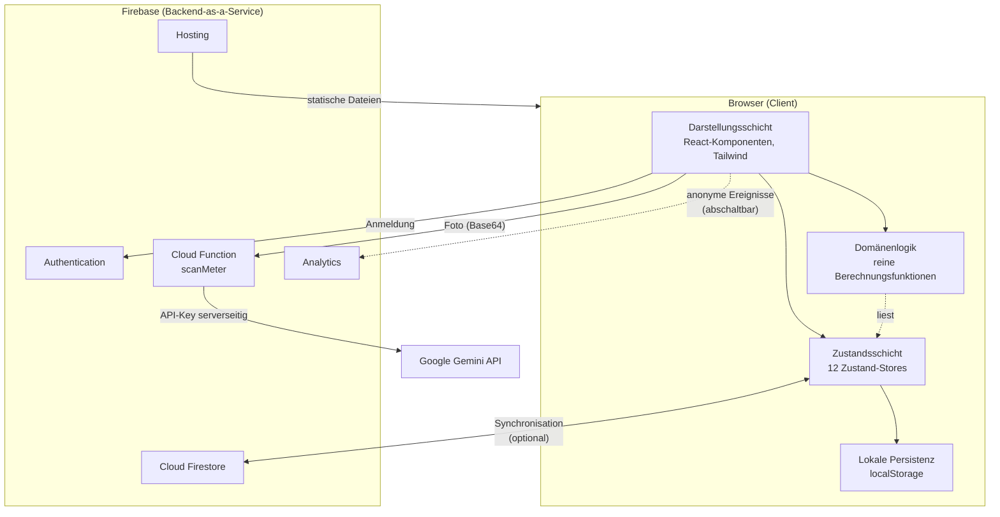

> **Abbildung 3:** Systemarchitektur im Überblick. Die gesamte Fachlogik liegt im
> Client; das Backend ist auf Identität, Ablage und einen geschützten KI-Aufruf
> beschränkt.

### 4.1.1 Schichten im Client

Innerhalb des Clients lassen sich vier Schichten unterscheiden, die sich auch in der
Verzeichnisstruktur wiederfinden:

1. **Darstellungsschicht** – React-Komponenten (`*.tsx`). Zuständig für Layout,
   Interaktion und Textausgabe über i18next. Enthält keine physikalischen Berechnungen.
2. **Domänenlogik** – reine TypeScript-Module (`*.ts`) wie `showerhead.ts`,
   `readings.ts`, `roomClimate.ts`. Seiteneffektfrei, ohne Framework-Abhängigkeiten.
3. **Zustandsschicht** – zwölf Zustand-Stores unter `src/store/`. Halten den
   Anwendungszustand und persistieren ihn.
4. **Infrastrukturschicht** – `src/lib/firebase.ts`, die Synchronisationsmodule und die
   Analytics-Kapselung.

Die Abhängigkeitsrichtung ist strikt: Darstellung darf auf alles zugreifen, Domänenlogik
kennt weder Darstellung noch (mit wenigen dokumentierten Ausnahmen) die Stores, und die
Zustandsschicht kennt keine Komponenten.

## 4.2 Modulstruktur: Feature Slices

Der Quellcode ist nicht nach technischen Rollen (`components/`, `services/`, `utils/`)
organisiert, sondern nach **fachlichen Bereichen**. Jeder Bereich unter `src/features/`
ist ein weitgehend eigenständiges Modul, das seine Komponenten, seine Logik, seine
Typen und seine Hilfsfunktionen bündelt.

Diese Struktur wurde gewählt, weil sie zwei praktische Eigenschaften hat: Erstens liegen
zusammengehörige Dateien beieinander – wer den Duschkopf-Test ändert, findet Anleitung,
Eingabemaske, Ergebnisdarstellung und Formel in einem Ordner. Zweitens sind die
Bereiche voneinander weitgehend unabhängig, sodass sich Änderungen lokal auswirken.

Geteilte Bausteine liegen bewusst außerhalb: `src/components/ui/` enthält
generische, fachlich neutrale Elemente (Karte, Modal, Schalter, Stoppuhr), `src/store/`
die Zustandsverwaltung und `src/types/` die Domänentypen.

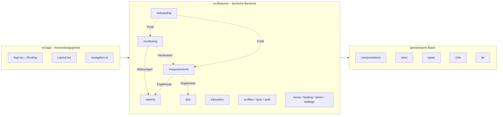

> **Abbildung 4:** Modulstruktur und fachliche Abhängigkeiten. Gestrichelte Pfeile
> zeigen Datenflüsse zwischen den Bereichen; sie verlaufen ausschließlich über die
> gemeinsame Zustandsschicht, nicht über direkte Modulaufrufe.

Bemerkenswert ist die Abhängigkeit **Monitoring → Messungen**: Der Raumklima-Check
benötigt für die Berechnung einer Euro-Einsparung die tatsächlichen Heizkosten, die
sich nur aus den Monitoring-Ablesungen ergeben. Diese Verbindung ist über das Modul
`room_temperature/heatingCost.ts` realisiert, das Funktionen aus dem
Monitoring-Bereich importiert – ein bewusst in Kauf genommener Querbezug, der im Code
dokumentiert ist.

## 4.3 Verzeichnisstruktur

Die folgende Übersicht zeigt die Struktur mit Erläuterung der jeweiligen Aufgabe. Eine
vollständige Dateiauflistung findet sich in Anhang A.

```
E-App/
├── .github/workflows/       zwei CI/CD-Pipelines (Firebase, GitHub Pages)
├── docs/                    Konzept- und Betriebsdokumentation (7 Dokumente)
├── functions/               Cloud Function scanMeter (Node.js)
├── public/                  statische Assets: Logo, Illustrationen, Video
├── src/
│   ├── app/                 Anwendungsgerüst: Routing, Layout, Theme, Navigation
│   ├── components/          wiederverwendbare Komponenten
│   │   └── ui/              fachlich neutrale Basiselemente (14 Komponenten)
│   ├── features/            fachliche Bereiche (15 Module)
│   │   ├── analytics/       Ereignisverfolgung mit Einwilligungsprüfung
│   │   ├── auth/            Anmeldung (E-Mail, Google) und Fehlerübersetzung
│   │   ├── billing/         Berechtigungen je Tarifstufe
│   │   ├── demo/            Beispielwohnung für den Demonstrationsmodus
│   │   ├── education/       Wissensbereich inkl. Karteikarten
│   │   ├── home/            Startseite mit Dashboard und Schätzfunktionen
│   │   ├── landing/         öffentliche Einstiegsseite
│   │   ├── measurements/    Mess-Framework und neun Experimente
│   │   ├── monitoring/      Zählerstände, Diagramme, Kamera-Erfassung
│   │   ├── onboarding/      Profilfragebogen und Profil-Übersicht
│   │   ├── profiles/        Wohnprofile, Teilen, Beitritt
│   │   ├── reports/         PDF-Berichte und Datenaufbereitung
│   │   ├── settings/        Einstellungsseite und Datenlöschung
│   │   ├── sync/            Cloud-Synchronisation
│   │   └── tips/            Ableitung personalisierter Empfehlungen
│   ├── i18n/                i18next-Initialisierung und zwei Sprachdateien
│   ├── lib/                 Firebase-Initialisierung, Bildverarbeitung
│   ├── store/               zwölf Zustand-Stores
│   ├── types/               zentrale Domänentypen
│   ├── index.css            Design-System: fünf Farbschemata, Effekte, Animationen
│   └── main.tsx             Einstiegspunkt
├── tests/                   Sicherheitstests der Firestore-Regeln
├── firestore.rules          Zugriffsregeln der Datenbank
└── firebase.json            Hosting-, Function- und Emulator-Konfiguration
```

Die Verteilung der Codezeilen zeigt die Gewichtung der Bereiche:

| Bereich | Zeilen | Anteil |
| --- | ---: | ---: |
| `features/measurements` | 6.476 | 27 % |
| `features/monitoring` | 2.819 | 12 % |
| `features/onboarding` | 2.408 | 10 % |
| `features/education` | 2.126 | 9 % |
| `features/reports` | 2.000 | 8 % |
| `components` (inkl. `ui`) | 1.574 | 7 % |
| `features/profiles` | 1.030 | 4 % |
| `store` | 890 | 4 % |
| übrige Feature-Module | 3.114 | 13 % |
| `i18n` (zwei Sprachdateien) | 3.952 | – |

> **Tabelle 1:** Verteilung des Quellcodes auf die Bereiche. Der Messbereich ist mit
> Abstand der umfangreichste – er enthält neun vollständige Messmodule mit je drei
> Darstellungskomponenten und einem Logikmodul.

## 4.4 Anwendungsgerüst und Routing

Der Einstiegspunkt `src/main.tsx` erfüllt vier Aufgaben, bevor React die Oberfläche
rendert:

```typescript
// src/main.tsx – Einstiegspunkt
initCloudSync()            // Synchronisation starten (reagiert auf An-/Abmeldung)
initAccountAvatarSync()    // Kontobild geräteübergreifend halten
void completeGoogleRedirect()  // laufende Google-Weiterleitung abschließen

createRoot(document.getElementById('root')!).render(
  <StrictMode><App /></StrictMode>,
)
```

> **Listing 1:** Initialisierungsreihenfolge im Einstiegspunkt. Die
> Synchronisationsmodule werden vor dem ersten Rendern gestartet, damit sie den
> Anmeldestatus bereits beobachten, wenn Firebase ihn ermittelt.

Das Routing ist in `src/app/App.tsx` definiert. Es unterscheidet drei Zonen:

| Zone | Routen | Merkmal |
| --- | --- | --- |
| **Öffentlich ohne Rahmen** | `/`, `/willkommen` | Landing Page mit eigener Kopfzeile, ohne Navigation |
| **Anwendung, frei zugänglich** | `/onboarding`, `/education`, `/tipps`, `/einstellungen`, `/login`, `/join/:pid/:inviteId` | Innerhalb des `Layout` mit Kopf- und Fußnavigation |
| **Anwendung, anmeldepflichtig** | `/measurements`, `/measurements/:id`, `/monitoring`, `/monitoring/:type`, `/reports` | Zusätzlich in `LoginGate` gekapselt |

Die Wurzelroute `/` verhält sich adaptiv: Erstbesucher sehen die Landing Page,
Wiederkehrer werden unmittelbar zum Onboarding beziehungsweise Dashboard weitergeleitet.
Als „Wiederkehrer" gilt, wer die Einführung gesehen hat (`introSeen`), ein
abgeschlossenes Profil besitzt (`data.completed`) oder sich im Demonstrationsmodus
befindet.

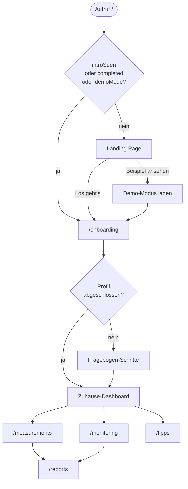

> **Abbildung 5:** Navigationsfluss vom Erstaufruf bis zu den Hauptbereichen. Der
> Demonstrationsmodus ist ein vollwertiger Nebeneinstieg, der dieselbe Oberfläche mit
> Beispieldaten füllt.

Das `Layout` (`src/app/Layout.tsx`) stellt das Grundgerüst bereit: eine feste Kopfzeile,
einen scrollbaren Inhaltsbereich mit maximaler Breite und – auf Mobilgeräten – eine
untere Navigationsleiste. Die Navigationspunkte selbst sind zentral in
`src/app/navigation.ts` definiert und werden von Kopfzeile (Desktop) und unterer Leiste
(mobil) gemeinsam genutzt, sodass die Navigation nur an einer Stelle gepflegt wird.

### 4.4.1 Zugriffsschutz

Die Komponente `LoginGate` kapselt anmeldepflichtige Bereiche. Statt einer harten
Weiterleitung zeigt sie eine freundliche Aufforderung zur Registrierung – die
Anwendung bleibt also ohne Konto benutzbar, während die weitergehenden Funktionen zur
Anmeldung motivieren. Im Demonstrationsmodus wird die Sperre bewusst aufgehoben, damit
Interessierte den vollen Funktionsumfang ohne Konto erleben können.

## 4.5 Zustandsverwaltung

Der Anwendungszustand ist auf zwölf Stores verteilt, die jeweils einen fachlich
abgeschlossenen Ausschnitt verwalten. Elf davon nutzen die `persist`-Middleware und
legen ihren Inhalt unter einem eigenen `localStorage`-Schlüssel ab.

| Store | Schlüssel | Inhalt | Teil des Wohnprofils |
| --- | --- | --- | :---: |
| `onboardingStore` | `eapp-onboarding` | Gebäude- und Haushaltsprofil, Ablaufsteuerung des Fragebogens | ✓ |
| `measurementsStore` | `eapp-measurements` | Messergebnisse je Instanz, übersprungene Räume, gewählte Ansicht | ✓ |
| `measurementDraftStore` | `eapp-measurement-drafts` | Zwischenstände unvollständiger Messungen | ✓ |
| `readingsStore` | `eapp-readings` | Zählerstände je Energieträger, Erinnerungsfrequenz | ✓ |
| `tariffStore` | `eapp-tariff` | Arbeits- und Grundpreise je Energieträger | ✓ |
| `progressStore` | `eapp-progress` | Quiz-Ergebnisse je Laborversuch | ✓ |
| `widgetOrderStore` | `eapp-widget-order` | Anordnung der Monitoring-Kacheln | ✓ |
| `settingsStore` | `eapp-settings` | Farbschema, Einführungsstatus, Demo-Modus, Analytics-Einwilligung | – |
| `profilesStore` | `eapp-active-profile` | Liste der Wohnprofile, aktives Profil | – |
| `authStore` | – (flüchtig) | Angemeldeter Nutzer, Initialisierungsstatus | – |
| `accountAvatarStore` | `eapp-account-avatar` | Kontobild je Nutzer-ID (Zwischenspeicher) | – |
| `tipsStore` | `eapp-tips` | Erledigte und ausgeblendete Empfehlungen | – |

> **Tabelle 2:** Die zwölf Zustand-Stores. Die letzte Spalte kennzeichnet, welche Stores
> zum synchronisierten Wohnprofil gehören (siehe Abschnitt 12.2).

Die Unterscheidung in der letzten Spalte ist zentral: **Gerätebezogene Vorlieben**
(Farbschema, Sprache, Einführungsstatus) werden bewusst **nicht** synchronisiert. Der
Kommentar im Code begründet dies damit, dass es sich um Eigenschaften des Geräts und
nicht der Wohnung handelt – wer am Laptop hell und am Telefon dunkel bevorzugt, soll
das dürfen.

### 4.5.1 Robuste Wiederherstellung persistierter Zustände

Ein wiederkehrendes Muster ist die explizite `merge`-Funktion beim Laden persistierter
Daten:

```typescript
// src/store/measurementsStore.ts (Auszug)
{
  name: 'eapp-measurements',
  // Gespeicherte Daten robust mit den aktuellen Defaults zusammenführen,
  // damit nach einem Update neu hinzugekommene Felder nie fehlen.
  merge: (persisted, current) => {
    const p = (persisted ?? {}) as Partial<MeasurementsState>
    return {
      ...current,
      ...p,
      results: { ...current.results, ...(p.results ?? {}) },
      skippedRooms: p.skippedRooms ?? current.skippedRooms,
      measurementsView: p.measurementsView ?? current.measurementsView,
    }
  },
}
```

> **Listing 2:** Verschmelzung persistierter Daten mit den aktuellen Standardwerten.
> Ohne diesen Mechanismus würde ein nach einem Update hinzugekommenes Feld bei
> Bestandsnutzern `undefined` bleiben und beim ersten Zugriff einen Laufzeitfehler
> auslösen.

Darüber hinaus existieren zwei echte Migrationen:

**Raumtyp-Zusammenführung.** Frühere Versionen kannten die Raumtypen `guest_toilet` und
`bureau`, die inzwischen mit `toilet` beziehungsweise `office` verschmolzen wurden. Die
Migration bildet die alten Schlüssel ab und addiert dabei die Anzahlen, falls beide
Typen im selben Profil vorkamen.

**Farbschema-Versionierung.** Der `settingsStore` führt eine Versionsnummer (`version: 2`).
Beim Übergang wurden drei Farbschemata entfernt; die Migration prüft, ob das
gespeicherte Schema noch existiert, und fällt andernfalls auf die Geräteeinstellung
(hell/dunkel) zurück – statt stumm auf den Standardwert zu springen.

### 4.5.2 Zustandszugriff außerhalb von React

An mehreren Stellen wird der Zustand außerhalb von Komponenten gelesen, etwa in der
Auswertungsfunktion des Raumklima-Checks:

```typescript
const profile = useOnboardingStore.getState().data
const heating = annualHeatingCostEur(
  profile.heatGenerators,
  useReadingsStore.getState().readings,
  useTariffStore.getState(),
)
```

> **Listing 3:** Zugriff auf mehrere Stores außerhalb des React-Renderzyklus. Die
> Werte werden nur im Moment der Auswertung benötigt; ein Abonnement über Hooks würde
> unnötige Neuberechnungen auslösen.

## 4.6 Persistenzebenen

Die Anwendung kennt drei Ebenen der Datenhaltung, die klar getrennte Aufgaben haben.

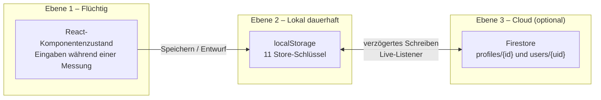

> **Abbildung 6:** Die drei Persistenzebenen. Ebene 2 ist die Quelle der Wahrheit für
> den abgemeldeten Betrieb; sobald ein Konto vorhanden ist, übernimmt Ebene 3 diese
> Rolle und Ebene 2 wird zum Zwischenspeicher für sofortige Anzeige und Offline-Betrieb.

Der Zwischenspeicher für unvollständige Messungen (`measurementDraftStore`) liegt
bewusst auf Ebene 2 und getrennt von den Endergebnissen. Der Grund ist im Code
dokumentiert: Manche Messungen laufen über Stunden oder Tage – die Innentemperatur
eines Kühlschranks stabilisiert sich erst nach mehreren Stunden, ein
Energiekosten-Messgerät muss etwa 24 Stunden zählen. Der Nutzer soll die App
zwischendurch schließen können, ohne seine bisherigen Eingaben zu verlieren, ohne dass
dadurch ein unfertiges Ergebnis in die Auswertung einfließt.

## 4.7 Datenmodell

### 4.7.1 Domänentypen

Die zentralen Typen liegen in `src/types/index.ts`. Charakteristisch ist die
durchgängige Verwendung von String-Literal-Vereinigungstypen anstelle von Aufzählungen
oder freien Zeichenketten:

```typescript
export type HeatGeneratorType =
  | 'gas_boiler' | 'oil_boiler' | 'heat_pump'
  | 'wood_stove' | 'pellets' | 'solar_thermal' | 'unknown'

export type RoomType =
  | 'living_room' | 'dining_room' | 'bedroom' | 'children_room'
  | 'office' | 'kitchen' | 'bathroom' | 'toilet'
  | 'hallway' | 'utility_room' | 'basement' | 'staircase' | 'attic'
```

> **Listing 4:** Auszug der Domänentypen. Die Schlüssel dienen zugleich als
> i18n-Schlüsselsuffixe (`onboarding.step3.roomTypes.bedroom`), wodurch Datenmodell und
> Übersetzung strukturell gekoppelt sind.

Diese Kopplung ist ein wiederkehrendes Muster: Ein neuer Raumtyp erfordert genau zwei
Änderungen – den Eintrag im Typ und die Übersetzungen –, alle weiteren Stellen ergeben
sich automatisch oder werden vom Compiler angemahnt.

Der zusammengesetzte Typ `OnboardingData` umfasst 25 Felder und beschreibt das
vollständige Profil einer Wohnung:

| Feldgruppe | Felder |
| --- | --- |
| Identität | `profileName`, `profileImage` |
| Haushalt | `personsCount`, `goals`, `occupancyStatus` |
| Gebäude | `buildingYear`, `buildingType`, `livingArea`, `floors`, `roomsCount`, `windowAge` |
| Räume | `rooms: RoomEntry[]` (Typ, Anzahl, Wärmeübergabe, optionale Fläche) |
| Wärmeversorgung | `heatGenerators[]`, `hotWaterType`, `hasExtraFireplace` |
| Hülle und Technik | `ventilationType`, `insulationState`, `hasPV`, `smartHomeDevices[]` |
| Sanierung | `lastRenovationYear`, `renovationItems[]` |
| Messgeräte | `instruments: InstrumentEntry[]` (Typ und Modellvarianten) |
| Standort | `locationMode`, `postalCode` |
| Kosten | `energyCostRange` |
| Steuerung | `completed`, `mode` |

> **Tabelle 3:** Struktur des Wohnungsprofils `OnboardingData`.

### 4.7.2 Struktur eines Messergebnisses

Alle neun Messungen liefern denselben Ergebnistyp – eine Entscheidung, die das gesamte
Rahmenwerk erst ermöglicht:

```typescript
export interface MeasurementResult {
  id: MeasurementId              // welche Messung
  rating: MeasurementRating      // 'good' | 'medium' | 'elevated' | 'high'
  primaryValue: number           // Hauptmesswert
  unit: string                   // dessen Einheit, z. B. 'L/min', 'W', '°C'
  completedAt: string            // ISO-Zeitstempel
  roomKey?: string               // bei raumbezogenen Messungen, z. B. 'bedroom#0'
  details?: Record<string, number>  // messungsspezifische Zusatzwerte
}
```

> **Listing 5:** Der einheitliche Ergebnistyp. Das offene `details`-Feld erlaubt jeder
> Messung, beliebige Zusatzgrößen abzulegen, ohne den gemeinsamen Typ zu erweitern.

Die Beschränkung von `details` auf `number`-Werte ist bewusst: Sie hält die Daten
JSON-serialisierbar und damit synchronisierbar, und sie erzwingt eine numerische
Kodierung auch für kategoriale Angaben. So wird etwa der Zugluftgrad als Index in eine
konstante Reihenfolge abgelegt (`draft: DRAFT_LEVELS.indexOf(draft)`) und der
Vereisungszustand als 0/1.

### 4.7.3 Firestore-Dokumentmodell

In der Cloud existieren zwei Sammlungen:

```
users/{uid}
  └─ accountPhoto      Kontobild als Data-URL (gehört zum Konto, nicht zur Wohnung)
  └─ (Alt-Daten)       Zustand aus der Zeit vor der Mehrprofilfähigkeit

profiles/{profileId}
  ├─ ownerUid          Ersteller und Eigentümer
  ├─ memberUids[]      alle Zugriffsberechtigten (Grundlage der Abfrage „meine Profile")
  ├─ roles{}           uid → 'owner' | 'editor'
  ├─ memberNames{}     uid → Anzeigename (für die Mitgliederliste)
  ├─ meta{}            name, image (für die Kacheldarstellung ohne Volllast)
  ├─ updatedAt         Zeitstempel der letzten Änderung
  ├─ state{}           Schnappschuss der sieben profilgebundenen Stores
  └─ invites/{inviteId}
       ├─ active       Einladung widerrufbar
       ├─ role         'editor'
       ├─ createdBy
       └─ createdAt
```

Zwei Entwurfsentscheidungen verdienen Hervorhebung:

**Das `meta`-Feld dupliziert Name und Bild** aus dem `state`. Dies ist eine bewusste
Denormalisierung: Die Profilauswahl muss alle Wohnungen als Kacheln darstellen, ohne
jeweils den vollständigen Zustand zu laden.

**Die Einladungs-ID ist das Geheimnis.** Einladungen sind Unterdokumente mit einer
zufällig erzeugten Firestore-ID. Wer diese ID kennt und angemeldet ist, darf beitreten –
solange `active` gesetzt ist. Das entspricht dem Modell geteilter Dokumentlinks und
kommt ohne serverseitige Logik aus; die Prüfung übernehmen die Sicherheitsregeln
(Abschnitt 12.4).

## 4.8 Backend-Komponenten

### 4.8.1 Firebase-Initialisierung

`src/lib/firebase.ts` initialisiert die Dienste. Die dort stehende Konfiguration ist
**kein Geheimnis** – bei jeder Firebase-Webanwendung liegt sie offen im Browser. Die
tatsächliche Absicherung erfolgt über die Firestore-Regeln und die Liste autorisierter
Domains. Dieser Umstand ist im Code ausführlich kommentiert, um Fehlinterpretationen bei
späteren Änderungen zu vermeiden.

Eine nichttriviale Besonderheit ist die dynamische Wahl der `authDomain`:

```typescript
function resolveAuthDomain(): string {
  const host = typeof window !== 'undefined' ? window.location.hostname : ''
  if (USE_FIRST_PARTY_AUTH_DOMAIN && host === FIRST_PARTY_AUTH_HOST) {
    return FIRST_PARTY_AUTH_HOST
  }
  return 'e-app-info.firebaseapp.com'
}
```

> **Listing 6:** Auswahl der Authentifizierungsdomain. Der Hintergrund ist ein
> Browser-Kompatibilitätsproblem, das in Abschnitt 13.8 ausführlich behandelt wird.

### 4.8.2 Die Cloud Function `scanMeter`

Das Backend enthält genau eine Funktion. Ihre Existenzberechtigung ist ausschließlich
sicherheitstechnisch: Der API-Schlüssel für die Gemini-Schnittstelle darf nicht in die
öffentlich ausgelieferte Webanwendung gelangen. Die Funktion ist als *callable function*
implementiert, verlangt einen angemeldeten Nutzer und ist in der Region `europe-west1`
angesiedelt.

Sie enthält mehrere Schutzmechanismen gegen Missbrauch und Kostenüberraschungen:
eine Authentifizierungspflicht, eine Größenbeschränkung des Bildes auf etwa 8 MB als
Base64, eine Zeitbeschränkung von 30 Sekunden, eine Beschränkung auf maximal fünf
gleichzeitige Instanzen sowie eine Protokollierung des Tokenverbrauchs je Aufruf. Die
fachliche Ausgestaltung wird in Abschnitt 8.5 behandelt.

---
# 5 Profilerfassung (Onboarding)

## 5.1 Zielsetzung und zwei Detailstufen

Sämtliche Auswertungen der Anwendung sind kontextabhängig: Der Duschkopf-Test benötigt
die Personenzahl, der Raumklima-Check die Wohnfläche und den Wärmeerzeuger, die
Empfehlungen den Mieter- oder Eigentümerstatus. Zugleich ist ein langer Fragebogen die
klassische Abbruchstelle einer Anwendung. Der Entwurf löst diesen Zielkonflikt durch
zwei wählbare Detailstufen.

| Modus | Schritte | Zeitaufwand | Inhalt |
| --- | ---: | --- | --- |
| **Schnellstart** | 6 | 3–5 Minuten | Wohnprofil, Basisdaten, Heizsystem, Messinstrumente, Preise, Prüfen |
| **Vollständig** | 10 | 8–10 Minuten | zusätzlich Zimmer, Gebäudehülle und Wärmeübergabe, Renovierungshistorie, Standort |

> **Tabelle 4:** Die beiden Erfassungsmodi. Der Modus ist keine Einbahnstraße – fehlende
> Angaben lassen sich jederzeit über den Profil-Hub nachtragen.

Die Modusauswahl selbst ist Schritt −1 (`currentStep = -1`); der Bildschirm nennt für
beide Varianten explizit, was enthalten ist, und schließt mit dem Hinweis, dass sich
alles später ergänzen lässt.

> **Abbildung 7:** Screenshot der Modusauswahl mit den beiden Karten „Schnellstart"
> (3–5 Min) und „Vollständig" (8–10 Min, als empfohlen markiert).

## 5.2 Die Erfassungsschritte im Einzelnen

**Schritt 1 – Wohnprofil.** Bezeichnung der Wohnung (dient zugleich als Kachelname bei
mehreren Wohnungen), optionales Profilbild, Personenzahl, Ziele der Nutzung
(Kosten sparen, CO₂ reduzieren, Komfort verbessern, Neugier, HTW-Studium) sowie der
Wohnstatus (Mieter oder Eigentümer).

**Schritt 2 – Basisdaten.** Baujahr, Gebäudetyp (Wohnung oder Haus), Wohnfläche in
Quadratmetern, Anzahl Etagen und Alter der Fenster.

**Schritt 3 – Zimmer** (nur vollständig). Auswahl der Raumtypen aus 13 Kategorien mit
Anzahl je Typ und optionaler Flächenangabe. Diese Angaben sind die Grundlage für alle
raumbezogenen Messungen und für die Flächenverteilung in Abschnitt 7.3.

**Schritt 4 – Heizsystem.** Wärmeerzeuger (Mehrfachauswahl aus Gas-, Öl-, Pellet-,
Holz-, Wärmepumpen- und Solarthermieanlage), Art der Warmwasserbereitung (wie Heizung,
separates System, teilweise kombiniert, unbekannt) und das Vorhandensein eines
zusätzlichen Kaminofens. Die Wärmeerzeuger steuern unmittelbar, welche Energieträger
im Monitoring erscheinen.

**Schritt 5 – Gebäudehülle und Wärmeübergabe** (nur vollständig). Je Raumtyp die Art der
Wärmeübergabe (Heizkörper oder Fußbodenheizung) sowie Lüftungsart und
Dämmzustand. Die Wärmeübergabe entscheidet, welche Fragen der Möbel-Abstands-Check
stellt.

**Schritt 6 – Messinstrumente.** Welche Messgeräte vorhanden sind, jeweils mit
auswählbaren Untertypen:

| Gerät | Untertypen |
| --- | --- |
| Temperatursensor | Raumthermometer, Raumthermostat, Quecksilberthermometer, Infrarot-Oberflächenthermometer, Digitalthermometer |
| Feuchtesensor | analoges/digitales Hygrometer, Thermo-Hygrometer, Datenlogger, Smart-Sensor |
| Entfernungsmesser | Zollstock, Lineal, Maßband, Laser-Entfernungsmesser, Ultraschall |
| Leistungsmessgerät | Steckdosen-Messgerät, Zangenamperemeter, Multimeter, Stromzähler |
| CO₂-Sensor | tragbares/stationäres Messgerät, Ampel, Smart-Sensor |

> **Tabelle 5:** Erfassbare Messgeräte und deren Untertypen. Die Angabe erlaubt es der
> Anwendung, in den Messanleitungen auf tatsächlich vorhandene Geräte Bezug zu nehmen.

Zusätzlich wird in diesem Schritt die grobe monatliche Energiekostenspanne erfragt.

**Schritt 7 – Renovierungshistorie** (nur vollständig). Jahr der letzten Sanierung sowie
durchgeführte Maßnahmen (Dachdämmung, Fenster, Heizungsanlage, Fassade,
Kellerdecke). Diese Angaben speisen die Effizienzeinordnung der Gebäudehülle
(Abschnitt 5.5).

**Schritt 8 – Standort** (nur vollständig). Optionale Postleitzahl für spätere
regionale Klimadaten. Der Erfassungsmodus (`manuell`, `automatisch`, `übersprungen`)
wird mitgeführt.

**Schritt 9 – Verbrauchspreise.** Arbeits- und Grundpreis je aktivem Energieträger. Der
Bildschirm betont ausdrücklich, dass leere Felder in Ordnung sind – dann rechnet die
Anwendung mit Durchschnittswerten und weist die Ergebnisse als geschätzt aus.

**Schritt 10 – Prüfen und Speichern.** Zusammenfassung aller Angaben mit
Sprungmöglichkeit zu einzelnen Abschnitten.

## 5.3 Profil-Hub und Bearbeitungsmodus

Nach Abschluss des Fragebogens wechselt der Onboarding-Bereich seine Rolle: Aus dem
linearen Ablauf wird das Zuhause-Dashboard. Für spätere Änderungen existiert ein
zweiter Modus.

Der Store unterscheidet dazu zwei Ablaufarten und nutzt negative Schrittindizes als
Sonderzustände:

| `currentStep` | Bedeutung |
| ---: | --- |
| `-2` | Profil-Hub (Übersicht aller Abschnitte, nur im Bearbeitungsmodus) |
| `-1` | Modusauswahl (nur im linearen Erstablauf) |
| `0 … n` | regulärer Erfassungsschritt |

Der Bearbeitungsmodus kann auf zwei Wegen betreten werden: `editProfile()` öffnet den
Hub, `editSection(step, returnTo)` springt direkt in einen Abschnitt und merkt sich
einen Rücksprungpfad. Letzteres wird von Kontextaufrufen genutzt – etwa wenn der
Raumklima-Check feststellt, dass keine Heizkosten hinterlegt sind, und direkt zum
Preisschritt verlinkt.

> **Abbildung 8:** Screenshot des Profil-Hubs mit den acht Abschnittskacheln und der
> jeweiligen Statusanzeige („vollständig" bzw. „N offen").

## 5.4 Vollständigkeitsermittlung

Zwei getrennte Heuristiken bewerten den Ausfüllstand.

Die **abschnittsbezogene** Prüfung (`sectionStatus.ts`) liefert je Abschnitt die Zahl
der Fragen und die Zahl der offenen Fragen. Ein Feld gilt als beantwortet, wenn es nicht
leer, nicht `'unknown'` und – bei Mehrfachauswahlen – nicht die leere Menge ist. Die
Heuristik ist bewusst tolerant: Offene Felder blockieren den Ablauf nicht, sie werden
lediglich sichtbar gemacht.

Die **globale** Prüfung (`profileCompleteness` in `estimateEnergy.ts`) bildet den
Anteil sinnvoll befüllter Felder über 16 Einzelkriterien und liefert einen Prozentwert
für die Fortschrittsanzeige auf der Startseite. Beide Funktionen greifen auf dieselbe
Grundidee zurück, dienen aber unterschiedlichen Darstellungen.

## 5.5 Abgeleitete Kennwerte: Effizienzeinordnung der Gebäudehülle

Aus Baujahr und erfassten Sanierungsmaßnahmen leitet die Anwendung eine qualitative
Einordnung der Gebäudehülle ab. Der Rechenkern ist bewusst zurückhaltend gestaltet:
**Er gibt keine absolute Kennzahl und keine Effizienzklasse nach außen.**

Grundlage ist ein spezifischer Heizwärmebedarf je Baualtersklasse:

| Baujahr | Spezifischer Heizwärmebedarf unsaniert |
| --- | ---: |
| vor 1978 | 220 kWh/(m²·a) |
| 1978 – 1994 | 150 kWh/(m²·a) |
| 1995 – 2001 | 100 kWh/(m²·a) |
| 2002 – 2015 | 70 kWh/(m²·a) |
| ab 2016 | 50 kWh/(m²·a) |

> **Tabelle 6:** Angesetzter spezifischer Heizwärmebedarf nach Baualtersklasse.

Erfasste Sanierungen wirken als multiplikative Abschläge:

| Bauteil | Faktor | Entspricht |
| --- | ---: | ---: |
| Fassade | 0,80 | −20 % |
| Dachdämmung | 0,88 | −12 % |
| Fenster | 0,88 | −12 % |
| Kellerdecke | 0,94 | −6 % |

> **Tabelle 7:** Wirkung sanierter Hüllbauteile als multiplikative Abschläge.

Aus dem Produkt der zutreffenden Faktoren ergeben sich drei Ausgaben: die relative
Einsparung gegenüber dem unsanierten Zustand, die Position auf einer normierten
Effizienzskala sowie – als handlungsleitendes Element – der **größte noch offene
Hebel**, also das wirkungsstärkste noch nicht sanierte Bauteil.

Die Begründung für diese Zurückhaltung ist im Konzeptdokument
`docs/renovation-redesign.md` festgehalten und im Code wiederholt: Die absoluten Werte
sind grob, die **relative Wirkung und die Rangfolge der Hebel** sind dagegen auch bei
groben Eingangswerten robust. Es wird also nur das ausgegeben, was die Datenlage
trägt – ein unmittelbarer Ausdruck des Leitprinzips P2 (ehrliche Unsicherheit).

---

# 6 Das Mess-Framework

## 6.1 Entwurfsmuster: Katalog, Registry und Runner

Neun Messungen mit jeweils eigener Anleitung, eigener Eingabemaske, eigener Formel und
eigener Ergebnisdarstellung könnten neun voneinander unabhängige Implementierungen sein.
Stattdessen liegt ein gemeinsames Rahmenwerk zugrunde, das aus drei Bausteinen besteht.

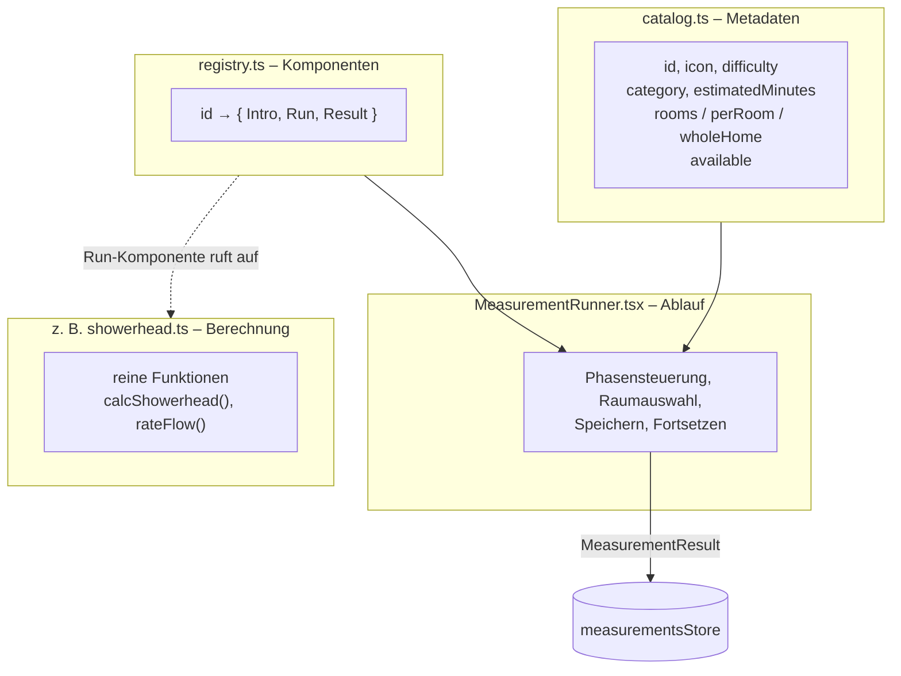

> **Abbildung 9:** Das Mess-Framework. Metadaten, Komponenten und Ablaufsteuerung sind
> getrennt; die Berechnungslogik hängt an keinem der drei Bausteine.

**Der Katalog** (`catalog.ts`) beschreibt jede Messung deklarativ. Die Reihenfolge im
Array ist zugleich die empfohlene Bearbeitungsreihenfolge (einfach zuerst):

```typescript
export interface MeasurementMeta {
  id: MeasurementId
  icon: LucideIcon
  difficulty: 1 | 2 | 3          // steuert die Katalogreihenfolge
  available: boolean             // nur verfügbare Messungen sind anklickbar
  category: MeasurementCategory  // 'heating' | 'hot_water' | 'electricity' | 'water'
  estimatedMinutes: number
  rooms?: RoomType[]             // Räume, in denen sie sinnvoll ist (ein Ergebnis)
  perRoom?: boolean              // je Raum ein eigenes Ergebnis
  wholeHome?: boolean            // gilt fürs ganze Zuhause
}
```

> **Listing 7:** Metadatenstruktur einer Messung.

**Die Registry** (`registry.ts`) bildet jede Kennung auf drei Komponenten ab:
`Intro`, `Run` und `Result`. Der Runner kennt nur diese Schnittstelle, nicht die
konkrete Messung.

**Der Runner** (`MeasurementRunner.tsx`) implementiert den generischen Ablauf.

Der praktische Nutzen dieser Trennung zeigt sich bei der Erweiterung: Eine zehnte
Messung erfordert einen Ordner mit vier Dateien, einen Eintrag im Katalog, einen Eintrag
in der Registry sowie die Übersetzungen. Weder Runner noch Übersichtsseite noch
Berichtserzeugung müssen angefasst werden – der Katalog wird überall dynamisch
ausgewertet.

## 6.2 Der dreiphasige Messablauf

Jede Messung durchläuft dieselben drei Phasen, die als anklickbare Segmentleiste
dargestellt werden.

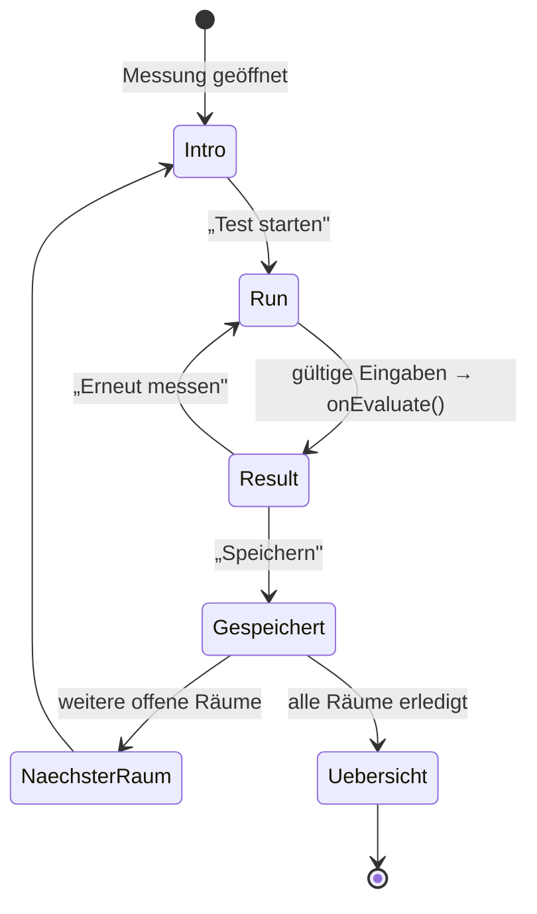

> **Abbildung 10:** Zustandsdiagramm des Messablaufs. Rückwärtsnavigation ist nur zu
> bereits erreichten Phasen möglich; der Runner führt dazu einen Zähler `maxReached`.

**Phase „Info".** Die `Intro`-Komponente zeigt eine dreischrittige Kurzanleitung, eine
Illustration oder ein Video, benötigte Hilfsmittel und – hinter einer Schaltfläche
„Details" – eine ausführliche Anleitung mit fünf bis sechs Hinweisen. Die Kurzfassung
bedient den eiligen Nutzer, die Langfassung den unsicheren.

**Phase „Messen".** Die `Run`-Komponente erfasst die Eingaben. Ihre einzige
Schnittstelle nach außen ist der Rückruf `onEvaluate(outcome)`, der ein fertiges,
aber noch nicht gespeichertes `MeasurementResult` übergibt.

**Phase „Ergebnis".** Die `Result`-Komponente stellt Bewertung, Kennzahlen und
Handlungshinweise dar. Der Runner ergänzt zwei Schaltflächen: „Speichern" und
„Erneut messen".

Nach dem Speichern erscheint ein kurzer **Erfolgsmoment** – eine Vollbildkarte mit
Häkchen, dem gefundenen Einsparbetrag und einer Weiter-Schaltfläche –, der nach
1,6 Sekunden automatisch zum nächsten Ziel navigiert. Bei raumbezogenen Messungen ist
dieses Ziel der nächste noch offene Raum, sodass sich mehrere Räume ohne Umweg über die
Übersicht durchmessen lassen.

Ein Sonderfall ist der Parameter `?begin=1`: Wird eine Messung aus einer Vorschau
heraus gestartet, in der die Information bereits gezeigt wurde, überspringt der Runner
die Info-Phase.

## 6.3 Raumbezug und Instanzschlüssel

Drei der neun Messungen werden je Raum durchgeführt (Raumklima, Möbelabstand,
Beleuchtung), zwei gelten für das ganze Zuhause (Grundlast, Standby), vier sind an
bestimmte Raumtypen gebunden (Duschkopf und Warmwasser-Wartezeit an Bad und Küche,
Kühl- und Gefriergerät an die Küche).

Ein Haushalt kann mehrere gleichartige Räume besitzen. Die Anwendung expandiert daher
die Angabe „Typ + Anzahl" in einzelne **Rauminstanzen** mit stabilem Schlüssel:

```typescript
export function roomInstances(rooms: RoomEntry[]): RoomInstance[] {
  const out: RoomInstance[] = []
  for (const r of rooms) {
    const n = Math.max(1, Math.floor(r.count ?? 1))
    for (let i = 0; i < n; i++) {
      out.push({ key: `${r.type}#${i}`, type: r.type, index: i, total: n })
    }
  }
  return out
}
```

> **Listing 8:** Expansion der Raumangaben in Instanzen. Der Schlüssel `bedroom#0`
> identifiziert das erste Schlafzimmer dauerhaft.

Ergebnisse werden unter einem zusammengesetzten Schlüssel abgelegt:

$$\text{instanceKey} = \begin{cases} \texttt{id} & \text{ohne Raumbezug} \\ \texttt{id@roomKey} & \text{mit Raumbezug} \end{cases}$$

Ein Raumklima-Ergebnis im zweiten Schlafzimmer liegt also unter
`room_temperature@bedroom#1`. Die Beschriftung nummeriert nur dann, wenn mehr als ein
Raum dieses Typs existiert („Schlafzimmer 2" statt „Schlafzimmer").

Eine elegante Umnutzung dieses Mechanismus findet sich beim Warmwasser-Wartezeit-Check:
Diese Messung ist nicht raumbezogen, setzt aber die **Entnahmestelle** als `roomKey`
ein. Dadurch entsteht je Zapfstelle (Dusche, Wanne, Küche, Waschbecken) ein eigenes
Ergebnis, ohne dass das Framework erweitert werden musste.

## 6.4 Bewertungssystem

Alle Messungen verwenden dieselbe vierstufige Skala:

| Stufe | Bedeutung | Farbe |
| --- | --- | --- |
| `good` | im empfohlenen Bereich | Grün `#16a34a` |
| `medium` | leichte Abweichung, geringes Potenzial | Amber `#d97706` |
| `elevated` | deutliche Abweichung | Orange `#ea580c` |
| `high` | starke Abweichung, hohes Potenzial | Rot `#dc2626` |

> **Tabelle 8:** Bewertungsstufen und zugeordnete Farben. Die Farben werden bewusst
> dezent eingesetzt – als zarte Tönung oder Textfarbe –, damit sie in hellen wie dunklen
> Farbschemata funktionieren.

Die Zuordnung von Messwert zu Stufe erfolgt je Messung durch eine eigene
`rate*`-Funktion mit dokumentierten Schwellenwerten (siehe Kapitel 7). Nicht jede
Messung nutzt alle vier Stufen: Der Duschkopf-Test etwa kennt nur `good`, `medium` und
`high`, weil eine feinere Abstufung des Volumenstroms fachlich nicht begründbar wäre.

## 6.5 Zwischenspeicherung langlaufender Messungen

Zwei Messungen erstrecken sich über Stunden bis Tage: Beim Kühlschrank-Check muss sich
die Innentemperatur nach dem Verstellen der Kühlstufe erst stabilisieren, beim
Gefrierschrank-Check zählt ein Energiekosten-Messgerät vor und nach dem Abtauen jeweils
mehrere Stunden.

Für diesen Fall existiert ein eigener Store, dessen Schlüssel der Instanzschlüssel der
Messung ist und dessen Wert eine offene Sammlung numerischer Felder darstellt:

```typescript
interface MeasurementDraftState {
  drafts: Record<string, Record<string, number>>
  setDraft: (key: string, patch: Record<string, number>) => void
  clearDraft: (key: string) => void
  resetDrafts: () => void
}
```

> **Listing 9:** Zwischenspeicher für unvollständige Messungen. Er ist bewusst von den
> Endergebnissen getrennt, damit unfertige Werte nicht in die Auswertung einfließen.

Der Runner löscht den Entwurf automatisch, sobald das Ergebnis gespeichert wurde.

## 6.6 Aggregation: Einsparpotenzial und CO₂

Die Übersichtsseite zeigt als prominenteste Kennzahl das aufsummierte jährliche
Einsparpotenzial. Die Aggregation muss dabei mit dem Umstand umgehen, dass die
Messungen ihre Sparkennzahl unterschiedlich benennen:

```typescript
export function resultSavingsEur(result: MeasurementResult): number {
  const d = result.details ?? {}
  const value = d.avoidableCost ?? d.yearlySaving ?? 0
  return Number.isFinite(value) && value > 0 ? value : 0
}
```

> **Listing 10:** Auslesen der Sparkennzahl. `avoidableCost` bezeichnet vermeidbare
> laufende Kosten (Standby, Vereisung), `yearlySaving` eine Einsparung durch eine
> Verhaltens- oder Ausstattungsänderung (Duschkopf, LED, Raumtemperatur).

Die CO₂-Abschätzung geht den Umweg über den Strompreis:

$$m_{\text{CO}_2} = \frac{S_{\text{€/a}}}{c_{\text{Arbeit}}} \cdot f_{\text{CO}_2}, \qquad f_{\text{CO}_2} = 0{,}38\ \frac{\text{kg}}{\text{kWh}}$$

Diese Umrechnung ist bewusst grob und im Code als solche gekennzeichnet: Sie unterstellt,
dass die eingesparten Euro dem Strompreis entsprechen, was für die
warmwasser- und heizungsbezogenen Anteile nur näherungsweise gilt. Die Oberfläche
weist den Wert entsprechend mit einem Informationshinweis aus.

Messungen ohne bezifferbare Einsparung – insbesondere der Grundlast-Check und der
Möbel-Abstands-Check – liefern bewusst den Wert 0 und erscheinen nicht in der Summe
(Leitprinzip P3).

## 6.7 Die drei Ansichten des Messbereichs

Der Messbereich bietet dieselben neun Messungen in drei Anordnungen an, zwischen denen
über ein Menü gewechselt wird. Die Wahl wird im Store gemerkt.

**„Empfohlen"** ist die Standardansicht und als Messplan gestaltet: Ein hervorgehobener
Block „Als Nächstes" zeigt den ersten offenen Schritt mit Gewerk, Zeitaufwand,
Kurzbeschreibung und – bei raumbezogenen Messungen – dem Raumfortschritt
(„Raum 2 von 4"). Darunter folgen die übrigen offenen Schritte und, getrennt davon, die
abgeschlossenen.

Die Schrittliste entsteht in `tasks.ts`. Bemerkenswert ist, dass raumbezogene Messungen
**nicht** expandiert werden: Sie erscheinen als *ein* Schritt mit Fortschrittsanzeige,
nicht als vier einzelne Einträge. Andernfalls würde die Liste bei einer
Vier-Zimmer-Wohnung auf über zwanzig Einträge anwachsen und den Überblick zerstören.

**„Gewerke"** gruppiert nach den vier Kategorien Heizung, Warmwasser, Strom und Wasser.

**„Raumweise"** gruppiert nach Rauminstanzen und bietet zusätzlich die Möglichkeit,
einen Raum als „nichts zu messen" zu markieren – etwa einen Abstellraum ohne Heizkörper
und ohne Beleuchtung. Der Status wird im Store gehalten (`skippedRooms`).

> **Abbildung 11:** Die drei Ansichten des Messbereichs nebeneinander (Empfohlen,
> Gewerke, Raumweise). Empfohlene Darstellung: drei Smartphone-Screenshots in einer
> Reihe.

Über allen Ansichten steht ein gemeinsamer Kopfbereich mit Fortschrittsring
(erledigte von gesamten Schritten) und dem aggregierten Einsparpotenzial in Euro pro
Jahr samt CO₂-Angabe.

---
# 7 Die neun Experimente im Detail

Dieses Kapitel beschreibt jede der neun implementierten Messungen nach einem
einheitlichen Schema: Fragestellung, Durchführung, Rechenmodell, Bewertungsschwellen,
Ergebnisdarstellung sowie Annahmen und Grenzen. Abschnitt 7.10 fasst alle Formeln und
Konstanten tabellarisch zusammen; Abschnitt 7.11 diskutiert die methodische Belastbarkeit
des Gesamtansatzes.

Ein Überblick vorab:

| # | Messung | Gewerk | Aufwand | Bezug | Hilfsmittel | Sparwert |
| ---: | --- | --- | ---: | --- | --- | :---: |
| 1 | Duschkopf-Test | Warmwasser | 5 min | Bad | Messgefäß, Stoppuhr | ✓ |
| 2 | Warmwasser-Wartezeit | Warmwasser | 2 min | je Entnahmestelle | Stoppuhr | ✓ |
| 3 | Raumklima-Check | Heizung | 5 min | je Raum | Thermometer (opt. Hygrometer) | ✓ |
| 4 | Möbel-Abstands-Check | Heizung | 2 min | je Raum | keine | – |
| 5 | Beleuchtungs-Check | Strom | 3 min | je Raum | keine | ✓ |
| 6 | Grundlast-Check | Strom | 5 min | ganzes Zuhause | Stromzähler, Stoppuhr | – (Diagnose) |
| 7 | Standby-Check | Strom | 12 min | ganzes Zuhause | Energiekosten-Messgerät | ✓ |
| 8 | Kühlschrank-Check | Strom | 10 min | Küche | Thermometer (opt. Messgerät) | ✓ |
| 9 | Gefrierschrank-Check | Strom | 5 min | Küche | Augenmaß (opt. Messgerät) | ✓ |

> **Tabelle 9:** Übersicht der neun Messungen. Die Reihenfolge entspricht der im
> Katalog hinterlegten Empfehlung, die nach Schwierigkeitsgrad sortiert ist.

---

## 7.1 Duschkopf-Test

### Fragestellung

Warmwasserbereitung macht nach Raumwärme den zweitgrößten Posten des häuslichen
Energieverbrauchs aus, und der weitaus größte Teil davon entfällt auf das Duschen. Der
entscheidende Stellhebel ist der **Volumenstrom des Duschkopfs**: Ein Sparduschkopf mit
etwa 8 L/min gegenüber einem konventionellen Modell mit 14 L/min reduziert den
Warmwasserbedarf um rund 40 %, ohne dass der Nutzer sein Verhalten ändern muss. Nur
wissen die wenigsten, welchen Durchfluss ihre Dusche tatsächlich hat.

### Durchführung

Die Anleitung umfasst drei Schritte und sechs Detailhinweise:

1. Ein Gefäß mit bekanntem Volumen bereitstellen – standardmäßig eine 5-Liter-Markierung.
2. Die Dusche wie gewohnt aufdrehen (gewohnte Temperatur und Stärke) und gleichzeitig
   die Stoppuhr starten.
3. Stoppen, sobald das Wasser die Markierung erreicht, und beide Werte eingeben.

Ergänzend empfiehlt die Detailanleitung, zwei- bis dreimal zu messen und den Mittelwert
zu verwenden, sowie bei einem Durchlauferhitzer das Wasser zunächst bis zur
Temperaturstabilität laufen zu lassen.

Die Eingabemaske bietet eine integrierte Stoppuhr sowie die alternative manuelle
Eingabe der Sekunden. Zusätzlich wird die **Warmwasserquelle** abgefragt, deren
Voreinstellung aus dem Profil abgeleitet wird.

> **Abbildung 12:** Screenshot der Durchführungsphase des Duschkopf-Tests mit
> Füllmengeneingabe, integrierter Stoppuhr und Auswahl der Warmwasserquelle.

### Rechenmodell

Der Volumenstrom folgt unmittelbar aus Volumen und Zeit:

$$\dot{V}\ \left[\frac{\text{L}}{\text{min}}\right] = \frac{V\ [\text{L}]}{t\ [\text{s}]} \cdot 60$$

Für die Kostenschätzung wird zunächst die jährliche Duschdauer des Haushalts bestimmt:

$$t_{\text{Dusche,a}} = n_{\text{Personen}} \cdot 1\,\frac{\text{Dusche}}{\text{d}} \cdot 5\,\frac{\text{min}}{\text{Dusche}} \cdot 365\,\frac{\text{d}}{\text{a}}$$

Daraus folgt die jährliche Wassermenge und die zu ihrer Erwärmung nötige Energie:

$$E_{\text{a}}\ [\text{kWh}] = \frac{\dot{V} \cdot t_{\text{Dusche,a}} \cdot \Delta T \cdot 1{,}163}{1000}, \qquad \Delta T = 27\ \text{K}$$

Die Temperaturdifferenz von 27 K entspricht der Erwärmung von etwa 11 °C
Kaltwassertemperatur auf rund 38 °C Duschtemperatur. Die Kosten ergeben sich durch
Multiplikation mit dem effektiven Warmwasserpreis:

$$K_{\text{a}} = E_{\text{a}} \cdot c_{\text{WW}}$$

Das Einsparpotenzial ist die Differenz zu einem Referenz-Sparduschkopf mit 8 L/min und
wird nur ausgewiesen, wenn der gemessene Durchfluss über 9 L/min liegt:

$$S_{\text{a}} = \max\left(0,\ K_{\text{a}}(\dot{V}) - K_{\text{a}}(8\,\text{L/min})\right)$$

### Effektiver Warmwasserpreis

Ein Detail hebt diesen Test von einfachen Rechnern ab: Der Warmwasserpreis wird **nicht
pauschal mit dem Strompreis** angesetzt, sondern nach der tatsächlichen Wärmequelle
berechnet – Warmwasser stammt in vielen Haushalten aus Gas oder einer Wärmepumpe.

$$c_{\text{WW}}\ \left[\frac{€}{\text{kWh}_{\text{th}}}\right] = \frac{c_{\text{Träger}}}{H \cdot \eta}$$

| Quelle | Heizwert $H$ | Nutzungsgrad $\eta$ bzw. COP | Preisbezug |
| --- | --- | ---: | --- |
| Strom / Durchlauferhitzer | – | 0,99 | ct/kWh |
| Gas | 10,0 kWh/m³ | 0,90 | €/m³ |
| Heizöl | 10,0 kWh/l | 0,90 | €/l |
| Pellets | 4,8 kWh/kg | 0,85 | €/kg |
| Wärmepumpe | – | COP 2,8 | ct/kWh |

> **Tabelle 10:** Kennwerte zur Umrechnung des Trägerpreises in Kosten je nutzbarer
> Kilowattstunde Wärme (`hotWaterEnergy.ts`).

Die Voreinstellung leitet sich aus dem Profil ab: Ist die Warmwasserbereitung als „wie
Heizung" oder „teilweise kombiniert" erfasst, wird der erste passende Wärmeerzeuger
verwendet; andernfalls elektrisch (Boiler oder Durchlauferhitzer). Der Nutzer kann die
Quelle im Test überschreiben.

### Bewertung

| Volumenstrom | Stufe |
| --- | --- |
| ≤ 9 L/min | `good` |
| > 9 und ≤ 12 L/min | `medium` |
| > 12 L/min | `high` |

> **Tabelle 11:** Bewertungsschwellen des Duschkopf-Tests.

### Kalibrierung und Grenzen

Die Annahmen sind so gewählt, dass sich ein plausibler Gesamtwert ergibt: Eine Dusche
pro Person und Tag zu fünf Minuten bei 9 L/min und 27 K Temperaturhub führt auf rund
516 kWh pro Person und Jahr – ein Wert, der mit der in der Literatur genannten
Größenordnung von 500–600 kWh je Person für die Warmwasserbereitung übereinstimmt [Q2].
Diese Kalibrierung ist im Quellcode als Kommentar dokumentiert.

Die wesentlichen Unsicherheiten liegen in den Nutzungsannahmen: Duschhäufigkeit und
-dauer variieren erheblich zwischen Haushalten und werden nicht erfragt. Der Wert ist
daher als **haushaltstypische Größenordnung** zu lesen, nicht als individuelle Prognose.
Das Ergebnis wird entsprechend mit dem Hinweis versehen, dass für die Warmwasserquelle
geschätzt gerechnet wurde und ein hinterlegter Preis die Genauigkeit erhöht.

---

## 7.2 Warmwasser-Wartezeit

### Fragestellung

Zwischen Warmwasserbereiter und Zapfstelle steht eine Rohrleitung, deren Inhalt beim
Öffnen des Hahns zunächst ungenutzt abfließt. Bei langen Leitungswegen können das je
Zapfung mehrere Liter Trinkwasser sein. Der Check macht diese unsichtbare Menge sichtbar
und beziffert sie.

### Durchführung

Der Nutzer wählt die Entnahmestelle, stellt den Hahn vollständig auf warm, startet
gleichzeitig die Stoppuhr und stoppt, sobald das Wasser spürbar warm ist. Die
Detailanleitung empfiehlt, an der am häufigsten genutzten Stelle zu messen, und ordnet
lange Wartezeiten fachlich ein: Sie deuten auf weite Leitungswege hin, denen mit einer
Zirkulationsleitung oder besserer Dämmung begegnet werden kann.

### Rechenmodell

Je Entnahmestelle sind ein typischer Volumenstrom und eine typische Häufigkeit hinterlegt:

| Entnahmestelle | Volumenstrom | Zapfungen/Tag | empfohlener Messort |
| --- | ---: | ---: | :---: |
| Dusche | 9 L/min | 1,5 | ✓ |
| Badewanne | 12 L/min | 0,3 | ✓ |
| Küche | 6 L/min | 4 | – |
| Waschbecken | 5 L/min | 5 | – |

> **Tabelle 12:** Kennwerte je Entnahmestelle. Dusche und Wanne sind wegen ihres hohen
> Durchsatzes als bevorzugte Messorte gekennzeichnet.

$$V_{\text{Zapfung}} = \frac{t\ [\text{s}]}{60} \cdot \dot{V}_{\text{Stelle}}, \qquad V_{\text{a}} = V_{\text{Zapfung}} \cdot n_{\text{Zapfungen/d}} \cdot 365$$

$$S_{\text{a}} = \frac{V_{\text{a}}}{1000} \cdot c_{\text{Wasser}}\ \left[\frac{€}{\text{m}^3}\right]$$

### Bewertung

| Wartezeit | Stufe |
| --- | --- |
| ≤ 15 s | `good` |
| ≤ 30 s | `medium` |
| ≤ 60 s | `elevated` |
| > 60 s | `high` |

> **Tabelle 13:** Bewertungsschwellen der Warmwasser-Wartezeit.

### Ergebnisdarstellung

Das Ergebnis nennt die abgeflossene Menge je Zapfung und je Jahr sowie das
Einsparpotenzial. Bemerkenswert ist der ergänzende Abschnitt „Aufgefangenes Wasser
nutzen für" mit vier konkreten Vorschlägen (Pflanzen gießen, Putzwasser, Reinigung,
Toilettenspülung). Damit bietet die Messung auch dann eine Handlung an, wenn die
bauliche Ursache – zu lange Leitungswege – kurzfristig nicht behebbar ist.

### Grenzen

Bewertet wird ausschließlich die **Wasser**menge, nicht die verlorene Wärmeenergie in
der Leitung. Die Häufigkeitsannahmen sind Haushaltsmittelwerte und skalieren nicht mit
der Personenzahl – eine bewusste Vereinfachung, da die tatsächliche Nutzung je
Zapfstelle stark streut.

---

## 7.3 Raumklima-Check

### Fragestellung

Die Raumtemperatur ist der wirksamste einzelne Hebel im Heizverbrauch: Etwa 6 % der
Heizenergie entfallen auf jedes Kelvin. Zugleich ist sie in vielen Haushalten höher als
angenommen. Der Check erfasst neben der Temperatur zwei weitere Komfort- und
Bauphysikdimensionen: Luftfeuchte und Zugluft.

### Durchführung

Das Thermometer wird etwa auf Sitzhöhe in der Raummitte platziert – nicht an Heizung,
Fenster oder Außenwand –, und der Wert wird nach einigen Minuten Stabilisierung
abgelesen. Die Eingabe erfolgt über einen Schrittregler in 0,5-K-Schritten. Luftfeuchte
ist optional zuschaltbar, Zugluft wird subjektiv in drei Stufen erfasst (keine,
spürbar, stark).

### Bewertung

Die Bewertung erfolgt mehrdimensional:

| Dimension | Optimal | Toleranzband | Extrem |
| --- | --- | --- | --- |
| Temperatur | 20 – 22 °C | 19 – 23 °C | < 17 °C oder > 25 °C |
| Luftfeuchte | 40 – 60 % | – | < 30 % oder > 70 % |
| Zugluft | keine | spürbar | stark |

> **Tabelle 14:** Schwellenwerte des Raumklima-Checks.

Die Gesamtbewertung folgt einer bewusst einfachen Regel:

- **`high`**, sobald eine Dimension extrem ausfällt (Temperatur außerhalb 17–25 °C,
  Feuchte außerhalb 30–70 % oder starke Zugluft),
- **`good`**, wenn Temperatur *und* – falls erfasst – Luftfeuchte optimal sind und keine
  Zugluft besteht,
- **`medium`** in allen übrigen Fällen.

Bemerkenswert ist eine im Code kommentierte Entwurfsentscheidung: Eine Temperatur im
Toleranzband (19–23 °C) hebt die Bewertung *nicht* auf `good` an. Nur das Optimum
erhält die beste Bewertung. Die Hilfsfunktion `temperatureIsOk` existiert im Code, wird
aber bewusst nicht in die Bewertung einbezogen – ein Beispiel für eine explizit
dokumentierte, nicht getroffene Entscheidung.

### Ermittlung der Euro-Einsparung

Dieser Check hat die aufwändigste Kostenermittlung der gesamten Anwendung, weil er als
einziger auf **reale Verbrauchsdaten aus dem Monitoring** zurückgreift. Die Kette
umfasst vier Schritte.

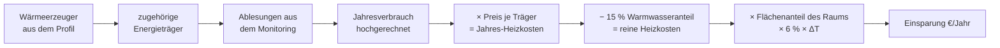

> **Abbildung 13:** Ermittlungskette der raumbezogenen Heizkosteneinsparung. Fehlt ein
> Glied – etwa weil keine Ablesungen vorliegen –, entfällt die Euro-Angabe und es bleibt
> bei der Prozentaussage.

**Schritt 1 – Jahres-Heizkosten.** Die Funktion `annualHeatingCostEur` bildet die
Wärmeerzeuger des Profils auf Energieträger ab, bildet aus deren Ablesungen
Verbrauchsabschnitte, rechnet auf 365 Tage hoch und multipliziert mit dem hinterlegten
Preis. Sie liefert `undefined`, wenn kein Heizträger mindestens zwei verwertbare
Ablesungen besitzt – dann wird bewusst kein Euro-Wert ausgewiesen.

**Schritt 2 – Warmwasseranteil abziehen.** Ein pauschaler Anteil von 15 % der
Heizenergie entfällt auf Warmwasser und ist temperaturunabhängig; er wird
herausgerechnet, da er durch eine niedrigere Raumtemperatur nicht sinkt.

**Schritt 3 – Flächenanteil des Raums.** Hier greift eine eigene Verteilungslogik
(`roomAreas.ts`). Hat der Nutzer für einen Raumtyp eine Fläche eingetragen, gilt diese
direkt. Andernfalls wird die **verbleibende** Wohnfläche – Gesamtfläche abzüglich der
explizit angegebenen Räume – nach typischen Gewichten auf die übrigen Räume verteilt:

| Raumtyp | Gewicht (m²) | Raumtyp | Gewicht (m²) |
| --- | ---: | --- | ---: |
| Wohnzimmer | 28 | Bad | 8 |
| Esszimmer | 14 | Hausflur | 6 |
| Schlafzimmer | 14 | Hauswirtschaftsraum | 6 |
| Dachgeschoss | 14 | Treppenhaus | 6 |
| Kinderzimmer | 12 | Gäste-WC | 3 |
| Arbeitszimmer | 12 | | |
| Keller | 12 | | |
| Küche | 10 | | |

> **Tabelle 15:** Relative Größengewichte je Raumtyp. Sie dienen ausdrücklich **nicht**
> als absolute Flächen, sondern als Verteilungsschlüssel, sodass die Summe aller Räume
> die im Profil angegebene Wohnfläche ergibt.

**Schritt 4 – Anteilige Einsparung.**

$$S_{\text{Raum,a}} = K_{\text{Heizung,rein}} \cdot \underbrace{\frac{A_{\text{Raum}}}{A_{\text{gesamt}}}}_{\text{Flächenanteil}} \cdot \underbrace{0{,}06 \cdot \Delta T}_{\text{relative Ersparnis}}, \qquad \Delta T = \max(0,\ T_{\text{ist}} - 20\,^\circ\text{C})$$

Liegt die Temperatur bei oder unter 20 °C, ist $\Delta T = 0$ und es wird keine
Einsparung ausgewiesen. Ist die Fläche geschätzt oder die Datenspanne der Ablesungen
kürzer als 300 Tage, wird das Ergebnis als geschätzt markiert.

### Ergebnisdarstellung

Neben der Gesamtbewertung erhält jede Dimension einen eigenen Statushinweis mit
Handlungsbezug – etwa „Eher feucht – regelmäßig stoßlüften beugt Schimmel vor" oder
„Spürbare Zugluft – Fenster/Türen abdichten". Liegen keine Heizkosten vor, zeigt das
Ergebnis statt eines Euro-Betrags die Prozentaussage und verlinkt mit „Heizverbrauch &
Preis eintragen" direkt in den entsprechenden Erfassungsbereich – ein Beispiel dafür,
wie die Bereiche der Anwendung ineinandergreifen.

---

## 7.4 Möbel-Abstands-Check

### Fragestellung

Eine verdeckte Heizfläche gibt einen Teil ihrer Wärme nicht an den Raum ab. Sofas vor
Heizkörpern, Verkleidungen, lange Vorhänge oder dicke Teppiche auf Fußbodenheizungen
sind typische, leicht behebbare Fehler. Dieser Check ist der einzige rein qualitative
der neun Messungen.

### Durchführung

Abhängig von der im Profil erfassten **Wärmeübergabe des Raums** stellt die App zwei
unterschiedliche Fragenpaare:

**Bei Heizkörpern:**
1. Steht ein großes Möbel (Sofa, Schrank, Regal) direkt vor dem Heizkörper?
2. Ist der Heizkörper durch Verkleidung, Vorhang oder Ablage verdeckt?

**Bei Fußbodenheizung:**
1. Stehen großflächige Möbel ohne Füße direkt auf dem Boden?
2. Liegt ein großer, dicker Teppich auf der beheizten Fläche?

Jede Frage wird mit „Nein" (0), „Teilweise" (1) oder „Ja" (2) beantwortet.

### Bewertung

$$\text{score} = \sum a_i, \qquad a_i \in \{0, 1, 2\}$$

| Punktsumme | Stufe | Bedeutung |
| ---: | --- | --- |
| 0 | `good` | Alles frei |
| 1 | `medium` | Kleinigkeit |
| 2 – 3 | `elevated` | Teilweise blockiert |
| ≥ 4 | `high` | Stark blockiert |

> **Tabelle 16:** Bewertung des Möbel-Abstands-Checks.

### Bewusster Verzicht auf einen Euro-Wert

Dieser Check liefert **kein** Einsparpotenzial in Euro und trägt nicht zur
Gesamtsumme bei. Der Grund ist methodisch: Der Wärmeverlust durch eine teilweise
verdeckte Heizfläche hängt von Verdeckungsgrad, Abstand, Material und
Heizkörperbauart ab und ließe sich aus zwei Ja/Nein-Fragen nicht seriös beziffern. Statt
einer erfundenen Zahl liefert das Ergebnis drei konkrete, auf die Übergabeart
zugeschnittene Empfehlungen. Dieser Verzicht ist ein weiteres Beispiel für Leitprinzip
P2.

---

## 7.5 Beleuchtungs-Check

### Fragestellung

LED-Leuchtmittel verbrauchen bei gleicher Lichtausbeute etwa 80–90 % weniger Strom als
Glühlampen und halten deutlich länger. Der Umstieg ist die am einfachsten umsetzbare
Strom-Sparmaßnahme überhaupt – vorausgesetzt, man weiß, wo sich der Tausch am meisten
lohnt.

### Durchführung

Pro Raum zählt der Nutzer die Lampen, die **noch keine LED** sind, aufgeteilt nach drei
Typen, und schätzt die tägliche Brenndauer. Die Eingabemaske zeigt eine
Live-Vorschau der geschätzten Einsparung, die sich mit jeder Änderung aktualisiert.

### Rechenmodell

Für jeden Lampentyp ist die durch den Tausch eingesparte Leistung hinterlegt:

| Typ | Beispiel | Alt | LED-Äquivalent | Einsparung |
| --- | --- | ---: | ---: | ---: |
| Glühbirne | klassische Birne | ~60 W | ~8 W | 52 W |
| Halogen | Halogenstab/-birne | ~40 W | ~5 W | 35 W |
| Halogen-Spot | Einbau-/Deckenspot | ~35 W | ~5 W | 30 W |

> **Tabelle 17:** Angesetzte Leistungsdifferenzen je Lampentyp (`lighting.ts`).

$$P_{\text{gespart}} = \sum_{\text{Typ}} n_{\text{Typ}} \cdot \Delta P_{\text{Typ}}$$

$$E_{\text{a}}\ [\text{kWh}] = \frac{P_{\text{gespart}} \cdot t_{\text{Tag}} \cdot 365}{1000}, \qquad S_{\text{a}} = \frac{E_{\text{a}} \cdot c_{\text{Arbeit}}}{100}$$

### Bewertung

Ungewöhnlich an diesem Check: Bewertet wird nicht der Messwert, sondern **die Höhe der
Einsparung** – denn ein Raum mit vielen alten Lampen, in dem das Licht kaum brennt, ist
weniger dringend als ein Raum mit zwei Lampen und acht Stunden Brenndauer.

| Jährliche Einsparung | Stufe | Bedeutung |
| --- | --- | --- |
| 0 € | `good` | Schon LED |
| < 8 € | `medium` | Kleines Plus |
| < 25 € | `elevated` | Lohnt sich |
| ≥ 25 € | `high` | Großes Plus |

> **Tabelle 18:** Bewertungsschwellen des Beleuchtungs-Checks.

Entsprechend ist auch der Hauptmesswert des Ergebnisses die Einsparung in €/Jahr und
nicht die Lampenzahl.

### Grenzen

Die Wattagen sind typische Näherungswerte; tatsächliche Leuchtmittel weichen ab. Es
handelt sich um eine **Brutto**einsparung: Die Anschaffungskosten der LEDs werden nicht
gegengerechnet. Da sich diese bei lange brennenden Leuchten typischerweise innerhalb
weniger Monate amortisieren, ist die Vereinfachung vertretbar; der Ergebnistext weist
bei hoher Bewertung ausdrücklich auf die kurze Amortisationszeit hin.

Da der Check raumweise läuft und je Raum einen Sparwert liefert, summiert die
Berichtserzeugung diese Werte über alle Räume auf (siehe Abschnitt 9.2).

---

## 7.6 Grundlast-Check

### Fragestellung

Jeder Haushalt zieht rund um die Uhr Strom: Kühl- und Gefriergeräte, Router,
Heizungspumpe, Standby-Geräte. Diese **Grundlast** ist der Sockel, auf dem der gesamte
Jahresverbrauch aufsetzt. Schon 30 W Dauerlast entsprechen rund 263 kWh im Jahr.

### Durchführung

Die Anleitung ist eine echte Diagnoseprozedur:

1. Den Stromzähler aufsuchen.
2. Alle aktiv genutzten Geräte ausschalten, Dauerläufer (Kühlschrank, Router)
   eingeschaltet lassen.
3. Die Leistung ablesen oder über eine Zeitmessung ermitteln.

Der Hinweis, die Messung nachts oder bei Abwesenheit durchzuführen, ist prominent
platziert.

### Drei Messverfahren

Die Anwendung unterstützt drei Zählerarten – ein Zugeständnis an den realen
Gerätebestand deutscher Haushalte.

**Verfahren 1 – Direktablesung (moderne digitale Zähler).** Der Zähler zeigt die
momentane Wirkleistung in Watt an; der Wert wird direkt übernommen.

**Verfahren 2 – Zeitmessung (digitale Zähler ohne Leistungsanzeige).** Der Nutzer liest
den kWh-Stand ab, startet die integrierte Stoppuhr, wartet einige Minuten und liest
erneut ab:

$$P\ [\text{W}] = \frac{(E_{\text{Ende}} - E_{\text{Start}})\ [\text{kWh}] \cdot 1000}{\Delta t\ [\text{h}]}$$

**Verfahren 3 – Ferraris-Zähler (Drehscheibe).** Bei älteren Induktionszählern zählt der
Nutzer die Umdrehungen in einer gemessenen Zeitspanne. Die Zählerkonstante (Umdrehungen
je Kilowattstunde, z. B. 75 U/kWh) steht auf dem Zähler:

$$P\ [\text{W}] = \frac{\left(\frac{n_{\text{U}}}{k\ [\text{U/kWh}]}\right) \cdot 1000}{\Delta t\ [\text{h}]}$$

```typescript
/** Leistung (W) aus einer Zeitmessung des kWh-Zählerstands. */
export function wattsFromTimed(startKwh: number, endKwh: number, elapsedMs: number): number {
  const deltaKwh = endKwh - startKwh
  const hours = elapsedMs / MS_PER_HOUR
  if (!Number.isFinite(deltaKwh) || deltaKwh <= 0 || hours <= 0) return 0
  return (deltaKwh * 1000) / hours
}

/** Leistung (W) aus der Ferraris-Drehscheibe. */
export function wattsFromFerraris(
  revolutions: number, constantPerKwh: number, elapsedMs: number,
): number {
  const hours = elapsedMs / MS_PER_HOUR
  if (revolutions <= 0 || constantPerKwh <= 0 || hours <= 0) return 0
  return ((revolutions / constantPerKwh) * 1000) / hours
}
```

> **Listing 11:** Die beiden indirekten Leistungsermittlungen. Beide Funktionen liefern
> bei unplausiblen Eingaben null statt einer Ausnahme oder eines `NaN`-Werts.

### Bewertung

| Grundlast | Stufe |
| --- | --- |
| ≤ 70 W | `good` |
| ≤ 150 W | `medium` |
| ≤ 250 W | `elevated` |
| > 250 W | `high` |

> **Tabelle 19:** Bewertungsschwellen der Grundlast. Die Schwellen sind bewusst grob –
> die angemessene Grundlast hängt von Haushaltsgröße und Gerätebestand ab, was der
> Ergebnistext auch ausspricht.

### Diagnose statt Sparwert

Der Check weist Jahresverbrauch und Jahreskosten der Grundlast aus, trägt aber
**bewusst nicht** zum aggregierten Sparpotenzial bei. Die Begründung steht als
Kommentar direkt am Ergebnisobjekt: Die konkreten Einsparungen liefern die
Folge-Checks, allen voran der Standby-Check und die Kühlgerätechecks. Eine zusätzliche
Anrechnung würde dieselben Watt doppelt zählen.

Stattdessen fungiert das Ergebnis als **Trichter**: Ein eigener Abschnitt „Verursacher
finden" verweist mit einer Schaltfläche direkt auf den Standby-Check. Damit wird eine
Diagnose ohne eigenen Handlungswert in einen konkreten nächsten Schritt überführt.

---

## 7.7 Standby-Check

### Fragestellung

Der Bereitschaftsbetrieb ist der Klassiker unter den verborgenen Stromverbrauchern.
Anders als bei den übrigen Messungen ist hier ein Hilfsmittel zwingend: ein
Energiekosten-Messgerät zum Zwischenstecken, das ab wenigen Euro erhältlich ist.

### Durchführung

Das Messgerät wird zwischen Steckdose und Gerät gesteckt, das Gerät in den
Bereitschaftszustand versetzt und die Leistung abgelesen. In der App wird eine Liste von
Geräten geführt, jeweils mit Typ (Fernseher, Spielkonsole, PC, Router, Audio,
Ladegerät, Sonstiges), optionaler Bezeichnung und gemessener Leistung in Watt. Die
Summe wird laufend angezeigt.

Mit zwölf Minuten ist dies die zeitaufwändigste Messung im Katalog.

### Rechenmodell

$$P_{\text{gesamt}} = \sum_i P_i, \qquad E_{\text{a}} = \frac{P_{\text{gesamt}} \cdot 8760}{1000}, \qquad K_{\text{a}} = \frac{E_{\text{a}} \cdot c_{\text{Arbeit}}}{100}$$

Die vermeidbaren Kosten entsprechen bei mittlerer oder hoher Bewertung den vollen
Jahreskosten – die Begründung: Eine schaltbare Steckdosenleiste oder ein Smart-Plug kann
den Bereitschaftsverbrauch praktisch vollständig beseitigen.

$$S_{\text{a}} = \begin{cases} 0 & \text{bei Bewertung } \texttt{good} \\ K_{\text{a}} & \text{sonst} \end{cases}$$

### Bewertung

| Gesamt-Standby-Leistung | Stufe |
| --- | --- |
| ≤ 5 W | `good` |
| ≤ 20 W | `medium` |
| > 20 W | `high` |

> **Tabelle 20:** Bewertungsschwellen des Standby-Checks.

Eine Feinheit: Der **Hauptmesswert** des Ergebnisses sind die Jahreskosten in Euro
(damit Übersicht und Kacheln unmittelbar die Wirkung zeigen), die **Bewertung** bleibt
dagegen leistungsbasiert – sie soll nicht vom Strompreis abhängen.

### Datenhaltung der Geräteliste

Da das `details`-Feld nur Zahlen aufnimmt, wird die Geräteaufschlüsselung nach dem
Schema `dev{index}_{type}` → Watt kodiert. Die Ergebnisdarstellung und die
Empfehlungserzeugung dekodieren dies wieder; letztere ermittelt daraus den größten
Einzelverbraucher, um die Empfehlung zu konkretisieren („Dein Fernseher zieht 14 W im
Standby").

Zusätzlich wird im Feld `tariffCustom` (0/1) festgehalten, ob der Nutzer einen eigenen
Strompreis hinterlegt hat – nur dann gilt der Kostenwert als nicht geschätzt.

### Grenzen

Das Modell unterstellt durchgängigen Bereitschaftsbetrieb über 8.760 Stunden im Jahr.
Für Geräte, die zeitweise aktiv genutzt oder vollständig abgeschaltet werden, überschätzt
dies den Verbrauch. Die Vereinfachung ist im Modulkommentar ausdrücklich benannt.

---

## 7.8 Kühlschrank-Check

### Fragestellung

Kühlschränke laufen ununterbrochen und sind daher überproportional am Stromverbrauch
beteiligt. Viele Geräte sind kälter eingestellt als nötig – jedes Kelvin unterhalb der
empfohlenen Lagertemperatur kostet rund 6 % Mehrverbrauch.

### Durchführung

Die Anleitung empfiehlt, das Thermometer in ein Glas Wasser in der Mitte des
Kühlschranks zu stellen – das zeigt die tatsächliche Lagertemperatur statt der stark
schwankenden Lufttemperatur – und mehrere Stunden, idealerweise über Nacht, zu warten.

Anschließend bietet der Check drei aufeinander aufbauende Genauigkeitsstufen an.

### Drei Ermittlungsverfahren

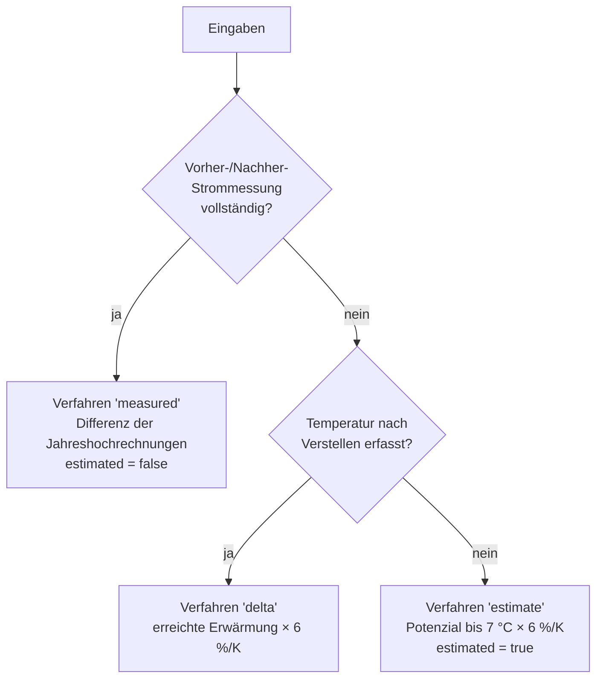

> **Abbildung 14:** Priorisierung der Ermittlungsverfahren beim Kühlschrank-Check.
> Dasselbe Muster – belastbarste verfügbare Methode gewinnt – findet sich beim
> Gefrierschrank-Check wieder (Leitprinzip P5).

**Verfahren „measured".** Liegt eine vollständige Messung vor (kWh und Laufzeit jeweils
vor und nach der Anpassung), wird die Ersparnis direkt aus den Messwerten berechnet. Die
Hilfsfunktionen dafür liegen in `energyMeter.ts`:

```typescript
/** Mittlere Leistung in Watt aus aufsummierten kWh über `hours` Stunden. */
export function avgWatts(kWh: number, hours: number): number {
  if (!Number.isFinite(kWh) || !Number.isFinite(hours) || hours <= 0 || kWh < 0) return 0
  return (kWh * 1000) / hours
}

/** Jahresverbrauch (kWh) direkt aus einer Mess-Periode. */
export function annualKwhFromPeriod(kWh: number, hours: number): number {
  return annualKwhFromW(avgWatts(kWh, hours))
}
```

> **Listing 12:** Hochrechnung aus einer Messperiode. Der Modulkommentar begründet den
> Ansatz: Kühlgeräte takten (der Kompressor schaltet ein und aus), weshalb eine
> momentane Watt-Anzeige unbrauchbar ist. Belastbar ist nur die über eine Periode
> aufsummierte Energie.

$$S_{\text{a}} = \left[E_{\text{a}}(\text{vorher}) - E_{\text{a}}(\text{nachher})\right] \cdot \frac{c_{\text{Arbeit}}}{100}$$

**Verfahren „delta".** Wurde die Stufe verstellt und erneut gemessen, ergibt sich die
Ersparnis aus der erreichten Erwärmung:

$$S_{\text{a}} = E_{\text{Basis}} \cdot 0{,}06 \cdot \max(0,\ T_{\text{nachher}} - T_{\text{vorher}}) \cdot \frac{c_{\text{Arbeit}}}{100}$$

**Verfahren „estimate".** Ohne Anpassung wird das theoretische Potenzial bis zur
Empfehlungstemperatur von 7 °C ausgewiesen:

$$S_{\text{a}} = E_{\text{Basis}} \cdot 0{,}06 \cdot \max(0,\ 7\,^\circ\text{C} - T_{\text{ist}}) \cdot \frac{c_{\text{Arbeit}}}{100}$$

Als Basisverbrauch $E_{\text{Basis}}$ dient der Jahresverbrauch laut Energielabel, falls
der Nutzer ihn eingibt, andernfalls ein Ersatzwert von 150 kWh (modernes Gerät). Der
Code weist explizit darauf hin, dass reale Werte von etwa 100 kWh (Effizienzklasse A)
bis 400 kWh (Altgerät) reichen – weshalb die Labeleingabe angeboten wird.

### Bewertung und Status

| Innentemperatur | Bewertung | Status |
| --- | --- | --- |
| < 3 °C | `high` | zu kalt |
| 3 – 4,9 °C | `medium` | zu kalt |
| 5 – 7 °C | `good` | optimal |
| 7,1 – 8 °C | `medium` | zu warm |
| > 8 °C | `high` | zu warm |

> **Tabelle 21:** Bewertung und Status des Kühlschrank-Checks. Die Trennung zwischen
> Bewertung und Status ist notwendig, weil „zu kalt" und „zu warm" beide schlecht sind,
> aber gegenläufige Empfehlungen erfordern.

Der Statusbegriff steuert die Handlungsempfehlung: „Wärmer einstellen" bei zu kalt,
„Kälter einstellen" bei zu warm – letzteres begründet mit Lebensmittelsicherheit, nicht
mit Energie.

---

## 7.9 Gefrierschrank-Check

### Fragestellung

Eine Eisschicht wirkt als Wärmedämmung zwischen Verdampfer und Gefriergut und zwingt das
Gerät zu längeren Laufzeiten. Die Literatur nennt für etwa 1 cm Eis einen Mehrverbrauch
von 10–15 %, für starke, lange nicht abgetaute Vereisung bis zu 50 % [Q4].

### Durchführung

Der Check beginnt mit einer einzigen Ja/Nein-Frage: Ist das Gerät vereist? Lautet die
Antwort nein, ist der Check nach einem Schritt beendet – mit der positiven Rückmeldung
„Top – eisfrei läuft die Truhe effizient, nichts weiter zu tun." Dieser
Kurzschluss ist bewusst gestaltet: Die häufigste Antwort soll den geringsten Aufwand
verursachen.

Bei Vereisung folgen die Einschätzung des Grades sowie optional eine
Vorher-/Nachher-Strommessung um das Abtauen herum und eine Temperaturmessung.

### Rechenmodell

Ohne Strommessung wird über den Vereisungsgrad geschätzt:

| Vereisungsgrad | Mehrverbrauch | Bewertung |
| --- | ---: | --- |
| eisfrei | 0 % | `good` |
| leicht (bis ca. 1 cm) | 12 % | `medium` |
| stark (dick) | 30 % | `high` |

> **Tabelle 22:** Angesetzter Mehrverbrauch je Vereisungsgrad.

$$S_{\text{a}} = E_{\text{Basis}} \cdot f_{\text{Eis}} \cdot \frac{c_{\text{Arbeit}}}{100}$$

Mit Strommessung gilt derselbe Ansatz wie beim Kühlschrank – die Differenz der
Jahreshochrechnungen vor und nach dem Abtauen. Der Ersatz-Jahresverbrauch beträgt hier
200 kWh; auch hier kann der Labelwert eingegeben werden.

### Temperaturbewertung

Zusätzlich und unabhängig vom Vereisungsgrad wird die Innentemperatur eingeordnet:

| Temperatur | Status |
| --- | --- |
| > −16 °C | zu warm |
| −16 bis −20 °C | optimal (Zielwert −18 °C) |
| < −20 °C | zu kalt – wärmer stellen spart Strom |

> **Tabelle 23:** Temperaturbewertung des Gefrierschrank-Checks.

### Hauptmesswert

Der Hauptmesswert dieser Messung sind die vermeidbaren Jahreskosten in Euro – nicht die
Temperatur und nicht der Vereisungsgrad. Bei einem eisfreien Gerät ist er null, und die
Ergebnisseite zeigt schlicht „Alles gut".

---

## 7.10 Zusammenfassung aller Rechenmodelle

Die folgende Tabelle fasst die zentralen Formeln, Konstanten und Bewertungsschwellen
aller neun Messungen zusammen. Sie eignet sich als Anhangstabelle oder als
Doppelseite im Hauptteil.

| Messung | Hauptmesswert | Kernformel | Bewertungsschwellen | Zentrale Konstanten |
| --- | --- | --- | --- | --- |
| Duschkopf | Volumenstrom [L/min] | $\dot V = \frac{V}{t}\cdot 60$; $E_a = \frac{\dot V \cdot t_{Du} \cdot 27 \cdot 1{,}163}{1000}$ | ≤9 / ≤12 / >12 | 1 Dusche·P⁻¹·d⁻¹, 5 min, ΔT = 27 K, 1,163 Wh/(L·K), Referenz 8 L/min |
| Warmwasser-Wartezeit | Wartezeit [s] | $V_a = \frac{t}{60}\dot V_{St} \cdot n_d \cdot 365$ | ≤15 / ≤30 / ≤60 / >60 s | Dusche 9 L/min·1,5 d⁻¹; Wanne 12·0,3; Küche 6·4; Becken 5·5 |
| Raumklima | Temperatur [°C] | $S = K_{Heiz} (1{-}0{,}15) \frac{A_R}{A_{ges}} \cdot 0{,}06 \Delta T$ | 20–22 opt.; 17/25 extrem; 40–60 % rF | Ziel 20 °C, 6 %/K, WW-Anteil 15 %, Datenspanne ≥300 d |
| Möbelabstand | Anzahl Befunde | $\text{score} = \sum a_i,\ a_i \in \{0,1,2\}$ | 0 / 1 / 2–3 / ≥4 | zwei Fragen je Übergabeart |
| Beleuchtung | Einsparung [€/a] | $E_a = \frac{\sum n_i \Delta P_i \cdot t_d \cdot 365}{1000}$ | 0 / <8 / <25 / ≥25 € | 52 W / 35 W / 30 W je Lampentyp |
| Grundlast | Leistung [W] | $P = \frac{\Delta E \cdot 1000}{\Delta t}$ bzw. $P = \frac{n_U/k \cdot 1000}{\Delta t}$ | ≤70 / ≤150 / ≤250 / >250 W | 8.760 h/a; kein Beitrag zum Sparpotenzial |
| Standby | Jahreskosten [€/a] | $E_a = \frac{P_{ges}\cdot 8760}{1000}$ | ≤5 / ≤20 / >20 W | vollständig vermeidbar ab `medium` |
| Kühlschrank | Temperatur [°C] | $S = E_{Basis}\cdot 0{,}06\cdot \Delta T \cdot \frac{c}{100}$ | 5–7 °C opt.; <3/>8 °C kritisch | 6 %/K, Referenz 7 °C, Ersatzwert 150 kWh/a |
| Gefrierschrank | vermeidbare Kosten [€/a] | $S = E_{Basis} \cdot f_{Eis} \cdot \frac{c}{100}$ | eisfrei / leicht / stark | 12 % / 30 %, Ersatzwert 200 kWh/a, Ziel −18 °C |

> **Tabelle 24:** Zusammenfassung der Rechenmodelle. $c$ bezeichnet den Arbeitspreis in
> ct/kWh, $E_{Basis}$ den angesetzten Jahresverbrauch des Geräts.

## 7.11 Methodische Einordnung und Genauigkeitsgrenzen

Die dargestellten Modelle sind bewusste Vereinfachungen. Eine kritische Einordnung
gehört zur wissenschaftlichen Redlichkeit und ist zugleich Teil des Produktentwurfs –
die Anwendung selbst kommuniziert ihre Unsicherheit an mehreren Stellen.

### Drei Quellen von Unsicherheit

**1. Messunsicherheit.** Die Erfassung erfolgt durch Laien mit ungeeichten
Hilfsmitteln. Beim Duschkopf-Test etwa führen Reaktionszeiten beim Starten und Stoppen
zu einem Fehler von etwa ±0,5 s, was bei einer Messdauer von 30 s bereits ±1,7 %
ausmacht. Die App begegnet dem durch die Empfehlung, mehrfach zu messen und den
Mittelwert zu bilden.

**2. Modellunsicherheit.** Die Faustregel „6 % je Kelvin" ist ein über viele Gebäude
gemittelter Wert; im Einzelfall hängt die Wirkung von Dämmstandard, Lüftungsverhalten
und Außentemperatur ab. Analog sind die angesetzten Nutzungsgrade und Heizwerte
Typwerte.

**3. Nutzungsunsicherheit.** Die größte Unsicherheit liegt in den Verhaltensannahmen:
Duschhäufigkeit, Brenndauer der Beleuchtung, tatsächliche Standby-Zeiten. Diese
Parameter werden teils erfragt (Brenndauer), teils pauschaliert (Duschhäufigkeit).

### Wie die Anwendung damit umgeht

Vier Mechanismen adressieren diese Unsicherheiten:

**Kennzeichnung.** Nahezu jede Auswertungsfunktion liefert ein `estimated`-Flag oder ein
`method`-Feld. Die Oberfläche zeigt entsprechende Werte mit dem Zusatz „geschätzt" und
nennt in einer Fußzeile das verwendete Verfahren („Aus deiner Strommessung
vorher/nachher" versus „Potenzial bis 7 °C – noch nicht angepasst").

**Angebot besserer Verfahren.** Wo eine genauere Messung möglich ist, wird sie angeboten
und automatisch bevorzugt (Leitprinzip P5).

**Spannen statt Punktwerte.** Die Empfehlungsseite zeigt Einsparungen als auf
5-€-Schritte gerundete Spanne. Der Codekommentar begründet dies unmissverständlich: Eine
centgenaue Zahl würde eine Genauigkeit vortäuschen, die es nicht gibt.

**Verzicht auf nicht belegbare Zahlen.** Wo eine Bezifferung methodisch nicht tragfähig
wäre, unterbleibt sie – beim Möbel-Abstands-Check ebenso wie bei der
Effizienzeinordnung der Gebäudehülle, die bewusst keine absolute Kennzahl ausgibt.

### Belastbarkeit des Gesamtergebnisses

Aus diesen Überlegungen folgt eine differenzierte Bewertung der Aussagekraft:

| Aussage | Belastbarkeit | Begründung |
| --- | --- | --- |
| Volumenstrom des Duschkopfs | **hoch** | direkte physikalische Messung |
| Elektrische Grundlast | **hoch** | direkte Messung am geeichten Zähler |
| Standby-Leistung je Gerät | **hoch** | direkte Messung |
| Raum- und Gerätetemperaturen | **hoch** | direkte Messung |
| Rangfolge der Maßnahmen | **hoch** | Fehler wirken gleichgerichtet und heben sich im Vergleich weitgehend auf |
| Größenordnung der Einsparung | **mittel** | Modell- und Nutzungsannahmen |
| Absoluter Euro-Betrag je Maßnahme | **niedrig bis mittel** | abhängig von Verhaltensannahmen und Tarif |
| CO₂-Abschätzung | **niedrig** | zusätzlicher Umweg über den Strompreis |

> **Tabelle 25:** Differenzierte Einordnung der Aussagekraft. Die für den Nutzen
> entscheidende Aussage – *welche Maßnahme lohnt sich zuerst* – ist deutlich robuster
> als der absolute Betrag, weil systematische Fehler die Rangfolge weniger beeinflussen
> als den Einzelwert.

Diese letzte Beobachtung rechtfertigt den gesamten Ansatz: Der Nutzer benötigt keine
exakte Prognose, sondern eine verlässliche Priorisierung. Genau diese liefert die
Anwendung.

---
# 8 Energie-Monitoring

Während die Messungen einen Zeitpunkt betrachten, verfolgt das Monitoring den Verbrauch
über die Zeit. Beides ergänzt sich: Die Messungen sagen, *wo* Energie verloren geht;
das Monitoring zeigt, *ob* eine Maßnahme gewirkt hat. Darüber hinaus liefert es die
Datengrundlage für die einzige messungsseitige Kostenrechnung, die auf echten
Verbrauchsdaten beruht (Raumklima-Check, Abschnitt 7.3).

## 8.1 Datenmodell und Energieträger

Die Anwendung unterstützt acht Energieträger. Welche davon sichtbar sind, ergibt sich
automatisch aus dem Profil.

| Energieträger | Einheit | Kostenfähig | Standard-Arbeitspreis | Aktiv, wenn |
| --- | --- | :---: | ---: | --- |
| Strom | kWh | ✓ | 35 ct/kWh | immer |
| Wasser | m³ | – | 4,50 €/m³ | immer |
| Gas | m³ | – | 1,20 €/m³ | Gasheizung im Profil |
| Heizöl | l | – | 1,10 €/l | Ölheizung im Profil |
| Pellets | kg | – | 0,35 €/kg | Pelletheizung im Profil |
| Wärmepumpe | kWh | ✓ | 30 ct/kWh | Wärmepumpe im Profil |
| Photovoltaik | kWh | – | – | `hasPV = 'yes'` |
| Solarthermie | kWh | – | – | Solarthermie im Profil |

> **Tabelle 26:** Unterstützte Energieträger. Die Spalte „Kostenfähig" kennzeichnet,
> ob eine unmittelbare Kostenumrechnung in der Übersicht erfolgt; für PV und
> Solarthermie ist ein Verbrauchspreis fachlich nicht sinnvoll, da es sich um Erzeugung
> handelt.

Die Ableitung erfolgt in `activeEnergyTypes()`: Strom und Wasser sind stets aktiv,
Wärmeerzeuger werden über eine Abbildungstabelle auf Träger übersetzt, Photovoltaik
kommt bei entsprechender Profilangabe hinzu. Das Ergebnis ist nach einer festen
Anzeigereihenfolge sortiert und duplikatfrei.

Eine einzelne Ablesung besteht aus vier Feldern:

```typescript
export interface MeterReading {
  id: string          // eindeutige Kennung (crypto.randomUUID mit Rückfallebene)
  date: string        // ISO-Datum yyyy-mm-dd
  value: number       // abgelesener Zählerstand
  createdAt?: string  // Erfassungszeitpunkt, unterscheidet Ablesungen am selben Tag
}
```

> **Listing 13:** Datenstruktur einer Ablesung. Das Feld `createdAt` löst ein
> praktisches Problem: Werden zwei Ablesungen für denselben Tag nachgetragen, wäre
> ihre Reihenfolge sonst undefiniert.

Die Trennung von Preis- und Anzeigedaten ist bemerkenswert: `energyConfig.ts` hält
Icon, Einheit und Akzentfarbe, `priceConfig.ts` dagegen Preiseinheit, Umrechnungsfaktor
und Standardwerte. Der Grund ist eine Abhängigkeitsvermeidung – der Tarif-Store benötigt
die Preisdaten, soll aber keine Icon-Bibliothek importieren müssen.

## 8.2 Preisverwaltung

Der Tarif-Store führt Strom aus Kompatibilitätsgründen in eigenen Feldern
(`electricityWorkPrice`, `electricityBasePrice`), alle übrigen Träger in einer
generischen Abbildung. Die Auflösungsfunktion vereinheitlicht den Zugriff:

```typescript
export function resolvePrice(s: TariffState, type: EnergyType): PriceEntry {
  const meta = PRICE_META[type]
  if (!meta) return { work: 0, base: 0, custom: false }
  if (type === 'electricity') {
    return { work: s.electricityWorkPrice, base: s.electricityBasePrice, custom: s.isCustom }
  }
  const p = s.prices[type]
  return p ?? { work: meta.defaultWork, base: meta.defaultBase, custom: false }
}
```

> **Listing 14:** Auflösung des effektiven Preises. Das Feld `custom` gibt an, ob der
> Wert vom Nutzer stammt – es entscheidet darüber, ob abgeleitete Kosten als geschätzt
> gekennzeichnet werden.

## 8.3 Berechnungen

Sämtliche Auswertungen basieren auf **Verbrauchsabschnitten** zwischen je zwei
aufeinanderfolgenden Ablesungen.

```typescript
export function consumptionSegments(readings: MeterReading[]): ConsumptionSegment[] {
  const sorted = sortByDate(readings)
  const segments: ConsumptionSegment[] = []
  for (let i = 1; i < sorted.length; i++) {
    const days = daysBetween(sorted[i - 1].date, sorted[i].date)
    const kwh = sorted[i].value - sorted[i - 1].value
    // Abschnitte mit ≤ 0 Tagen oder negativem Verbrauch überspringen
    // (Zählerwechsel, Tippfehler).
    if (days <= 0 || kwh < 0 || !Number.isFinite(kwh)) continue
    segments.push({ from: sorted[i - 1].date, to: sorted[i].date, days, kwh })
  }
  return segments
}
```

> **Listing 15:** Bildung der Verbrauchsabschnitte. Die Filterung negativer Differenzen
> ist praktisch bedeutsam: Ein Zählerwechsel oder ein Tippfehler würde sonst einen
> unsinnigen Negativverbrauch erzeugen und die Hochrechnung verfälschen.

Auf dieser Grundlage entstehen vier Kennzahlen:

$$\dot{E}_{\text{Tag}} = \frac{E_{\text{Abschnitt}}}{d_{\text{Abschnitt}}}, \qquad E_{\text{Jahr}} = \dot{E}_{\text{Tag}} \cdot 365$$

$$K_{\text{Abschnitt}} = E_{\text{Abschnitt}} \cdot c_{€/\text{Einheit}}, \qquad K_{\text{Jahr}} = E_{\text{Jahr}} \cdot c_{€/\text{Einheit}}$$

Der **Trend** vergleicht den Tagesverbrauch des letzten mit dem des vorletzten
Abschnitts:

$$\Delta_{\text{rel}} = \frac{\dot{E}_{\text{Tag,letzt}} - \dot{E}_{\text{Tag,vor}}}{\dot{E}_{\text{Tag,vor}}}$$

Beträge unter 3 % gelten als unverändert – eine Totzone, die verhindert, dass
Messrauschen als Trend interpretiert wird. In der Darstellung ist ein sinkender
Verbrauch grün eingefärbt: Anders als bei Finanzkennzahlen ist hier „nach unten" das
gute Vorzeichen.

## 8.4 Widget-Board

Die Monitoring-Übersicht besteht aus frei anordenbaren Kacheln: einem großen
Hero-Widget an Position 0 und einem Raster darunter. Jede Kachel zeigt den aktuellen
Zählerstand, eine Miniaturkurve (Sparkline) und den Trend; ein Antippen öffnet die
Detailseite.

Die Reihenfolge lässt sich durch Gedrückthalten und Ziehen ändern und wird **pro
Wohnprofil** gespeichert – der `widgetOrderStore` gehört daher zu den synchronisierten
Stores. Die Zusammenführung von gespeicherter Reihenfolge und aktuell aktiven Trägern
ist robust gestaltet: Bekannte Typen erscheinen in der gewählten Reihenfolge, neu
hinzugekommene Energieträger hängen automatisch hinten an, entfernte fallen weg.

Im Leerzustand zeigt das Board eine als „Beispiel" gekennzeichnete Geistervorschau mit
einem monoton steigenden Verlauf – der Nutzer sieht also sofort, wie die Kachel mit
Daten aussehen wird.

> **Abbildung 15:** Screenshot des Widget-Boards mit Hero-Widget (Strom) und
> Kachelraster (Wasser, Gas), jeweils mit Sparkline und Trendabzeichen.

## 8.5 Erfassung von Zählerständen

Die Erfassung ist der kritische Punkt jedes Monitoring-Systems: Ist sie umständlich,
bleibt sie aus. Die Anwendung bietet daher drei Wege an.

### 8.5.1 Zählwerk-Eingabe (Odometer)

Statt eines Zahlenfeldes wird ein Zählwerk aus einzelnen Ziffernrollen dargestellt, das
die Optik eines mechanischen Zählers aufgreift. Jede Ziffer lässt sich über Pfeile
(mit Übertrag auf die nächsthöhere Stelle), durch vertikales Ziehen oder über die
Tastatur ändern. Die zugehörigen Hilfsfunktionen liegen bewusst in einer eigenen Datei
`odometer.ts`, damit die Komponentendatei ausschließlich Komponenten exportiert – eine
Voraussetzung für das Hot-Module-Replacement von Vite.

### 8.5.2 Kamera-Erfassung

Der Scanner ist ein vollflächiges Overlay mit Live-Kamerabild und einem flachen,
breiten Erfassungsrahmen (90 % der Videobreite, Seitenverhältnis 5:1), der exakt auf
eine Ziffernzeile zugeschnitten ist. Wo das Gerät es unterstützt, kann die
Taschenlampe zugeschaltet werden; auf iOS-Safari, das diese Fähigkeit nicht meldet,
bleibt der Schalter aus, statt einen wirkungslosen Knopf anzuzeigen.

Der Ablauf nach dem Auslösen:

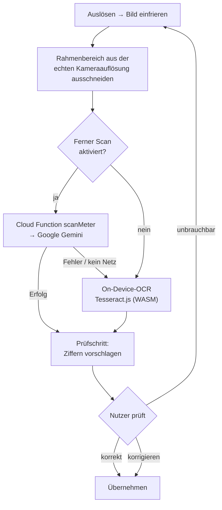

> **Abbildung 16:** Ablauf der Kamera-Erfassung mit zweistufiger Erkennung und
> obligatorischem Prüfschritt.

Drei Entwurfsentscheidungen sind hervorzuheben.

**Die Erkennung ist ein Vorschlag, kein Ergebnis.** Der Nutzer bestätigt oder korrigiert
jeden erkannten Wert. Liegt die Konfidenz unter 75 oder wurden keine Ziffern erkannt,
warnt die Oberfläche zusätzlich deutlich. Der zuletzt bekannte Zählerstand wird im
Prüfschritt als Referenz eingeblendet.

**Die geräteinterne OCR ist die Rückfallebene, nicht der Hauptweg.** Zählwerke sind für
OCR schwierig – helle Ziffern auf dunklem Grund, mechanische Rollen zwischen zwei
Stellungen, Spiegelungen auf der Abdeckung. Die Implementierung in `ocr.ts` begegnet dem
mit einer eigenen Vorverarbeitung: Der Ausschnitt wird auf eine Zielhöhe von 160 px
hochskaliert, in Graustufen gewandelt und einer **Perzentil-Kontrastspreizung** (3 % bis
97 %) unterzogen, die gegenüber einer einfachen Min-Max-Normierung deutlich robuster
gegen Glanzlichter und Schatten ist. Tesseract wird auf eine einzelne Zeile und
ausschließlich Ziffern beschränkt; aus dem Ergebnis wird die längste zusammenhängende
Ziffernfolge extrahiert, um Streuziffern am Rand zu verwerfen.

```typescript
// Perzentil-Grenzen (3 %/97 %) für den Kontrast-Stretch bestimmen.
const total = canvas.width * canvas.height
const loCount = total * 0.03
const hiCount = total * 0.97
let acc = 0, lo = 0, hi = 255
for (let v = 0; v < 256; v++) {
  acc += hist[v]
  if (acc <= loCount) lo = v
  if (acc <= hiCount) hi = v
}
const range = Math.max(1, hi - lo)
for (let i = 0; i < d.length; i += 4) {
  const v = Math.max(0, Math.min(255, ((d[i] - lo) / range) * 255))
  d[i] = d[i + 1] = d[i + 2] = v
}
```

> **Listing 16:** Perzentilbasierte Kontrastspreizung in der OCR-Vorverarbeitung.

**Der KI-gestützte Scan läuft serverseitig.** Ein multimodales Sprachmodell bewältigt
die Zählwerkerkennung deutlich besser als klassische OCR, erfordert aber einen
API-Schlüssel, der nicht in die öffentliche Webanwendung gehört. Die Cloud Function
`scanMeter` kapselt den Aufruf.

Die Aufgabenstellung an das Modell ist eng geführt und adressiert genau die
Fehlerquellen realer Zählerfotos:

- Es sollen **zwei** Werte zurückgegeben werden: die schwarzen Vorkommastellen und –
  getrennt davon – ausschließlich die **erste** rote Nachkommastelle.
- Typenschild, Serien- und Modellnummern (Beispiele werden genannt), Einheiten und
  sonstiger Text sind ausdrücklich zu ignorieren.
- Bei Unsicherheit ist ein leerer Wert zurückzugeben, statt zu raten.
- Der zuletzt bekannte Stand wird als grober Plausibilitätshinweis mitgegeben, jedoch
  mit der ausdrücklichen Anweisung, ihn nicht einfach zu übernehmen.

Technisch wird ein erzwungenes JSON-Antwortschema mit `temperature: 0` verwendet. Die
Nachbereitung entfernt führende Nullen (unter Erhalt mindestens einer Ziffer) und fügt
die Nachkommastelle mit deutschem Dezimalkomma an: `07356,453` wird zu `7356,4`.

### 8.5.3 Ableseerinnerungen

Die Erinnerungsfrequenz ist wählbar (aus, wöchentlich, monatlich). Aus der letzten
Ablesung und der Frequenz ergibt sich ein Fälligkeitsdatum; überfällige Energieträger
werden auf der Übersicht hervorgehoben. Die Umsetzung ist bewusst schlicht gehalten –
es handelt sich um eine In-App-Anzeige, nicht um eine Systembenachrichtigung, die eine
Push-Infrastruktur erfordern würde.

## 8.6 Verlaufsdiagramm

Die Detailseite eines Energieträgers zeigt den absoluten Zählerstand als Liniendiagramm.
Es ist als reines SVG ohne Diagrammbibliothek implementiert, was das Bundle klein hält
und die vollständige Kontrolle über die Themenanpassung erlaubt.

Zwei Eigenschaften heben es von einer Standardlösung ab:

**Zeitproportionale x-Achse.** Punkte sitzen entsprechend ihrem tatsächlichen zeitlichen
Abstand, nicht in gleichmäßigen Schritten je Ablesung. Eine dreimonatige Lücke erzeugt
also auch einen dreimal so großen horizontalen Abstand – die Kurvenneigung entspricht
damit tatsächlich dem Tagesverbrauch.

**Scrubber.** Nach dem Vorbild der Apple-Wetter-App wählt Tippen oder Ziehen auf dem
Graphen den nächstgelegenen Messpunkt; eine mitlaufende Blase zeigt Datum und Wert.
Die Bedienung ist per Maus, Berührung und Tastatur (Pfeiltasten) möglich.

> **Abbildung 17:** Screenshot der Zähler-Detailseite mit Verlaufsdiagramm,
> aktivem Scrubber und Historienliste.

---

# 9 Berichtserzeugung

## 9.1 Berichtstypen und Konfiguration

Der Berichtsbereich bietet drei Typen an, die jeweils in zwei Ausführlichkeitsstufen
und mit wählbaren Inhalten erzeugt werden können.

| Typ | Inhalt |
| --- | --- |
| **Messungen** | Fortschritt, Ergebnisse nach Gewerk, Sparpotenzial, Empfehlungen, offene Messungen |
| **Monitoring** | Kennzahlen, Verlaufsdiagramme, Vergleich zur Vorperiode, Ablesehistorie |
| **Gesamt** | Profilkopf plus beide Abschnitte |

> **Tabelle 27:** Die drei Berichtstypen.

Der In-Page-Konfigurator erlaubt die Auswahl von Variante (kurz/lang), Inhaltsblöcken,
Zeitraum (7, 30, 90 Tage oder alle) sowie eine Filterung nach Energieträgern und
Gewerken. Die Voreinstellungen hängen von der Variante ab:

```typescript
export function defaultContentOptions(variant: ReportVariant): ReportContentOptions {
  const long = variant === 'long'
  return {
    charts: true, kpis: true, comparison: true,
    history: long,        // Ablesehistorie nur in der Langfassung
    savings: true,
    tips: long,           // Empfehlungen nur in der Langfassung
    openMeasurements: long,
  }
}
```

> **Listing 17:** Vorbelegung der Inhaltsoptionen je Variante.

## 9.2 Datenaufbereitung

Die Aufbereitung ist strikt von der Ausgabe getrennt: Zwei Module
(`measurementsReportData.ts`, `monitoringReportData.ts`) liefern reine Datenobjekte,
die von den Generatoren nur noch formatiert werden. Beide Funktionen sind
seiteneffektfrei und leersicher.

Eine fachliche Feinheit betrifft raumbezogene Messungen mit Sparwert. Der
Beleuchtungs-Check liefert je Raum ein eigenes Ergebnis; für den Bericht müssen diese
Werte summiert werden:

```typescript
function sumSavingsForMeasurement(results, id: string): number {
  let total = 0
  const prefix = `${id}@`
  for (const [key, value] of Object.entries(results)) {
    if (!value) continue
    if (key === id || key.startsWith(prefix)) total += readSaving(value.details) ?? 0
  }
  return total
}
```

> **Listing 18:** Summierung des Sparpotenzials über alle Rauminstanzen einer Messung.

Zusätzlich wird bei Pro-Raum-Messungen mit Sparwert nicht der Einzelmesswert eines
beliebigen Raums als Hauptwert angezeigt, sondern die Summe über alle Räume – sonst
stünde im Bericht ein wenig aussagekräftiger Einzelwert.

Für die Monitoring-Auswertung wird zusätzlich ein **Vorperiodenvergleich** gebildet:
Zum gewählten Zeitfenster wird ein gleich langes Fenster unmittelbar davor
ausgewertet und die relative Änderung berechnet.

## 9.3 Das PDF-Design-Kit

Die PDF-Erzeugung erfolgt vollständig clientseitig mit jsPDF. Da die Bibliothek nur
elementare Zeichenoperationen bietet, wurde ein eigenes Design-Kit (`pdfKit.ts`)
entwickelt, das Cursorverwaltung, Seitenumbruch und grafische Bausteine kapselt.

| Baustein | Funktion |
| --- | --- |
| `headerBand()` | Kopfbereich mit vektorisiertem Logo, Titel, Untertitel, Datum, Trennlinie |
| `kpiRow()` | Reihe von Kennzahl-Kacheln |
| `lineChart()` | Vektor-Liniendiagramm |
| `barChart()` | Vektor-Balkendiagramm |
| `kvTable()` | Schlüssel-Wert-Tabelle |
| `trendBadge()` | Trendabzeichen mit Pfeil und Prozentangabe |
| `ensure(n)` | Seitenumbruch, falls `n` Punkte nicht mehr passen |
| `finalizeFooters()` | Seitenzahlen und Fußnote nachträglich auf allen Seiten |

> **Tabelle 28:** Bausteine des PDF-Design-Kits. Alle Maße in Punkt auf A4
> (595,28 × 841,89 pt).

Zwei Details verdienen Erwähnung.

**Das Logo wird vektoriell gezeichnet**, nicht als Bild eingebettet: Drei
Parallelogramme in einem Treppenmuster, definiert über Anteile einer Bezugsbox. Damit
bleibt es bei jeder Auflösung scharf und die Dateigröße klein.

**Zeichensatznormalisierung.** Der jsPDF-Standardfont Helvetica unterstützt nur Latin-1.
Deutsche Texte enthalten jedoch regelmäßig Zeichen außerhalb dieses Bereichs –
typografische Anführungszeichen, Gedankenstriche, Pfeile und insbesondere die
tiefgestellte Zwei in „CO₂". Ohne Behandlung erschienen diese als leere Kästchen. Die
Funktion `toLatin1()` ersetzt sie systematisch:

```typescript
export function toLatin1(input: string): string {
  const SUBSCRIPTS = '₀₁₂₃₄₅₆₇₈₉'
  return input
    .replace(/[₀-₉]/g, (ch) => String(SUBSCRIPTS.indexOf(ch)))
    .replace(/[→➜➔]/g, '->').replace(/[↑]/g, '+').replace(/[↓]/g, '-')
    .replace(/[•·]/g, '-').replace(/[„""‟]/g, '"').replace(/[''‚]/g, "'")
    .replace(/[–—]/g, '-').replace(/[…]/g, '...')
    .replace(/[      ]/g, ' ')
}
```

> **Listing 19:** Normalisierung auf den Latin-1-Zeichenvorrat. Die Alternative – einen
> Unicode-Font einzubetten – hätte das Bundle um mehrere hundert Kilobyte vergrößert.

Die Farbpalette des Kits spiegelt bewusst die Bewertungsfarben der Anwendung, sodass
ein Ergebnis im PDF dieselbe Farbe trägt wie auf dem Bildschirm.

## 9.4 Wiederverwendung im Gesamtbericht

Die Generatoren sind so geschnitten, dass der Gesamtbericht die beiden Einzelabschnitte
wiederverwendet. Sowohl `fillMeasurements()` als auch `fillMonitoring()` nehmen ein
bestehendes Kit entgegen und besitzen einen Parameter `withHeader`, mit dem der eigene
Kopfbereich unterdrückt wird:

```typescript
export function generateGesamtPdf(args: GenerateGesamtArgs): void {
  const kit = new PdfKit()
  kit.headerBand({ /* … Gesamtkopf … */ })
  writeProfileHead(kit, t, language, profile)
  kit.gap(8)
  fillMeasurements(kit, { variant, options, t, language, data: measurements }, false)
  kit.gap(10)
  fillMonitoring(kit, { variant, options, t, language, data: monitoring }, false)
  kit.finalizeFooters(/* … */)
  kit.save(`E-App-…-${todayIso()}.pdf`)
}
```

> **Listing 20:** Zusammensetzung des Gesamtberichts aus den beiden Teilabschnitten.
> Der Ansatz vermeidet eine dritte, redundante Implementierung.

> **Abbildung 18:** Beispielseiten des erzeugten PDF-Berichts – Kopfbereich mit
> Kennzahl-Kacheln, Ergebnistabelle nach Gewerken und Verlaufsdiagramm.

---

# 10 Wissensbereich

## 10.1 Struktur

Der Wissensbereich ist zweistufig organisiert. Die oberste Ebene unterscheidet
**allgemeines Energiewissen** von **HTW-GEIT-Studieninhalten**; darunter liegen die
jeweiligen Themen als horizontal scrollbare Auswahl.

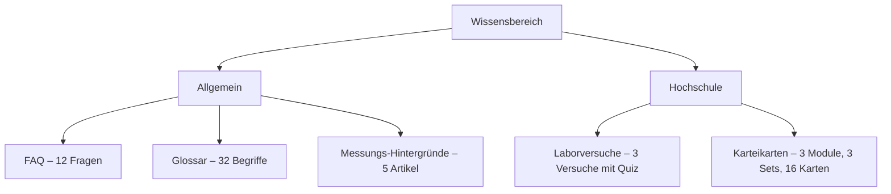

> **Abbildung 19:** Zweistufige Gliederung des Wissensbereichs.

Die fachlichen Inhalte liegen bewusst **nicht** in den Übersetzungsdateien, sondern als
deutschsprachige Datenstrukturen in `educationContent.ts` und `flashcardsContent.ts`.
Nur die Bedienelemente – Schaltflächen, Überschriften, Beschriftungen – werden
übersetzt. Die Begründung ist im Dateikopf vermerkt: Fachtexte sind kein
Oberflächentext, sie werden inhaltlich gepflegt und nicht schlicht übersetzt.

## 10.2 FAQ, Glossar und Messungs-Hintergründe

Die **FAQ** umfasst zwölf Fragen, von denen drei als „beliebt" markiert sind und
hervorgehoben erscheinen. Die Antworten sind ausformuliert und, wo sinnvoll, mit einer
anklickbaren Quelle versehen.

Das **Glossar** enthält 32 Begriffe von „Arbeitspreis" bis „Wärmedurchgangskoeffizient",
jeweils mit Definition und Quellenangabe. Eine Suchfunktion filtert die Liste.

Die **Messungs-Hintergründe** liefern zu fünf Messungen den fachlichen Kontext, der über
die Kurzanleitung im Messablauf hinausgeht.

Die Quellenangaben verweisen durchgängig auf die deutschsprachige Wikipedia. Der
Codekommentar begründet dies als bewusste Zwischenlösung: Es handele sich um allgemein
zugängliche, stabil verlinkbare Referenzen, die bei fachlicher Prüfung durch
Primärquellen (VDI, Umweltbundesamt) zu ersetzen seien. Diese Selbsteinschätzung ist
für eine wissenschaftliche Arbeit relevant und wird in Kapitel 15 aufgegriffen.

## 10.3 Laborvorbereitung

Für drei Laborversuche des Moduls „Labor Mechanische Gebäudetechnik" existieren
Vorbereitungseinheiten:

| Versuch | Schwierigkeit | Dauer | Fragen | Bestehensgrenze |
| --- | --- | ---: | ---: | ---: |
| Hydraulischer Abgleich | mittel | 5 min | 6 | 60 % |
| Pumpenprüfstand | schwer | 6 min | 6 | 60 % |
| Heizkörperprüfstand | mittel | 5 min | 6 | 60 % |

> **Tabelle 29:** Die drei Laborversuche mit Vorbereitungstest.

Jeder Versuch besteht aus einer Zielbeschreibung, einer Liste von
Vorbereitungspunkten und einem Multiple-Choice-Test. Die Vorbereitungspunkte des
Pumpenprüfstands illustrieren das fachliche Niveau:

- Pumpenkennlinie als Förderhöhe $H$ über Volumenstrom $\dot{V}$ verstehen
- Anlagenkennlinie als Widerstandsverlauf des Systems einordnen
- Betriebspunkt als Schnittpunkt beider Kennlinien erkennen
- Affinitätsgesetze anwenden: $\dot{V} \sim n$, $H \sim n^2$, $P \sim n^3$
- Wirkungsgrad relativ zum Bestpunkt beurteilen
- Kavitation und die Bedeutung des NPSH-Werts kennen

Der Test wertet nach dem Absenden jede Frage einzeln aus: Er markiert die gegebene und
die richtige Antwort und zeigt eine **Erklärung**, warum die richtige Antwort richtig
ist. Das Ergebnis wird im Fortschritts-Store gespeichert, wobei ein einmal bestandener
Test bestanden bleibt – ein späterer schlechterer Versuch überschreibt das Ergebnis
nicht:

```typescript
recordQuiz: (experimentId, record) => set((s) => {
  const prev = s.quizResults[experimentId]
  // Bestes Ergebnis behalten: ein einmal bestandener Test bleibt bestanden.
  const keepPrev = prev && prev.passed && !record.passed
  // …
})
```

> **Listing 21:** Speicherung des Quiz-Ergebnisses mit Bestwert-Logik.

Zusätzlich lässt sich ein PDF-Zertifikat mit Versuchsbezeichnung, optionalem Namen,
Datum, Punktzahl und Bestehensvermerk erzeugen. jsPDF wird hierfür **dynamisch
importiert**, damit die Bibliothek nicht im Hauptbundle landet – ein Muster, das auch
bei der OCR-Engine angewandt wird.

## 10.4 Karteikarten

Der Karteikartenbereich ist dreistufig aufgebaut: Fachsemester (1–6) → Module →
Kartensets. Aktuell sind drei Module mit je einem Set und insgesamt 16 Karten
hinterlegt.

| Modul | Semester | Set | Karten |
| --- | ---: | --- | ---: |
| Thermodynamik & Wärmeübertragung | 2 | Grundgrößen & Einheiten | 6 |
| Heizungstechnik & Hydraulik | 3 | Hydraulischer Abgleich | 5 |
| Strömungsmaschinen | 3 | Kreiselpumpen & Kennlinien | 5 |

> **Tabelle 30:** Vorhandene Karteikartensets.

Das Datenmodell ist als „Hybrid" ausgelegt: Vorder- und Rückseite können jeweils als
Bild und/oder als Text vorliegen. Die aktuellen Karten sind textbasiert und über das
Flag `FLASHCARDS_PLACEHOLDER = true` ausdrücklich als Beispiel gekennzeichnet – die
Struktur ist darauf ausgelegt, später gescannte Karten als Bilder aufzunehmen.

Ein Detail des Datenmodells ist bemerkenswert: Jede Karte trägt eine **stabile
Kennung**, die laut Kommentar niemals nachträglich geändert werden darf. Der Grund ist
vorausschauend – an diesen Kennungen soll später der Lernfortschritt eines
Wiederholungsalgorithmus hängen. Ergänzend führt jedes Set eine Inhaltsversion.

Der **Lernmodus** ist als ablenkungsfreies Vollbild-Overlay über der gesamten Anwendung
gestaltet: keine Kopfzeile, keine Navigation, nur die Karte. Antippen dreht sie mit
einer 3D-Animation um, Wischen oder Pfeiltasten blättern. Eine Selbstbewertung
(„Nochmal" / „Gut") und der eigentliche Wiederholungsalgorithmus sind laut Roadmap für
eine spätere Phase vorgesehen.

> **Abbildung 20:** Screenshot des Vollbild-Lernmodus mit umgedrehter Karte.

---

# 11 Personalisierte Empfehlungen

## 11.1 Konzept

Der Empfehlungsbereich beantwortet die Frage, die nach allen Messungen offenbleibt: *Was
soll ich jetzt konkret tun?* Er leitet aus Profil und Messergebnissen eine sortierte
Liste von Handlungen ab.

Der zentrale Entwurfsgedanke ist im Modulkommentar festgehalten: Es entsteht **ein Tipp
je Befund**, nicht pauschal einer je Messung. Ein zu warmer und ein zu kalter Raum, eine
hohe Luftfeuchte und eine spürbare Zugluft ergeben jeweils eine eigene, passende
Empfehlung – auch wenn sie alle aus derselben Messung stammen.

Die Empfehlungen selbst sind **zustandslos**: Sie werden bei jedem Aufruf neu aus den
aktuellen Daten abgeleitet. Gespeichert wird nur, was der Nutzer damit gemacht hat –
abgehakt („erledigt") oder ausgeblendet („nicht relevant"). Dieser Entwurf hat den
Vorteil, dass sich Empfehlungen automatisch aktualisieren, sobald eine Messung
wiederholt wird.

## 11.2 Ableitungsregeln

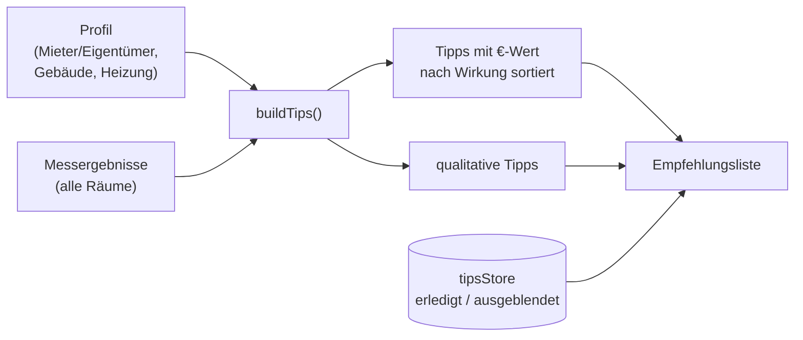

> **Abbildung 21:** Ableitung der Empfehlungen. Messbasierte Tipps mit beziffertem
> Nutzen stehen oben, qualitative folgen.

Die Regeln greifen auf mehreren Ebenen:

**Aus dem Sparpotenzial.** Liefert eine Messung einen Sparwert über null, entsteht ein
Tipp mit diesem Wert. Bei raumbezogenen Messungen werden die Werte über alle Räume
summiert.

**Aus konkreten Befunden.** Der Kühlschrank-Check erzeugt zwei verschiedene Tipps: Bei
unter 5 °C den Hinweis, wärmer einzustellen (mit Sparwert), bei über 7 °C den Hinweis,
kälter einzustellen (ohne Sparwert, begründet mit Lebensmittelsicherheit).

**Aus Detailwerten.** Der Standby-Tipp wird konkretisiert, indem aus der kodierten
Geräteliste der größte Einzelverbraucher ermittelt und im Text benannt wird.

**Aus der schlechtesten Bewertung.** Für Messungen ohne Sparwert – etwa die Grundlast –
wird die schlechteste Bewertung über alle Rauminstanzen herangezogen; nur bei einer
Bewertung schlechter als `good` entsteht ein Tipp.

**Persona-Gating.** Fest installierte Maßnahmen erscheinen nur für Eigentümer. Ein
Mieter erhält keine Empfehlung zur Fassadendämmung, sondern die im Rahmen seiner
Möglichkeiten umsetzbaren Maßnahmen.

## 11.3 Darstellung der Unsicherheit

Ein bemerkenswertes Detail der Darstellung ist die Behandlung der Euro-Beträge. Statt
eines Punktwerts zeigt die Empfehlungsliste eine auf 5-€-Schritte gerundete **Spanne**.
Der Codekommentar begründet dies ausdrücklich: Die zugrunde liegenden Werte seien selbst
nur Schätzungen; eine centgenaue Zahl würde eine Genauigkeit vortäuschen, die es nicht
gibt.

Damit ist das Leitprinzip P2 nicht nur in der Berechnung, sondern bis in die
Zahlenformatierung hinein umgesetzt.

Die Tipps sind zusätzlich nach Gewerk farbcodiert (Heizung, Strom, Wasser) und lassen
sich abhaken oder ausblenden; ausgeblendete Empfehlungen sind über einen eigenen
Bereich wiederherstellbar.

> **Abbildung 22:** Screenshot der Empfehlungsseite mit nach Wirkung sortierten Tipps,
> Sparspannen und Gewerke-Farbcodierung.

---
# 12 Mehrbenutzerbetrieb und Cloud-Synchronisation

## 12.1 Das Konzept der Wohnprofile

Die Anwendung ist nicht auf einen Nutzer und eine Wohnung beschränkt. Das Datenmodell
kennt drei Ebenen:

- Ein **Konto** (Firebase-Nutzer) kann mehrere **Wohnungen** besitzen.
- Eine **Wohnung** kann von mehreren Konten genutzt werden.
- Genau eine Wohnung ist zu einem Zeitpunkt **aktiv**; deren Daten liegen in den lokalen
  Stores und werden angezeigt.

Eine Wohnung ist technisch ein Firestore-Dokument, dessen Feld `state` einen
Schnappschuss von sieben Stores enthält (siehe Tabelle 2). Die Rollenverteilung kennt
zwei Stufen: `owner` (Ersteller, darf löschen, teilen, Mitglieder entfernen und
übertragen) und `editor` (darf alle Wohnungsdaten bearbeiten, aber die Mitgliedschaft
nicht verändern).

Der praktische Anwendungsfall ist ein Haushalt, in dem mehrere Personen Zählerstände
erfassen, sowie – perspektivisch – Vermieter oder Energieberater, die mehrere Einheiten
verwalten.

## 12.2 Der Synchronisationsalgorithmus

Das Modul `cloudSync.ts` implementiert die Synchronisation als Zustandsmaschine, die auf
Anmeldevorgänge und Store-Änderungen reagiert.

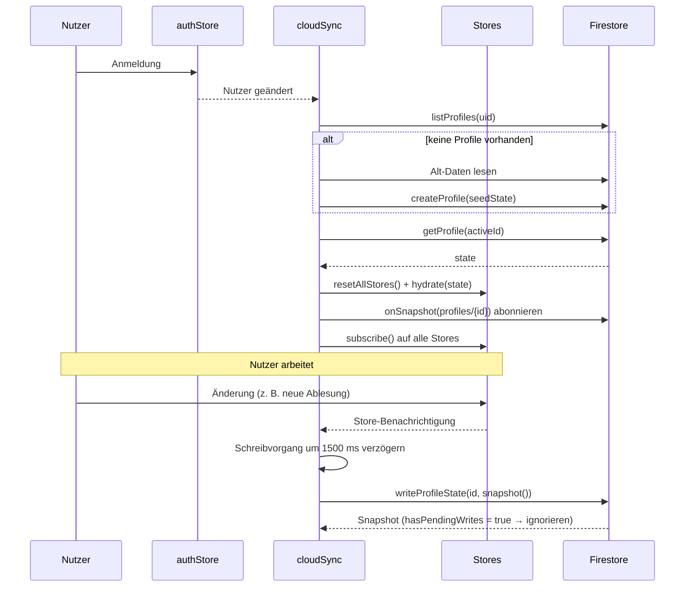

> **Abbildung 23:** Ablauf der Cloud-Synchronisation von der Anmeldung bis zum
> verzögerten Schreiben.

### Fünf Mechanismen im Detail

**1. Verzögertes Schreiben.** Jede Store-Änderung setzt einen Zeitgeber von 1,5 Sekunden
zurück. Schnell aufeinanderfolgende Änderungen – etwa während der Eingabe eines
Zählerstands – führen so zu genau einem Schreibvorgang. Vor einem Profilwechsel wird
ein ausstehender Schreibvorgang mit `flushPending()` erzwungen, damit nichts verloren
geht.

**2. Schutz vor Rückkopplung.** Werden Daten aus der Cloud in die Stores gespielt,
lösen diese ihrerseits Benachrichtigungen aus, die einen Schreibvorgang anstoßen würden
– eine Endlosschleife. Ein Merker `isHydrating` unterbindet dies:

```typescript
function applyRemote(state: Record<string, unknown>) {
  if (demoActive()) return
  isHydrating = true
  try {
    resetAllStores()
    hydrate(state)
  } finally {
    isHydrating = false
  }
}
```

> **Listing 22:** Einspielen eines Cloud-Zustands ohne Rückschreibschleife. Der
> `finally`-Block stellt sicher, dass der Merker auch bei einem Fehler zurückgesetzt
> wird.

Ergänzend werden Snapshots mit `metadata.hasPendingWrites` ignoriert – das sind die
eigenen, noch nicht bestätigten Schreibvorgänge, die Firestore optimistisch
zurückspiegelt.

**3. Erstmigration.** Meldet sich ein Nutzer an, der noch keine Wohnung besitzt, wird
eine erzeugt. Als Startzustand dienen entweder Alt-Daten aus `users/{uid}` (aus der Zeit
vor der Mehrprofilfähigkeit) oder der aktuelle lokale Zustand. Letzteres ist wichtig:
Wer die App zunächst ohne Konto nutzt und sich später registriert, verliert seine
Eingaben nicht – sie werden zur ersten Wohnung.

**4. Datenschutz beim Abmelden.** Nach der Abmeldung werden die Wohnungsdaten lokal
geleert. Der Codekommentar nennt den Grund: Auf einem geteilten Gerät soll nach dem
Logout nicht das Profil des Vornutzers sichtbar bleiben. Die Daten liegen sicher in der
Cloud und kehren beim nächsten Login zurück. Farbschema und Sprache bleiben erhalten –
sie gehören zum Gerät.

**5. Umgang mit Zugriffsverlust.** Verliert ein Nutzer den Zugriff auf eine Wohnung –
etwa weil der Besitzer ihn entfernt hat –, meldet der Live-Listener einen
`permission-denied`-Fehler. Die Fehlerbehandlung entfernt die Wohnung aus der Liste,
lädt die verbleibenden neu und aktiviert eine davon. Bleibt keine übrig, wird
automatisch eine neue leere angelegt – die Anwendung befindet sich nie in einem Zustand
ohne aktive Wohnung.

### Pausierung im Demonstrationsmodus

Solange der Demonstrationsmodus aktiv ist, pausiert die Synchronisation in **beide**
Richtungen. Das ist ein nicht offensichtlicher, aber wichtiger Schutz: Ein angemeldeter
Nutzer, der sich die Beispielwohnung ansieht, würde andernfalls sein echtes Profil mit
den Demodaten überschreiben.

## 12.3 Teilen und Beitritt

Der Einladungsmechanismus folgt dem Modell geteilter Dokumentlinks und kommt ohne
serverseitige Logik aus.

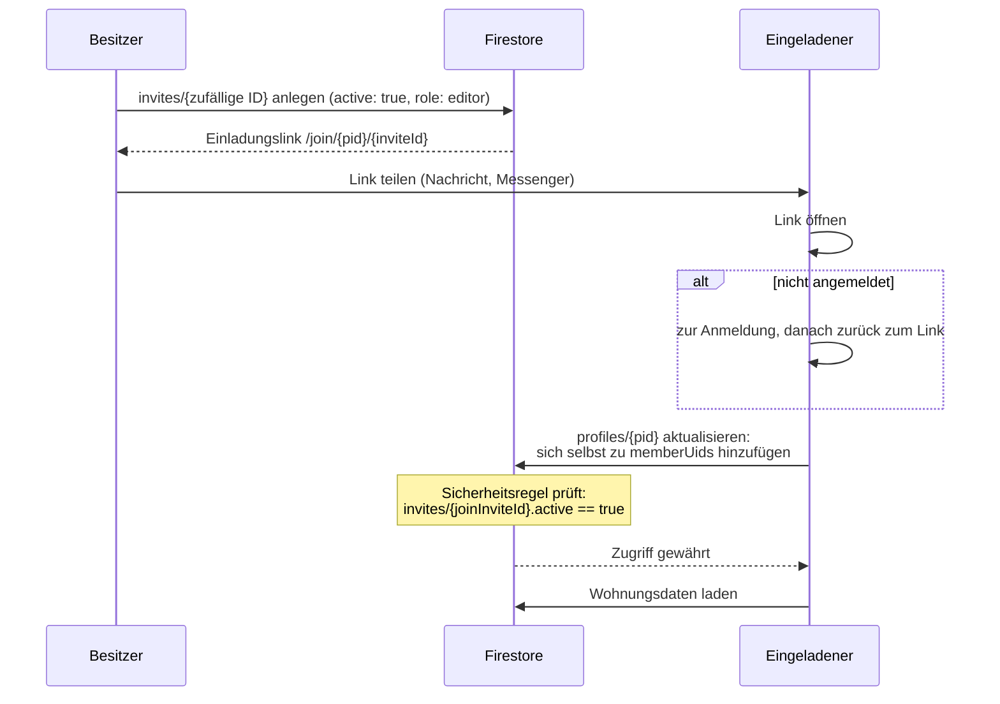

> **Abbildung 24:** Einladungs- und Beitrittsablauf. Das Geheimnis ist die zufällige
> Einladungs-ID; die Prüfung übernimmt die Datenbank selbst.

Der Besitzer kann den Link jederzeit widerrufen (`active: false`) oder neu erzeugen.
Die Mitgliederliste erlaubt das Entfernen einzelner Mitglieder; Mitglieder können die
Wohnung selbst verlassen. Zusätzlich existiert eine Eigentumsübertragung an ein
bestehendes Mitglied.

Für das Teilen über Messenger wurde eigens eine Vorschaugrafik samt Open-Graph-Metadaten
hinterlegt, sodass der Link eine gestaltete Karte statt einer nackten URL erzeugt.

## 12.4 Firestore-Sicherheitsregeln

Da die Anwendung keinen eigenen Server besitzt, sind die Firestore-Regeln die
**einzige** Zugriffskontrolle. Sie sind entsprechend sorgfältig ausgearbeitet und
umfassen fünf getrennte Aktualisierungsregeln.

| Regel | Wer | Was darf geändert werden | Schutzzweck |
| --- | --- | --- | --- |
| Lesen | jedes Mitglied | – | Nur Mitglieder sehen die Wohnung |
| Anlegen | angemeldeter Nutzer | nur mit sich selbst als alleinigem Erstmitglied | Niemand legt Wohnungen für Dritte an |
| (a) Update Besitzer | Besitzer | alles außer `ownerUid` | Schutz vor Selbstübernahme |
| (a2) Eigentumsübertragung | Besitzer | ausschließlich `ownerUid` und `roles` | Übertragung nur an bestehendes Mitglied, keine Datenänderung im selben Vorgang |
| (b) Update Editor | Mitglied | alles außer Mitgliedschaftsfeldern | Ein Editor kann niemanden aussperren |
| (c) Selbst verlassen | Mitglied (nicht Besitzer) | entfernt **ausschließlich** sich selbst | Kein Entfernen Dritter unter dem Deckmantel des Austritts |
| (d) Beitritt | Nicht-Mitglied | fügt **ausschließlich** sich selbst als `editor` hinzu | Nur mit gültiger, aktiver Einladung |
| Löschen | Besitzer | – | Nur der Eigentümer löscht endgültig |

> **Tabelle 31:** Die Zugriffsregeln für Wohnprofile.

Die Regeln arbeiten mit Differenzprüfungen, um die Änderungsmenge exakt einzugrenzen.
Die Beitrittsregel ist das komplexeste Beispiel:

```javascript
allow update: if isSignedIn()
  && !(request.auth.uid in resource.data.memberUids)
  && request.resource.data.ownerUid == resource.data.ownerUid
  && request.resource.data.diff(resource.data).affectedKeys()
       .hasOnly(['memberUids', 'roles', 'memberNames', 'joinInviteId'])
  && request.resource.data.memberUids.size() == resource.data.memberUids.size() + 1
  && request.resource.data.memberUids.hasAll(resource.data.memberUids)
  && request.auth.uid in request.resource.data.memberUids
  && request.resource.data.roles.diff(resource.data.roles).affectedKeys()
       .hasOnly([request.auth.uid])
  && request.resource.data.roles[request.auth.uid] == 'editor'
  && get(/databases/$(database)/documents/profiles/$(profileId)
       /invites/$(request.resource.data.joinInviteId)).data.active == true;
```

> **Listing 23:** Die Beitrittsregel. Sie prüft in dieser Reihenfolge: Anmeldung, noch
> kein Mitglied, Besitzer unverändert, nur Mitgliedschaftsfelder betroffen, genau ein
> Mitglied mehr, alle bisherigen Mitglieder erhalten, der Aufrufer selbst ist das neue
> Mitglied, nur seine eigene Rolle wurde ergänzt, diese Rolle ist `editor`, und die
> genannte Einladung ist aktiv.

Jede einzelne Bedingung schließt einen konkreten Angriff aus. Ohne die
Größenprüfung könnte der Beitretende gleichzeitig andere Mitglieder entfernen; ohne die
Rollenprüfung sich selbst zum Besitzer machen; ohne die `affectedKeys`-Prüfung im selben
Vorgang die Wohnungsdaten überschreiben.

Die Einladungs-Unterdokumente haben eigene Regeln: Der **Einzelabruf** ist jedem
angemeldeten Nutzer erlaubt (nötig für den Beitritt – wer die geheime ID kennt, darf
sie prüfen), das **Auflisten** und Verwalten dagegen nur dem Besitzer. Diese
Unterscheidung ist entscheidend: Könnte jeder die Einladungen auflisten, wäre das
Geheimnis wertlos.

## 12.5 Prüfung der Sicherheitsregeln

Die Regeln sind der einzige Bestandteil des Projekts mit einer automatisierten
Testsuite. Sie umfasst **26 Testfälle** in sieben Gruppen und läuft gegen den
Firestore-Emulator:

```bash
npm run test:rules
# firebase emulators:exec --only firestore --project eapp-rules-tests
#   "vitest run tests/firestore.rules.test.ts"
```

| Gruppe | Testfälle | Beispiel |
| --- | ---: | --- |
| Lesen | 4 | „Fremde dürfen NICHT lesen" |
| Anlegen | 2 | „Anlage mit fremdem Besitzer wird abgelehnt" |
| Update Editor | 5 | „Editor darf NICHT den Besitzer aussperren, auch wenn ownerUid unverändert bleibt" |
| Update Besitzer | 2 | „Besitzer darf NICHT den Besitzer wechseln (nur über die dedizierte Transfer-Regel)" |
| Beitritt | 5 | „Beitritt mit widerrufener Einladung schlägt fehl" |
| Eigentumsübertragung | 4 | „Editor darf sich NICHT selbst zum Besitzer machen" |
| Löschen und Einladungen | 4 | „Nur Besitzer darf Einladung erstellen" |

> **Tabelle 32:** Struktur der Sicherheitstestsuite. Die Auswahl ist angriffsorientiert:
> Geprüft wird primär, was **nicht** erlaubt sein darf.

Dass ausgerechnet die Sicherheitsregeln die einzige Testsuite besitzen, ist eine
bewusste Priorisierung: Ein Fehler in einer Berechnungsformel führt zu einem falschen
Ratschlag, ein Fehler in den Regeln zu einem Datenleck.

---

# 13 Querschnittsthemen

## 13.1 Design-System und Theming

### Fünf Farbschemata

Die Anwendung bietet fünf Farbschemata, die über das Attribut `data-theme` am
`<html>`-Element umgeschaltet werden.

| Schema | Hintergrund | Akzent | Charakter |
| --- | --- | --- | --- |
| `light` | `#FAFAFA` | `#18181B` | Standard hell, neutral |
| `dark` | `#111114` | `#FAFAFA` | Standard dunkel |
| `midnight` | `#000000` | `#FAFAFA` | reines Schwarz, OLED-schonend |
| `htw` | `#f0f5ea` | `#5a8a1b` | Hochschulfarben |
| `amber` | `#fdf6ec` | `#d97706` | Energie-Akzent |

> **Tabelle 33:** Die fünf Farbschemata.

Technisch definiert jedes Schema einen Satz von neun CSS-Variablen (`--bg`, `--surface`,
`--surface-2`, `--fg`, `--muted`, `--border`, `--primary`, `--primary-fg`, `--success`),
die über `@theme inline` an Tailwind-Utilities gebunden werden:

```css
@theme inline {
  --color-background: var(--bg);
  --color-surface: var(--surface);
  --color-foreground: var(--fg);
  --color-primary: var(--primary);
  /* … */
}

[data-theme='htw'] {
  --bg: #f0f5ea;
  --surface: #ffffff;
  --fg: #1b2a12;
  --primary: #5a8a1b;
  color-scheme: light;
  /* … */
}
```

> **Listing 24:** Bindung der Themenvariablen an Tailwind-Utilities. Eine Komponente
> schreibt `bg-surface text-foreground` und ist damit automatisch in allen fünf
> Schemata korrekt.

### Vermeidung des Themen-Aufblitzens

Ein bekanntes Problem clientseitig gesetzter Farbschemata ist das kurze Aufblitzen der
Standardfarben, bevor JavaScript das gespeicherte Schema anwendet. Die Anwendung löst
das mit einem blockierenden Inline-Skript im `<head>`, das den Wert direkt aus
`localStorage` liest, gegen die gültigen Schemata prüft und andernfalls die
Systemeinstellung verwendet:

```html
<script>
  try {
    var valid = ['light', 'dark', 'midnight', 'htw', 'amber'];
    var raw = localStorage.getItem('eapp-settings');
    var theme = raw ? JSON.parse(raw).state.theme : null;
    if (!theme || valid.indexOf(theme) === -1) {
      theme = window.matchMedia('(prefers-color-scheme: dark)').matches ? 'dark' : 'light';
    }
    document.documentElement.setAttribute('data-theme', theme);
  } catch (e) {
    document.documentElement.setAttribute('data-theme', 'light');
  }
</script>
```

> **Listing 25:** Anti-Flicker-Skript in `index.html`. Es kennt die Struktur des
> persistierten Stores – eine bewusst in Kauf genommene Kopplung, die im Code
> dokumentiert ist.

### Visuelle Sprache

Das Design folgt einer „Liquid-Glass"-Ästhetik: halbtransparente Flächen mit
Hintergrundunschärfe (`.glass`), auf einem ruhigen Untergrund mit zwei langsam
driftenden, stark weichgezeichneten Farbverlaufsflächen (`.app-backdrop`). Die
Bewegung ist mit Perioden von 26 Sekunden bewusst kaum wahrnehmbar und erzeugt Tiefe,
ohne abzulenken.

Die Basiselemente unter `src/components/ui/` bilden ein kleines, konsistentes
Vokabular: Karte, Feld, Modal, Auswahl-Chip, Schrittregler, Schieberegler, Schalter,
Fortschrittsring, Info-Popover, Stoppuhr, Avatar und Logo.

## 13.2 Internationalisierung

Die Anwendung ist vollständig zweisprachig (Deutsch, Englisch) mit **1.392
Übersetzungsschlüsseln** je Sprache. Die Spracherkennung prüft zuerst `localStorage`,
dann die Browsersprache; die Wahl wird persistiert.

Der Schlüsselbaum ist an der Anwendungsstruktur ausgerichtet
(`measurements.showerhead.intro.steps`), wodurch sich Übersetzungen dynamisch aus
Datenstrukturen auflösen lassen: `t(\`measurements.${meta.id}.title\`)` funktioniert für
jede Messung, ohne dass eine Zuordnungstabelle nötig wäre.

Bewusst **nicht** übersetzt sind die Fachinhalte des Wissensbereichs (siehe
Abschnitt 10.1). Zahlen- und Datumsformatierung erfolgt durchgängig über die
`Intl`-Schnittstelle mit der aktiven Sprache.

## 13.3 Barrierefreiheit und Bewegungsreduktion

Mehrere Maßnahmen adressieren Zugänglichkeit:

- Ein einheitlicher Fokusring (`.focus-ring:focus-visible`) für Tastaturbedienung
- ARIA-Attribute an interaktiven Elementen (`role="switch"`, `aria-expanded`,
  `aria-pressed`, `aria-current="step"`)
- Das Verlaufsdiagramm ist per Pfeiltasten bedienbar
- Zwei `@media (prefers-reduced-motion: reduce)`-Blöcke deaktivieren die
  Hintergrundbewegung, die Startbildschirm-Animation und die Kartenumdrehung
- `-webkit-text-size-adjust: 100%` verhindert unerwünschte Schriftskalierung
- Ein Sicherheitsnetz gegen horizontalen Überlauf (`overflow-x: clip`) und ein per
  Portal gerendertes, am Viewport geklemmtes Info-Popover verhindern das in mobilem
  Safari sonst auftretende ungewollte Auszoomen

## 13.4 Datenschutz und Nutzungsstatistik

Die Anwendung erhebt anonyme Nutzungsereignisse über Firebase Analytics – jedoch mit
einer expliziten Widerspruchsmöglichkeit in den Einstellungen. Die Umsetzung greift auf
zwei Ebenen:

```typescript
export async function track(name: string, params?: EventParams) {
  // Opt-out respektieren: kein Ereignis senden, wenn abgeschaltet.
  if (!useSettingsStore.getState().analyticsEnabled) return
  try {
    const analytics = await analyticsReady
    if (analytics) logEvent(analytics, name, params)
  } catch {
    // Analytics ist optional – Fehler bewusst ignorieren.
  }
}
```

> **Listing 26:** Ereignisverfolgung mit Einwilligungsprüfung. Zusätzlich überträgt
> `syncAnalyticsConsent()` die Einwilligung an Firebase selbst
> (`setAnalyticsCollectionEnabled`), damit auch die automatisch erfassten Ereignisse –
> etwa der Sitzungsstart – der Wahl des Nutzers folgen.

Die Fehlerbehandlung ist bewusst schluckend: Die Anwendung darf niemals von der
Verfügbarkeit der Statistik abhängen.

Ergänzend existiert eine eigene Seite zur **Datenlöschung** mit getrennten, zweistufig
bestätigten Rücksetzoptionen je Datenbereich.

## 13.5 Demonstrationsmodus

Der Demonstrationsmodus lädt über den Parameter `?demo` eine vollständig befüllte
Beispielwohnung in die lokalen Stores: ein ausgefülltes Profil, zahlreiche
abgeschlossene Messungen und rund 18 Monate regelmäßiger Ablesungen für Strom, Gas und
Wasser.

Zwei Details zeigen die Sorgfalt der Umsetzung:

**Die Daten werden relativ zum heutigen Datum erzeugt.** Die Ablesungen entstehen bei
jedem Aufruf neu mit Datumsangaben, die vom aktuellen Tag zurückrechnen – die Verläufe
wirken dadurch stets aktuell, statt in der Vergangenheit zu enden.

**Die Reihenfolge der Operationen ist sicherheitsrelevant.** Zuerst wird der Demo-Modus
gesetzt (was die Synchronisation pausiert), dann werden die lokalen Stores geleert und
der Beispielzustand eingespielt. Ohne diese Reihenfolge würde die Synchronisation den
Import als echte Änderung interpretieren und das Profil eines angemeldeten Nutzers
überschreiben.

Ein Hinweisstreifen bleibt während der gesamten Demo sichtbar und bietet zwei Wege:
„Selbst loslegen" startet das eigene Onboarding, „Verlassen" kehrt zurück. Angemeldete
Nutzer lösen beim Verlassen ein Neuladen aus, damit die Synchronisation ihr echtes
Profil wiederherstellt.

## 13.6 Landing Page

Die öffentliche Einstiegsseite folgt einem eigenen Feinkonzept
(`docs/landing-concept.md`) und gliedert sich in fünf Abschnitte: Hero, „So sieht's mit
Daten aus", Fähigkeiten, Vertrauen und Abschluss-Aufruf. Sie verzichtet bewusst auf die
Anwendungsnavigation und besitzt eine eigene schlanke Kopfzeile.

Der konzeptionell interessanteste Abschnitt ist der zweite: Statt Funktionen zu
behaupten, zeigt er drei Vorschaukacheln (Dashboard, Verbrauchsverlauf,
Messergebnis) und führt zum stärksten Überzeugungsmittel – der interaktiven
Beispielwohnung. Die Argumentation des Konzepts lautet, dass eine leere App den
Erstbesucher nicht überzeugen kann; er muss sehen, wie sie mit Daten aussieht.

Ein Analytics-Detail: Die über die Einstellungen erreichbare Vorschau (`/willkommen`)
unterdrückt das Ereignis `landing_view`, damit die Konversionskennzahl nur echte
Erstaufrufe zählt.

## 13.7 Berechtigungssystem

Das Modul `entitlements.ts` bildet Tarifstufen auf konkrete Limits ab. Es existiert
heute **ohne** angeschlossene Abrechnung – jeder Nutzer hat den Tarif `free`.

| Tarif | max. Wohnungen | max. Mitglieder je Wohnung | Teilen erlaubt |
| --- | ---: | ---: | :---: |
| `free` | 3 | 5 | ✓ |
| `premium` | 10 | 10 | ✓ |
| `business` | 100 | 50 | ✓ |

> **Tabelle 34:** Hinterlegte Tarifstufen. Die Zahlen sind ausdrücklich als Platzhalter
> gekennzeichnet.

Der Wert dieses Moduls liegt nicht in der heutigen Funktion, sondern in der
**Vorbereitung**: Der Codekommentar erläutert, dass sich bei Einführung eines echten
Abrechnungssystems nur zwei Dinge ändern müssen – die Herkunft des Tarifs (künftig aus
Firebase Custom Claims) und gegebenenfalls die Zahlen in der Tabelle. Verstreute
`if`-Abfragen im Code werden dadurch von vornherein vermieden.

Bemerkenswert ist, dass das Teilen auch im kostenlosen Tarif erlaubt ist – es wird
ausdrücklich als Wachstumshebel eingeordnet.

## 13.8 Fallstudie: Google-Anmeldung auf Safari und iOS

Ein Problem verdient eine eigene Darstellung, weil es exemplarisch zeigt, wie eine
Plattformeigenheit einen Architekturentscheid erzwingen kann – und weil die Lösung eine
Abhängigkeit außerhalb des Repositorys hat.

### Das Problem

Firebase wickelt die Google-Anmeldung über einen versteckten Iframe beziehungsweise
eine Weiterleitung auf der konfigurierten `authDomain` ab. Weicht diese Domain von der
Domain der Anwendung ab, entsteht ein Cross-Origin-Kontext. Safari blockiert dort
aufgrund seiner Tracking-Schutzmechanismen (ITP, Storage-Partitionierung) den Zugriff
auf den Speicher. Die Folge: `getRedirectResult()` liefert `null`, und der Nutzer bleibt
trotz erfolgreicher Anmeldung ausgeloggt – ohne jede Fehlermeldung.

Auf iOS kommt ein zweites Problem hinzu: `signInWithPopup` öffnet dort einen oft
unsichtbaren neuen Tab, und die Anmelde-Zusage bleibt hängen. Der Nutzer sieht nur, dass
etwas lädt und dann nichts passiert.

### Die Lösung

Die Anwendung setzt die `authDomain` auf die eigene Anwendungsdomain, sodass der
Authentifizierungs-Handler gleich-origin ausgeliefert wird. Damit entfällt der
Cross-Origin-Kontext und die Weiterleitung funktioniert zuverlässig.

Die Umschaltung erfolgt nur, wenn die Anwendung tatsächlich auf der Produktionsdomain
läuft; in allen anderen Umgebungen bleibt es bei der Firebase-Standarddomain. Ein
exportierter Wahrheitswert `authDomainIsFirstParty` macht das Ergebnis für die
Anmeldelogik verfügbar, die daran ihre Strategie ausrichtet:

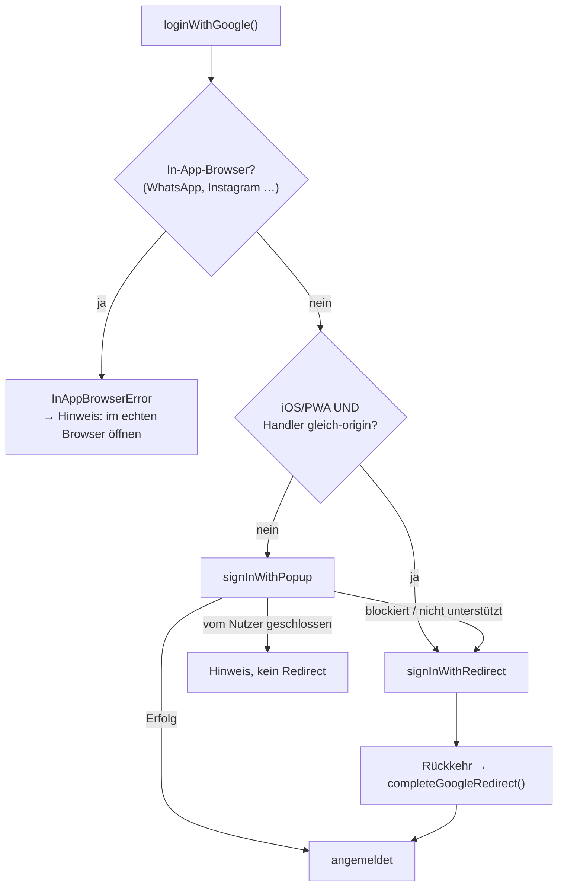

> **Abbildung 25:** Entscheidungsbaum der Google-Anmeldung. Bemerkenswert ist die
> Bedingung in der zweiten Verzweigung: Der Redirect ist nur dann die bessere Wahl,
> wenn der Handler gleich-origin läuft – sonst tauscht man ein hängendes Popup gegen
> ein stilles Scheitern, was schlechter ist.

Zusätzlich werden eingebettete In-App-Browser erkannt (WhatsApp, Instagram, Facebook,
TikTok und weitere), in denen Google die Anmeldung grundsätzlich mit
`disallowed_useragent` verweigert. Statt eines kryptischen Fehlers erhält der Nutzer den
verständlichen Hinweis, die Seite im Systembrowser zu öffnen.

### Die externe Abhängigkeit

Die Lösung hängt an einer Einstellung **außerhalb des Repositorys**: Google prüft die
Weiterleitungs-URI gegen eine Positivliste im OAuth-Client. Fehlt dort der Eintrag
`https://e-app-info.web.app/__/auth/handler`, bricht **jeder** Anmeldevorgang mit
„Fehler 400: redirect_uri_mismatch" ab.

Diese Abhängigkeit ist im Quellcode mit einem Warnhinweis dokumentiert, der den
genauen Ort der Einstellung nennt und beschreibt, was zu tun ist, falls sie entfernt
wird. Das ist gute Praxis: Eine unsichtbare externe Kopplung, deren Verletzung ein
zentrales Feature vollständig lahmlegt, gehört an die Stelle im Code, die von ihr
abhängt.

---

# 14 Qualitätssicherung, Build und Auslieferung

## 14.1 Statische Absicherung

Bei einem Einzelentwicklerprojekt ohne umfassende Testsuite übernimmt die statische
Analyse einen Großteil der Absicherung. Die TypeScript-Konfiguration ist entsprechend
streng:

| Option | Wirkung |
| --- | --- |
| `noUnusedLocals`, `noUnusedParameters` | verhindert toten Code |
| `noFallthroughCasesInSwitch` | verhindert versehentliches Durchfallen |
| `verbatimModuleSyntax` | erzwingt explizite `import type`-Angaben |
| `erasableSyntaxOnly` | verbietet Konstrukte ohne reine Typbedeutung |
| `resolveJsonModule` | typisierter Import der Übersetzungsdateien |

> **Tabelle 35:** Wesentliche Compiler-Optionen.

ESLint ergänzt dies mit den empfohlenen Regelsätzen für JavaScript und TypeScript sowie
den React-spezifischen Regeln für Hooks und Fast Refresh. Letztere hat konkrete
Auswirkungen auf die Dateiorganisation: Weil `react-refresh/only-export-components`
verlangt, dass Komponentendateien ausschließlich Komponenten exportieren, wurden
Hilfsfunktionen in eigene Dateien ausgelagert – etwa `odometer.ts` neben
`OdometerInput.tsx`. Die Auslagerung ist im Dateikopf entsprechend begründet.

Der Build-Befehl kettet Typprüfung und Bündelung: `tsc -b && vite build`. Ein
Typfehler verhindert also die Auslieferung.

## 14.2 Tests

Automatisiert getestet werden ausschließlich die Firestore-Sicherheitsregeln (26
Testfälle, siehe Abschnitt 12.5). Die Berechnungsmodule sind durch ihre Bauform
hervorragend testbar – reine Funktionen ohne Abhängigkeiten –, besitzen aber derzeit
keine Testsuite. Dies ist die deutlichste Lücke der Qualitätssicherung und wird in
Kapitel 15 aufgegriffen.

## 14.3 Build und die Besonderheit zweier Auslieferungspfade

Die Anwendung wird an zwei Orte ausgeliefert, die unterschiedliche Basispfade
verwenden: Firebase Hosting unter `/`, GitHub Pages unter `/E-App/`. Die
Vite-Konfiguration löst dies über eine Umgebungsvariable:

```typescript
export default defineConfig(({ command }) => ({
  base: process.env.VITE_BUILD_BASE ?? (command === 'build' ? '/E-App/' : '/'),
  plugins: [react(), tailwindcss()],
  resolve: { alias: { '@': path.resolve(__dirname, './src') } },
}))
```

> **Listing 27:** Basispfad-Auflösung. Der Standard-Build erzeugt die
> GitHub-Pages-Variante; `npm run build:firebase` setzt `VITE_BUILD_BASE=/`.

Der React-Router übernimmt diesen Pfad automatisch über
`basename={import.meta.env.BASE_URL.replace(/\/$/, '')}`, sodass die Navigation in
beiden Varianten funktioniert.

Für GitHub Pages ist zusätzlich ein Kniff nötig: Da der Dienst keine
Server-Rewrites für Single-Page-Anwendungen unterstützt, kopiert der Workflow die
`index.html` nach `404.html`. Direkte Aufrufe tiefer Routen landen so beim
Anwendungsgerüst, das die Route dann clientseitig auflöst. Firebase Hosting löst
dasselbe Problem sauber über eine Rewrite-Regel.

## 14.4 Auslieferung

Zwei GitHub-Actions-Workflows werden bei jedem Push auf `main` ausgelöst und sind
zusätzlich manuell startbar.

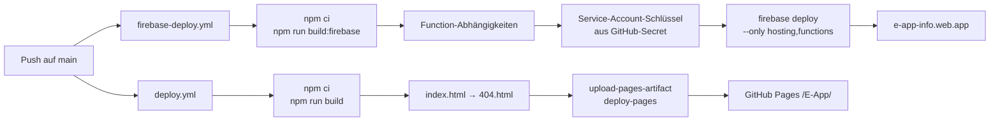

> **Abbildung 26:** Die beiden Auslieferungspipelines.

Beide Workflows verwenden `concurrency`-Gruppen, sodass niemals zwei Auslieferungen
desselben Ziels gleichzeitig laufen. Die Firebase-Anmeldung erfolgt über einen
Dienstkonto-Schlüssel, der als GitHub-Secret hinterlegt ist.

Die Betriebsdokumentation (`docs/deployment.md`) unterscheidet explizit die drei
Schlüsselarten, um eine verbreitete Verwechslung zu vermeiden:

| Schlüssel | Ort | Geheim? |
| --- | --- | :---: |
| Dienstkonto-Schlüssel für CI | GitHub-Secret `FIREBASE_SERVICE_ACCOUNT` | ✓ |
| Gemini-API-Schlüssel | Firebase-Secret `GEMINI_API_KEY` | ✓ |
| Firebase-Web-Konfiguration | `src/lib/firebase.ts` | ✗ (öffentlich, per Design) |

> **Tabelle 36:** Die drei Schlüsselarten des Projekts. Nur die ersten beiden sind
> Geheimnisse; die Web-Konfiguration liegt bei jeder Firebase-Anwendung offen im
> Browser und wird durch die Sicherheitsregeln abgesichert.

Die Auslieferung ist zusätzlich abgesichert durch HTTP-Header: `X-Content-Type-Options:
nosniff` und `X-Frame-Options: SAMEORIGIN` für alle Antworten, sowie eine
Cache-Steuerung mit einjähriger Gültigkeit für versionierte Bündel.

## 14.5 Projektverlauf

Der Entwicklungsverlauf lässt sich aus der Versionsgeschichte rekonstruieren:

| Kennzahl | Wert |
| --- | --- |
| Commits gesamt | 50 |
| Entwicklungszeitraum | Juli – August 2026 |
| Version | 0.5.0 |
| Quelldateien (`src/`) | 185 |
| Codezeilen (TS/TSX/CSS) | ca. 24.000 |
| Übersetzungsschlüssel je Sprache | 1.392 |

> **Tabelle 37:** Projektkennzahlen zum betrachteten Stand.

Die Commit-Nachrichten folgen der Konvention *Conventional Commits*
(`feat(bereich): …`, `fix(bereich): …`, `refactor(bereich): …`) und sind
deutschsprachig verfasst.

---
# 15 Diskussion

## 15.1 Abgleich mit den Anforderungen

Alle in Abschnitt 3.2 formulierten funktionalen Anforderungen sind umgesetzt. Der
folgende Abgleich bewertet zusätzlich die Umsetzungstiefe.

| ID | Anforderung | Status | Anmerkung |
| --- | --- | --- | --- |
| FA-01 … FA-02 | Profilerfassung, nachträgliche Bearbeitung | vollständig | zwei Modi, Profil-Hub mit Abschnittsstatus |
| FA-03 … FA-08 | Mess-Framework | vollständig | Katalog-/Registry-Muster trägt |
| FA-09 | Neun Messverfahren | vollständig | alle als `available` markiert |
| FA-10 … FA-11 | Zählerstände, Auswertung | vollständig | acht Träger, Segmentrechnung |
| FA-12 | Kamera-Erfassung | vollständig | zweistufig mit Rückfallebene |
| FA-13 | Ableseerinnerungen | eingeschränkt | In-App-Anzeige, keine Systembenachrichtigung |
| FA-14 | PDF-Berichte | vollständig | drei Typen, zwei Varianten, konfigurierbar |
| FA-15 | Empfehlungen | vollständig | befundbasiert, mit Persona-Gating |
| FA-16 | Wissensbereich | teilweise | Inhalte als Erstentwurf gekennzeichnet, Karteikarten als Platzhalter |
| FA-17 … FA-19 | Mehrere Wohnungen, Teilen, Synchronisation | vollständig | inkl. geprüfter Sicherheitsregeln |
| FA-20 | Demonstrationsmodus | vollständig | 18 Monate Beispieldaten, relativ zum Tagesdatum |

> **Tabelle 38:** Abgleich der funktionalen Anforderungen.

Bei den nichtfunktionalen Anforderungen ist besonders NFA-04 („Ehrlichkeit der Ausgabe")
konsequent umgesetzt: von den `estimated`-Flags über die Methodenangabe bis zur
Darstellung als Spanne statt als Punktwert.

## 15.2 Stärken der Umsetzung

**Die Trennung von Berechnung und Darstellung ist konsequent durchgehalten.** Jede
Messung besitzt ein Logikmodul ohne Framework-Abhängigkeiten. Der praktische Nutzen
zeigt sich daran, dass die Berechnungsergebnisse ohne Anpassung in drei völlig
unterschiedlichen Kontexten verwendet werden: in der Oberfläche, in der
PDF-Erzeugung und in der Empfehlungsableitung.

**Das Katalog-/Registry-Muster hat sich bewährt.** Eine zehnte Messung erfordert keinen
Eingriff in Runner, Übersichtsseite oder Berichtserzeugung. Dass neun Messungen mit
teils sehr unterschiedlicher Interaktion (Stoppuhr, Geräteliste, Schrittregler,
Ja/Nein-Fragen, drei alternative Zählerverfahren) demselben Rahmen folgen, ohne dass
dieser aufgeweicht wurde, ist ein belastbarer Nachweis der Tragfähigkeit.

**Die Dokumentation im Code ist außergewöhnlich.** Die Kommentare erklären nicht, *was*
der Code tut, sondern *warum* er es so tut. Sie halten verworfene Alternativen fest
(„Bewusst NICHT als Firebase-`photoURL` gespeichert: ein Data-URL im Auth-Token würde
dieses unnötig aufblähen"), begründen Vereinfachungen und dokumentieren externe
Abhängigkeiten. Für die vorliegende Arbeit war dies die wichtigste Quelle zur
Rekonstruktion der Entwurfsentscheidungen.

**Die Sicherheitsregeln sind sorgfältig und geprüft.** Fünf differenzierte
Aktualisierungsregeln mit Differenzprüfungen und 26 angriffsorientierte Testfälle sind
für ein Projekt dieser Größe überdurchschnittlich.

**Die Robustheit gegen Fehleingaben ist durchgängig.** Jede Rechenfunktion prüft
`Number.isFinite`, begrenzt Wertebereiche und liefert im Zweifel null statt `NaN` oder
einer Ausnahme.

## 15.3 Grenzen und offene Punkte

Die folgende Zusammenstellung ist bewusst kritisch und nennt sowohl methodische als auch
technische Schwächen.

### Fehlende Tests der Berechnungsmodule

Die deutlichste Lücke. Die Logikmodule sind durch ihre Bauform ideal testbar – reine
Funktionen mit klaren Ein- und Ausgaben –, besitzen aber keine Testsuite. Gerade bei
Formeln mit Schwellenwerten wären Randfalltests wertvoll: Was liefert
`rateFridge(7.0)` gegenüber `rateFridge(7.1)`? Verhält sich `calcShowerhead` bei
`seconds = 0` korrekt? Die Testinfrastruktur (Vitest) ist bereits vorhanden und
konfiguriert; die Erweiterung wäre mit geringem Aufwand möglich.

### Fachliche Prüfung der Wissensinhalte ausstehend

Der Dateikopf von `educationContent.ts` beginnt mit „Erstentwurf – vom Nutzer zu
prüfen". Die Quellenangaben verweisen durchgängig auf die deutschsprachige Wikipedia;
der Kommentar bezeichnet dies selbst als Zwischenlösung, die bei fachlicher Prüfung
durch Primärquellen (VDI-Richtlinien, Umweltbundesamt) zu ersetzen sei. Für eine
wissenschaftliche Arbeit ist diese Selbsteinschätzung zu übernehmen: Die Inhalte sind
plausibel und intern konsistent, aber nicht fachlich validiert.

### Veraltete Aussage in der FAQ

Ein konkretes Beispiel für Dokumentationsdrift: Die FAQ-Antwort zur Datenverarbeitung
lautet, die Anwendung verarbeite Eingaben lokal auf dem Gerät, und ergänzt in Klammern,
spätere Cloud- und Kontofunktionen wären optional und klar gekennzeichnet. Diese
Funktionen existieren inzwischen. Die Aussage ist nicht falsch – die Cloud-Anbindung ist
tatsächlich optional –, aber sie ist im Futur formuliert und sollte an den aktuellen
Stand angepasst werden.

### Ungenutzter und redundanter Code

Zwei kleinere Befunde:

- Die Komponente `PagePlaceholder` stammt aus der frühen Entwicklungsphase und wird
  nirgends mehr verwendet.
- `src/types/index.ts` definiert einen Typ `Theme` mit drei Werten. Der tatsächlich
  verwendete Typ mit fünf Werten liegt in `src/store/settingsStore.ts`; die Definition
  im Typmodul ist ungenutzt und inhaltlich veraltet. Sie sollte entfernt werden, um
  eine spätere Fehlnutzung auszuschließen.

### Zeitliche Gültigkeit hinterlegter Kennwerte

Mehrere Konstanten unterliegen jährlicher Veränderung: der CO₂-Emissionsfaktor des
Strommixes (0,38 kg/kWh), die Standardpreise aller Energieträger sowie die
Nutzungsgrade. Sie sind zwar jeweils an genau einer Stelle definiert und gut
kommentiert, aber es existiert kein Mechanismus, der auf ihre Veralterung hinweist. Eine
Kennzeichnung mit Stand-Datum und ein jährlicher Prüftermin wären angemessen.

### Grenzen der lokalen Speicherung

Profil- und Kontobilder werden als Data-URLs gespeichert (JPEG, 256 × 256 Pixel,
Qualität 0,82 – typischerweise 10–20 kB). Bei mehreren Wohnungen und langen
Ablesereihen nähert sich der Gesamtbestand der praktischen Grenze von etwa 5 MB je
Ursprung im `localStorage`. Ein Überlauf würde derzeit nicht abgefangen. Für den
absehbaren Nutzungsumfang ist das unkritisch, für Vielnutzer perspektivisch relevant.

### Zweisprachigkeit nur der Oberfläche

Die Bedienoberfläche ist vollständig übersetzt, die Fachinhalte des Wissensbereichs
liegen ausschließlich auf Deutsch vor. Ein englischsprachiger Nutzer erhält damit eine
englische Oberfläche mit deutschen Fachtexten. Die Entscheidung ist begründet – Fachtexte
sind kein Oberflächentext –, das Ergebnis für den Nutzer aber inkonsistent.

### Methodische Grenzen

Die in Abschnitt 7.11 diskutierten Unsicherheiten bleiben bestehen. Insbesondere:

- Die Verhaltensannahmen (Duschhäufigkeit, Standby-Dauer) sind pauschaliert und werden
  nicht erfragt.
- Der Standby-Check unterstellt 8.760 Stunden Bereitschaftsbetrieb im Jahr.
- Die CO₂-Abschätzung nimmt den Umweg über den Strompreis und ist damit für
  wärmebezogene Einsparungen nur grob.
- Die Effizienzeinordnung der Gebäudehülle beruht auf vier Bauteilfaktoren und
  Baualtersklassen, nicht auf tatsächlichen U-Werten.

Diese Grenzen sind sämtlich im Code dokumentiert und werden dem Nutzer gegenüber
kommuniziert – sie sind damit keine verborgenen Fehler, sondern bewusst gewählte
Vereinfachungen.

## 15.4 Übertragbare Erkenntnisse

Aus der Arbeit lassen sich vier über das konkrete Projekt hinausweisende Beobachtungen
ableiten.

**Ehrliche Unsicherheit ist eine Produkteigenschaft, keine Schwäche.** Die
konsequenteste Entwurfsentscheidung des Projekts – Schätzwerte als solche zu
kennzeichnen, Spannen statt Punktwerte zu zeigen und auf nicht belegbare Zahlen ganz zu
verzichten – erhöht die Glaubwürdigkeit, statt sie zu mindern. Ein Werkzeug, das
zugibt, was es nicht weiß, ist vertrauenswürdiger als eines, das centgenaue Prognosen
suggeriert.

**Priorisierung ist robuster als Absolutwerte.** Systematische Fehler in
Verhaltensannahmen wirken auf alle Maßnahmen gleichgerichtet und beeinflussen daher die
Rangfolge weniger als den Einzelbetrag. Für den Nutzernutzen – *womit fange ich an?* –
ist dies die entscheidende Eigenschaft.

**Fortschreitende Verbesserung schlägt Alles-oder-nichts.** Der Ansatz, mehrere
Genauigkeitsstufen anzubieten und automatisch die beste verfügbare zu wählen, senkt die
Einstiegshürde, ohne die Qualität zu deckeln. Wer nur ein Thermometer hat, bekommt eine
Schätzung; wer ein Messgerät besitzt, ein belastbares Ergebnis.

**Kommentare, die das Warum festhalten, sind das wertvollste Artefakt.** Bei der
Rekonstruktion der Entwurfsentscheidungen für diese Arbeit erwiesen sich die
Codekommentare als deutlich informativer als die Konzeptdokumente – weil sie an der
Stelle stehen, an der die Entscheidung wirkt, und weil sie mit dem Code gepflegt werden.

---

# 16 Fazit und Ausblick

## 16.1 Fazit

Die Arbeit hat eine webbasierte Anwendung konzipiert und implementiert, die die
identifizierte Lücke zwischen kostenpflichtiger Energieberatung und generischen
Online-Rechnern schließt. Alle sechs Teilziele aus Abschnitt 1.2 sind erreicht:

Die Anwendung erfasst ein Gebäude- und Haushaltsprofil in zwei wählbaren Detailstufen
(Z1) und leitet den Nutzer durch neun mit Alltagsgegenständen durchführbare Messungen,
die keine Fachkenntnisse voraussetzen (Z2). Die Auswertung erfolgt nach offen
dokumentierten physikalischen Modellen und überführt Messwerte in Bewertungen sowie –
wo methodisch vertretbar – in Jahreskosten und Einsparpotenziale (Z3). Ein
Monitoring-Modul verfolgt Zählerstände von bis zu acht Energieträgern über die Zeit und
stellt Verbrauch, Trend und Jahreshochrechnung dar (Z4). Aus Profil und Messergebnissen
entstehen personalisierte Empfehlungen und exportierbare PDF-Berichte (Z5). Die
Anwendung läuft ohne Installation im Browser, ist in wesentlichen Teilen ohne
Benutzerkonto nutzbar und speichert Daten standardmäßig lokal (Z6).

Technisch zeichnet sich die Umsetzung durch drei Eigenschaften aus: eine konsequente
Trennung von Berechnungslogik und Darstellung, ein tragfähiges Erweiterungsmuster für
die Messungen und eine durchgängig ehrliche Kommunikation von Unsicherheit.

Die wesentliche Einschränkung liegt in der methodischen Genauigkeit: Die Anwendung
liefert Orientierungswerte, keine Prognosen. Diese Einschränkung ist jedoch nicht
verborgen, sondern integraler Bestandteil des Entwurfs – sie wird sowohl im Code als
auch gegenüber dem Nutzer benannt. Die für den praktischen Nutzen entscheidende
Aussage – die Rangfolge der lohnenden Maßnahmen – ist dabei deutlich belastbarer als der
absolute Einzelbetrag.

## 16.2 Ausblick

Aus den Konzeptdokumenten des Projekts und den in Kapitel 15 benannten Lücken ergeben
sich Weiterentwicklungen in vier Richtungen.

### Kurzfristig: Konsolidierung

- **Testsuite für die Berechnungsmodule.** Die Infrastruktur ist vorhanden; Randfalltests
  für alle `rate*`- und `calc*`-Funktionen wären der wirksamste einzelne
  Qualitätsschritt.
- **Fachliche Prüfung und Ersetzung der Quellen** im Wissensbereich durch
  Primärquellen.
- **Bereinigung** des ungenutzten Codes und Aktualisierung der veralteten FAQ-Aussage.
- **Stand-Datum für zeitabhängige Kennwerte** (CO₂-Faktor, Standardpreise).

### Mittelfristig: Vertiefung vorhandener Bereiche

Der Wissensbereich soll laut Roadmap (`docs/ux-roadmap.md`) zu einem Lern-Hub mit
Fortschrittspfad ausgebaut werden: Erfahrungspunkte, Wochenziele in Ringform, Abzeichen
und eine Erfolgsgalerie – ausdrücklich in zurückhaltender, ernsthafter Tonalität. Für
die Karteikarten sieht `docs/flashcards-roadmap.md` sieben Phasen vor, deren Kern ein
anpassbarer Wiederholungsalgorithmus mit kontogebundener Fortschrittssynchronisation
ist. Das Datenmodell ist dafür bereits vorbereitet: stabile Kartenkennungen und
Inhaltsversionen sind vorhanden.

Für die Renovierungshistorie beschreibt `docs/renovation-redesign.md` einen Übergang von
einem globalen Sanierungsjahr zu bauteilweisen Zuständen, was die Effizienzeinordnung
deutlich verbessern würde.

### Mittelfristig: Neue Messungen

Das Katalogmuster ist auf Erweiterung ausgelegt. Naheliegende Kandidaten sind eine
Fenster- und Türdichtigkeitsprüfung, eine Bewertung der Heizungseinstellung
(Vorlauftemperatur, Heizkurve), eine Warmwassertemperaturmessung am Speicher sowie eine
Untersuchung des Lüftungsverhaltens. Für Studierende des Studiengangs GEIT wäre zudem
eine Verknüpfung der Laborversuche mit den Haushaltsmessungen reizvoll – etwa ein
vereinfachter hydraulischer Abgleich am eigenen Heizkörper.

### Langfristig: Erweiterung des Ansatzes

- **Hardware-Anbindung.** Die Integration von Smart Plugs oder Smart-Meter-Schnittstellen
  würde die aufwändigsten Messungen (Standby, Grundlast) automatisieren. Die
  Intro-Komponente des Standby-Checks kündigt dies bereits als geplant an.
- **Gebäudeautomations-Fragebogen.** Die Projekt-Dokumentation nennt als Idee eine
  raumweise Erfassung von Tastern, Steckdosen, Schaltern und Leuchten, aus der sich
  passende Smart-Home-Produktvorschläge ableiten ließen – mit einer möglichen
  Erlösquelle über Empfehlungsprovisionen.
- **Native Verpackung.** Das Projekt ist auf eine spätere Auslieferung als native
  Anwendung für iOS und Android vorbereitet. Das würde echte Push-Benachrichtigungen für
  Ableseerinnerungen ermöglichen und die derzeitige Einschränkung von FA-13 aufheben.
- **Regionale Klimadaten.** Die im Onboarding optional erfasste Postleitzahl ist bislang
  ungenutzt. Mit Gradtagzahlen ließen sich Verbrauchsvergleiche witterungsbereinigen –
  ein deutlicher Genauigkeitsgewinn für die Monitoring-Auswertung.
- **Anonymisierter Vergleich.** Mit wachsender Nutzerbasis wäre ein Vergleich mit
  ähnlichen Haushalten (gleiche Personenzahl, Wohnfläche, Baualtersklasse) möglich – ein
  starker Motivationsfaktor, der jedoch sorgfältige datenschutzrechtliche Prüfung
  erfordert.

## 16.3 Schlussbetrachtung

Die zentrale Erkenntnis der Arbeit ist, dass die Hürde zur häuslichen Energieanalyse
selten in der Messtechnik liegt. Ein Messbecher, eine Stoppuhr und ein Thermometer
genügen für einen erheblichen Teil der relevanten Größen. Was fehlt, ist die
Verbindung aus Anleitung, Auswertung und Einordnung – und genau diese lässt sich in
Software abbilden.

Entscheidend für die Glaubwürdigkeit eines solchen Werkzeugs ist dabei nicht die
Präzision der Einzelaussage, sondern die Offenheit über deren Grenzen. Eine Anwendung,
die eine Einsparung als „etwa 40 bis 45 € pro Jahr, geschätzt" ausweist und begründet,
wie sie darauf kommt, leistet mehr als eine, die 42,73 € behauptet.

---

# Quellen- und Literaturverzeichnis

> **Hinweis für die LaTeX-Umsetzung:** Die folgenden Einträge sind in `.bib`-Format zu
> überführen. Die im Text verwendeten Kennungen `[Q1]` bis `[Q8]` verweisen auf diese
> Liste. Vor der Abgabe sind die mit ⟨…⟩ markierten Abrufdaten zu ergänzen und die
> in Abschnitt 15.3 genannte Ersetzung von Sekundär- durch Primärquellen zu prüfen.

## Fachliche Quellen

| Kennung | Quelle | Verwendung |
| --- | --- | --- |
| [Q1] | Umweltbundesamt: Energieverbrauch privater Haushalte. ⟨URL, Abrufdatum⟩ | Einleitung, Kapitel 2.1 |
| [Q2] | Kennwerte zur Warmwasserbereitung: ca. 500–600 kWh je Person und Jahr. ⟨Primärquelle ergänzen⟩ | Kalibrierung Duschkopf-Test, Abschnitt 7.1 |
| [Q3] | Hochschule Biberach (2011): Untersuchung zur Heizenergieeinsparung je Kelvin Raumtemperaturabsenkung (real gemessen 7–8 %). ⟨vollständige Angabe ergänzen⟩ | Abschnitt 2.1.3, 7.3 |
| [Q4] | Verivox / BUND Hessen / klimaaktiv: Mehrverbrauch vereister Gefriergeräte (ca. 1 cm Eis → +10–15 %, stark vereist bis +50 %). ⟨Einzelnachweise ergänzen⟩ | Abschnitt 7.9 |
| [Q5] | Umweltbundesamt: Emissionsfaktor des deutschen Strommix (ca. 0,38 kg CO₂/kWh, Stand 2023/24). ⟨URL, Abrufdatum⟩ | Abschnitt 2.1.5, 6.6 |
| [Q6] | Heizwerte und Nutzungsgrade von Erdgas, Heizöl und Pellets sowie typische Leistungszahlen von Warmwasser-Wärmepumpen. ⟨Primärquelle ergänzen⟩ | Tabelle 10 |
| [Q7] | Richtwerte für Raumtemperatur und relative Luftfeuchte in Wohnräumen. ⟨Primärquelle ergänzen, z. B. DIN EN 16798-1⟩ | Abschnitt 7.3 |
| [Q8] | Spezifischer Heizwärmebedarf nach Baualtersklasse. ⟨Primärquelle ergänzen, z. B. IWU-Gebäudetypologie⟩ | Tabelle 6 |

## Im Wissensbereich der Anwendung verlinkte Referenzen

Die Anwendung verlinkt 32 Glossarbegriffe und mehrere FAQ-Antworten auf Artikel der
deutschsprachigen Wikipedia (unter anderem *Bereitschaftsbetrieb*, *Raumklima*,
*Lüftung*, *Luftfeuchtigkeit*, *Warmwasser*, *Hydraulischer Abgleich*, *Strompreis*,
*Leuchtdiode*). Der Quellcode bezeichnet diese Wahl ausdrücklich als Zwischenlösung, die
bei fachlicher Prüfung durch Primärquellen zu ersetzen ist.

## Technische Dokumentation

| Kennung | Quelle |
| --- | --- |
| [T1] | React-Dokumentation. https://react.dev ⟨Abrufdatum⟩ |
| [T2] | TypeScript-Handbuch. https://www.typescriptlang.org/docs ⟨Abrufdatum⟩ |
| [T3] | Vite-Dokumentation. https://vite.dev ⟨Abrufdatum⟩ |
| [T4] | Tailwind CSS v4. https://tailwindcss.com ⟨Abrufdatum⟩ |
| [T5] | Zustand. https://zustand.docs.pmnd.rs ⟨Abrufdatum⟩ |
| [T6] | Firebase-Dokumentation (Authentication, Firestore, Functions, Hosting). https://firebase.google.com/docs ⟨Abrufdatum⟩ |
| [T7] | Firestore-Sicherheitsregeln. https://firebase.google.com/docs/firestore/security/get-started ⟨Abrufdatum⟩ |
| [T8] | Google Gemini API. https://ai.google.dev ⟨Abrufdatum⟩ |
| [T9] | Tesseract.js. https://tesseract.projectnaptha.com ⟨Abrufdatum⟩ |
| [T10] | jsPDF. https://github.com/parallax/jsPDF ⟨Abrufdatum⟩ |
| [T11] | i18next. https://www.i18next.com ⟨Abrufdatum⟩ |
| [T12] | WebKit: Intelligent Tracking Prevention. ⟨URL, Abrufdatum⟩ – Hintergrund zu Abschnitt 13.8 |

## Projekteigene Dokumente

| Datei | Inhalt |
| --- | --- |
| `README.md` | Projektüberblick, Technikstapel, Backlog |
| `CLAUDE.md` | Arbeitsanweisungen, Branch-Strategie, Infrastruktur-Kurzfassung |
| `docs/deployment.md` | Auslieferung, CI/CD, Schlüsselverwaltung, Abrechnung |
| `docs/firebase-setup.md` | Einrichtung der Firebase-Dienste, OAuth-Konfiguration |
| `docs/gemini-scan-setup.md` | Einrichtung des KI-gestützten Zählerscans |
| `docs/landing-concept.md` | Feinkonzept der öffentlichen Einstiegsseite |
| `docs/ux-roadmap.md` | UX-Analyse und Weiterentwicklungsplan des Wissensbereichs |
| `docs/flashcards-roadmap.md` | Sieben-Phasen-Plan für die Karteikartenfunktion |
| `docs/renovation-redesign.md` | Konzept zur bauteilweisen Sanierungserfassung |

---

# Anhang

## Anhang A – Vollständige Verzeichnisstruktur des Quellcodes

```
src/
├── app/
│   ├── App.tsx                    Routing, Analytics-Einwilligung, Landing-Weiche
│   ├── Layout.tsx                 Grundgerüst mit Kopf-/Fußnavigation
│   ├── navigation.ts              zentrale Definition der fünf Hauptbereiche
│   ├── themes.ts                  Farbvorschau je Schema
│   ├── useApplyTheme.ts           überträgt das Schema auf <html>
│   └── version.ts                 Anzeigeversion
├── components/
│   ├── AvatarPicker.tsx           Profilbildwahl mit clientseitiger Verkleinerung
│   ├── BottomNav.tsx              untere Navigationsleiste (mobil)
│   ├── Header.tsx                 Kopfzeile mit Logo und Kontomenü
│   ├── LoginGate.tsx              Zugriffsschutz mit Registrierungsaufforderung
│   ├── OnboardingIntro.tsx        Erst-Einführung mit drei Wert-Beats
│   ├── PagePlaceholder.tsx        (ungenutzt, Rest aus Phase 0)
│   ├── ProfileMenu.tsx            Kontomenü mit Schemawahl
│   ├── SplashScreen.tsx           animierter Startbildschirm
│   ├── ThemePicker.tsx            Auswahl der fünf Farbschemata
│   └── ui/                        Avatar, Card, Field, InfoButton, Logo, Modal,
│                                  OptionChip, ProgressRing, SelectChip, Slider,
│                                  Stepper, Stopwatch, Toggle
├── features/
│   ├── analytics/analytics.ts
│   ├── auth/                      LoginPage.tsx, auth.ts
│   ├── billing/entitlements.ts
│   ├── demo/                      DemoBanner, DemoLoader, demoProfile, enterDemo
│   ├── education/
│   │   ├── Accordion.tsx, EducationPage.tsx, PhotoPlaceholder.tsx, Quiz.tsx
│   │   ├── educationContent.ts    FAQ, Glossar, Messungs-Infos, Laborversuche
│   │   ├── generateCertificate.ts PDF-Zertifikat
│   │   └── flashcards/            FlashcardsView, StudyMode, flashcardsContent
│   ├── home/                      HomeDashboard, EnergySummaryCard, ProgressRing,
│   │                              estimateEnergy.ts
│   ├── landing/                   LandingPage, PreviewSection
│   ├── measurements/
│   │   ├── catalog.ts             Metadaten aller Messungen
│   │   ├── registry.ts            Zuordnung Kennung → Komponenten
│   │   ├── types.ts               MeasurementResult, MeasurementRating
│   │   ├── runnerTypes.ts         Schnittstellen der Messmodule
│   │   ├── rooms.ts               Rauminstanzen, Instanzschlüssel
│   │   ├── tasks.ts               Schrittliste der Empfohlen-Ansicht
│   │   ├── rating.ts              Bewertungsfarben
│   │   ├── impact.ts              Aggregation Sparpotenzial und CO₂
│   │   ├── energyMeter.ts         Hochrechnung aus Messperioden
│   │   ├── MeasurementRunner.tsx  generischer dreiphasiger Ablauf
│   │   ├── MeasurementsPage.tsx   Übersicht mit drei Ansichten
│   │   ├── MeasurementRow, RatingBadge, MediaLightbox,
│   │   │   IntroHeroImage, IntroHeroVideo
│   │   ├── views/                 MeasurementFlow, GroupTileGrid, TradesView, ByRoomView
│   │   ├── showerhead/            Intro, Run, Result, showerhead.ts, hotWaterEnergy.ts
│   │   ├── hot_water_wait/        Intro, Run, Result, hotWaterWait.ts
│   │   ├── room_temperature/      Intro, Run, Result, roomClimate.ts,
│   │   │                          heatingCost.ts, roomAreas.ts
│   │   ├── furniture_spacing/     Intro, Run, Result, furnitureSpacing.ts
│   │   ├── lighting/              Intro, Run, Result, lighting.ts
│   │   ├── base_load/             Intro, Run, Result, baseLoad.ts
│   │   ├── standby/               Intro, Run, Result, standby.ts
│   │   ├── fridge/                Intro, Run, Result, fridge.ts
│   │   └── freezer/               Intro, Run, Result, freezer.ts
│   ├── monitoring/
│   │   ├── MonitoringPage.tsx, WidgetBoard.tsx, MeterDetailPage.tsx
│   │   ├── AddReadingScreen.tsx, OdometerInput.tsx, odometer.ts
│   │   ├── MeterScanner.tsx, ocr.ts, scanRemote.ts
│   │   ├── AbsoluteLineChart.tsx, Sparkline.tsx, MeterTrend.tsx
│   │   ├── ReadingReminder.tsx, TariffModal.tsx
│   │   ├── readings.ts            Segmente, Trend, Kennzahlen
│   │   ├── energyConfig.ts        Anzeige-Metadaten je Träger
│   │   ├── priceConfig.ts         Preis-Metadaten je Träger
│   │   └── due.ts                 Fälligkeitsberechnung
│   ├── onboarding/
│   │   ├── OnboardingPage.tsx, ProfileHub.tsx, StepIndicator.tsx
│   │   ├── sectionStatus.ts, instrumentOptions.ts, roomIcons.ts
│   │   └── steps/                 Step0Mode … Step8Review, StepPrices
│   ├── profiles/                  JoinProfilePage, ProfileSwitcher,
│   │                              ShareProfileDialog, profiles.ts
│   ├── reports/
│   │   ├── ReportsPage.tsx, reportTypes.ts
│   │   ├── measurementsReportData.ts, monitoringReportData.ts
│   │   ├── generateMeasurementsPdf.ts, generateMonitoringPdf.ts,
│   │   │   generateGesamtPdf.ts
│   │   └── pdf/                   pdfKit.ts, format.ts
│   ├── settings/                  SettingsPage, DataResetPage, SettingsRow,
│   │                              SettingsSection
│   ├── sync/                      cloudSync.ts, stores.ts, accountAvatarSync.ts
│   └── tips/                      TipsPage.tsx, buildTips.ts
├── i18n/                          index.ts, locales/de.json, locales/en.json
├── lib/                           firebase.ts, image.ts
├── store/                         zwölf Zustand-Stores
├── types/index.ts                 zentrale Domänentypen
├── index.css                      Design-System (673 Zeilen)
└── main.tsx                       Einstiegspunkt
```

## Anhang B – Übersicht aller Konstanten der Rechenmodelle

| Modul | Konstante | Wert | Bedeutung |
| --- | --- | ---: | --- |
| `showerhead.ts` | `GOOD_MAX` | 9 L/min | obere Grenze guter Volumenstrom |
| | `MEDIUM_MAX` | 12 L/min | obere Grenze mittlerer Volumenstrom |
| | `SHOWERS_PER_PERSON_PER_DAY` | 1 | Duschen je Person und Tag |
| | `MINUTES_PER_SHOWER` | 5 min | Dauer je Duschvorgang |
| | `DELTA_T` | 27 K | Temperaturhub Kalt- zu Duschwasser |
| | `WH_PER_LITER_PER_K` | 1,163 Wh/(L·K) | Energie zur Erwärmung |
| | `EFFICIENT_FLOW_LPM` | 8 L/min | Referenz-Sparduschkopf |
| `hotWaterEnergy.ts` | `GAS_KWH_PER_M3` | 10,0 | Heizwert Erdgas |
| | `OIL_KWH_PER_L` | 10,0 | Heizwert Heizöl |
| | `PELLET_KWH_PER_KG` | 4,8 | Heizwert Pellets |
| | `GAS_EFFICIENCY` | 0,90 | Nutzungsgrad Gas |
| | `OIL_EFFICIENCY` | 0,90 | Nutzungsgrad Öl |
| | `PELLET_EFFICIENCY` | 0,85 | Nutzungsgrad Pellets |
| | `ELECTRIC_EFFICIENCY` | 0,99 | Nutzungsgrad elektrisch |
| | `HEAT_PUMP_COP` | 2,8 | Leistungszahl Warmwasser-Wärmepumpe |
| `hotWaterWait.ts` | Dusche | 9 L/min · 1,5 /d | Volumenstrom und Häufigkeit |
| | Wanne | 12 L/min · 0,3 /d | |
| | Küche | 6 L/min · 4 /d | |
| | Waschbecken | 5 L/min · 5 /d | |
| `roomClimate.ts` | `TEMP_OPTIMAL_MIN/MAX` | 20 / 22 °C | Optimalbereich |
| | `TEMP_OK_MIN/MAX` | 19 / 23 °C | Toleranzband |
| | `TEMP_EXTREME_LOW/HIGH` | 17 / 25 °C | Extremgrenzen |
| | `HUM_OPTIMAL_MIN/MAX` | 40 / 60 % | Optimalbereich Feuchte |
| | `HUM_EXTREME_LOW/HIGH` | 30 / 70 % | Extremgrenzen Feuchte |
| | `TARGET_TEMP` | 20 °C | Zieltemperatur für Einsparung |
| | `PERCENT_PER_DEGREE` | 0,06 | Heizenergie je Kelvin |
| `heatingCost.ts` | `WARM_WATER_SHARE` | 0,15 | Warmwasseranteil der Heizenergie |
| | `RELIABLE_SPAN_DAYS` | 300 d | Mindestspanne für belastbare Hochrechnung |
| `lighting.ts` | `BULB_SAVE_W.incandescent` | 52 W | Einsparung je Glühbirne |
| | `BULB_SAVE_W.halogen` | 35 W | Einsparung je Halogenlampe |
| | `BULB_SAVE_W.spot` | 30 W | Einsparung je Halogenspot |
| `baseLoad.ts` | `GOOD_MAX` | 70 W | Grenze niedrige Grundlast |
| | `MEDIUM_MAX` | 150 W | Grenze mittlere Grundlast |
| | `ELEVATED_MAX` | 250 W | Grenze erhöhte Grundlast |
| `standby.ts` | `GOOD_MAX` | 5 W | Grenze guter Standby |
| | `MEDIUM_MAX` | 20 W | Grenze mittlerer Standby |
| | `HOURS_PER_YEAR` | 8.760 h | angenommene Bereitschaftsdauer |
| `fridge.ts` | `GOOD_MIN/MAX` | 5 / 7 °C | Optimalbereich |
| | `TOO_COLD_MAX` | 2 °C | Grenze „deutlich zu kalt" |
| | `TOO_WARM_MIN` | 8 °C | Grenze „deutlich zu warm" |
| | `YEARLY_KWH` | 150 kWh | Ersatz-Jahresverbrauch |
| | `PERCENT_PER_DEGREE` | 0,06 | Mehrverbrauch je Kelvin |
| | `REFERENCE_TEMP` | 7 °C | empfohlene Innentemperatur |
| `freezer.ts` | `EXTRA_SHARE.light` | 0,12 | Mehrverbrauch leichte Vereisung |
| | `EXTRA_SHARE.heavy` | 0,30 | Mehrverbrauch starke Vereisung |
| | `YEARLY_KWH` | 200 kWh | Ersatz-Jahresverbrauch |
| | `TEMP_OPTIMAL` | −18 °C | Zieltemperatur |
| | `TEMP_TOO_WARM/COLD` | −16 / −20 °C | Grenzen |
| `impact.ts` | `CO2_PER_KWH` | 0,38 kg/kWh | Emissionsfaktor Strommix |
| `estimateEnergy.ts` | Grundbedarf | 900 kWh/a | Sockel der Verbrauchsschätzung |
| | je Person | 1.100 kWh/a | |
| | je m² | 6 kWh/(m²·a) | |
| `tariffStore.ts` | `DEFAULT_WORK_PRICE` | 35 ct/kWh | Standard-Arbeitspreis Strom |
| | `DEFAULT_BASE_PRICE` | 12 €/Monat | Standard-Grundpreis Strom |
| `cloudSync.ts` | `WRITE_DELAY_MS` | 1.500 ms | Verzögerung des Cloud-Schreibvorgangs |
| `MeterScanner.tsx` | `LOW_CONFIDENCE` | 75 | Schwelle für die Unsicherheitswarnung |
| | `GUIDE_W` / `GUIDE_ASPECT` | 0,9 / 5:1 | Erfassungsrahmen |

> **Tabelle 39:** Vollständige Übersicht der Modellkonstanten mit Fundstelle. Diese
> Tabelle eignet sich als Referenz für eine spätere Aktualisierung zeitabhängiger Werte.

## Anhang C – Verzeichnis der Abbildungen und Listings

**Vorgeschlagene Abbildungen (26):** Problemaufriss (1), Technologie-Landkarte (2),
Systemarchitektur (3), Modulstruktur (4), Navigationsfluss (5), Persistenzebenen (6),
Modusauswahl (7), Profil-Hub (8), Mess-Framework (9), Zustandsdiagramm Messablauf (10),
drei Ansichten des Messbereichs (11), Duschkopf-Durchführung (12), Ermittlungskette
Heizkosteneinsparung (13), Priorisierung Kühlschrank-Verfahren (14), Widget-Board (15),
Ablauf Kamera-Erfassung (16), Zähler-Detailseite (17), PDF-Beispielseiten (18),
Gliederung Wissensbereich (19), Lernmodus Karteikarten (20), Ableitung der
Empfehlungen (21), Empfehlungsseite (22), Cloud-Synchronisation (23), Einladungsablauf
(24), Entscheidungsbaum Google-Anmeldung (25), Auslieferungspipelines (26).

Davon sind **15 als Mermaid-Diagramme ausgearbeitet** (Nummern 3, 4, 5, 6, 9, 10, 13,
14, 16, 19, 21, 23, 24, 25, 26) und in TikZ, PlantUML oder als exportierte Grafik zu
übertragen. Die übrigen elf (1, 2, 7, 8, 11, 12, 15, 17, 18, 20, 22) sind Screenshots
der laufenden Anwendung beziehungsweise frei zu gestaltende Grafiken; die jeweils
gewünschte Darstellung ist in der Bildunterschrift beschrieben.

**Listings (27):** Initialisierung (1), Store-Verschmelzung (2), Zustandszugriff (3),
Domänentypen (4), Ergebnistyp (5), Authentifizierungsdomain (6), Messmetadaten (7),
Rauminstanzen (8), Entwurfsspeicher (9), Sparkennzahl (10), Grundlastformeln (11),
Messperiodenhochrechnung (12), Ablesung (13), Preisauflösung (14),
Verbrauchsabschnitte (15), Kontrastspreizung (16), Inhaltsoptionen (17),
Sparsummierung (18), Latin-1-Normalisierung (19), Gesamtbericht (20),
Quizspeicherung (21), Hydration ohne Rückkopplung (22), Beitrittsregel (23),
Themenvariablen (24), Anti-Flicker-Skript (25), Analytics-Einwilligung (26),
Vite-Basispfad (27).

**Tabellen (39):** siehe Nummerierung im Text.

---

*Ende des Dokuments.*
